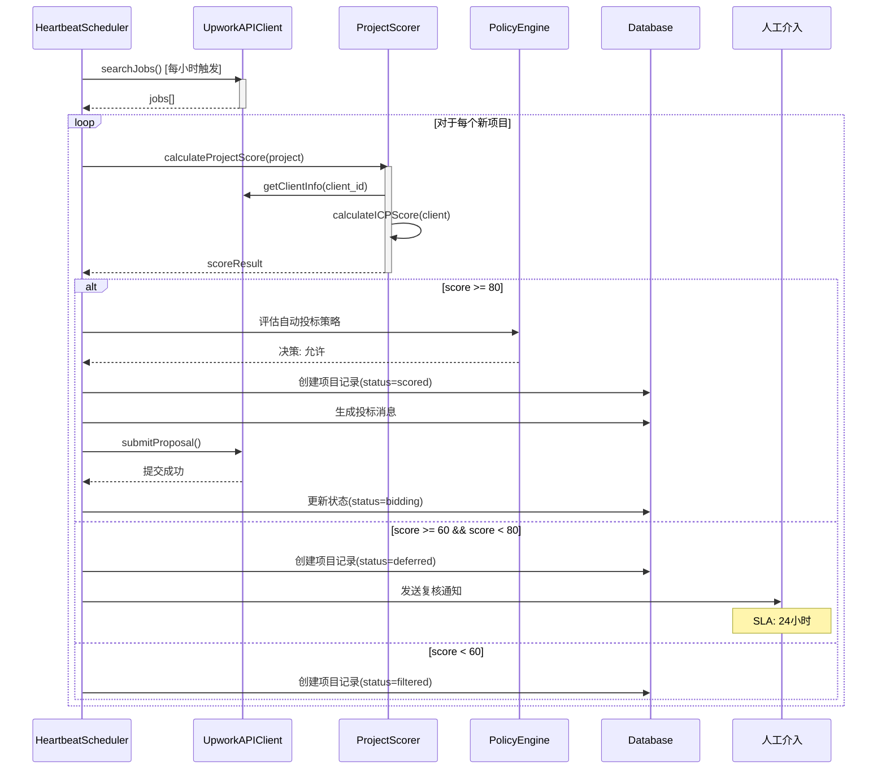
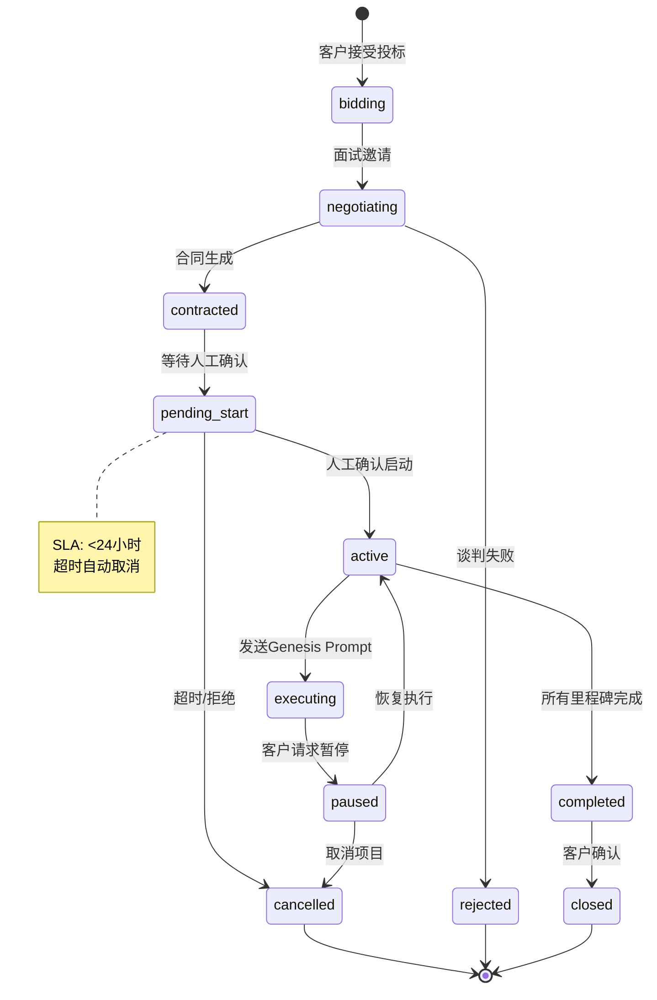
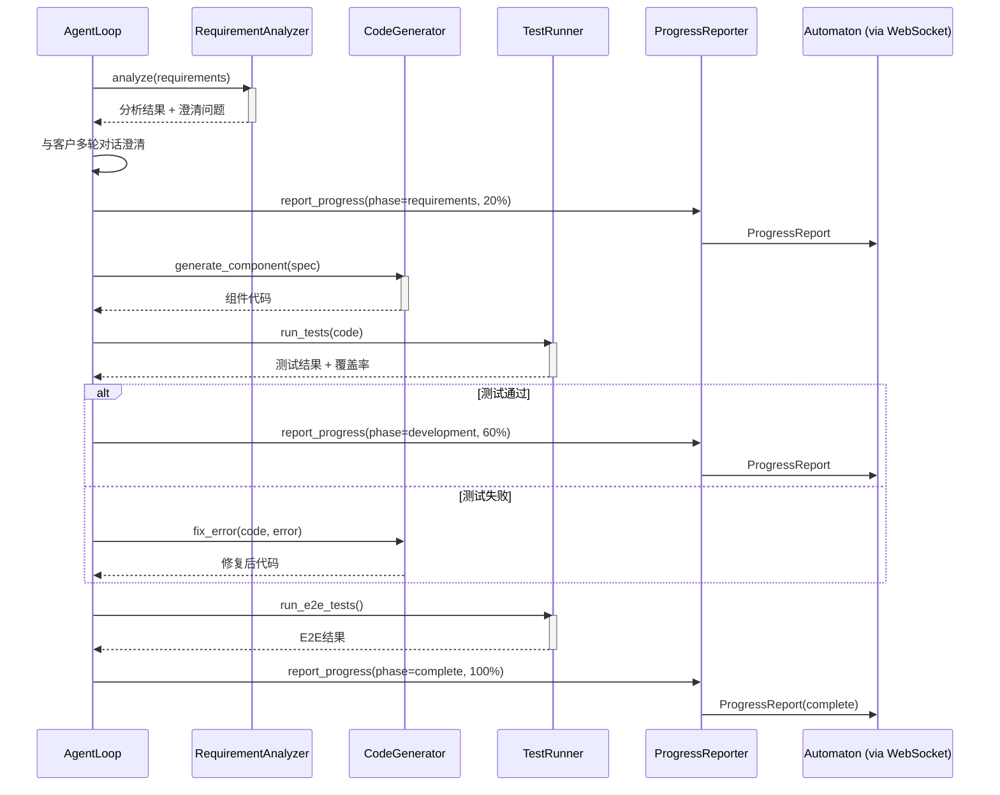
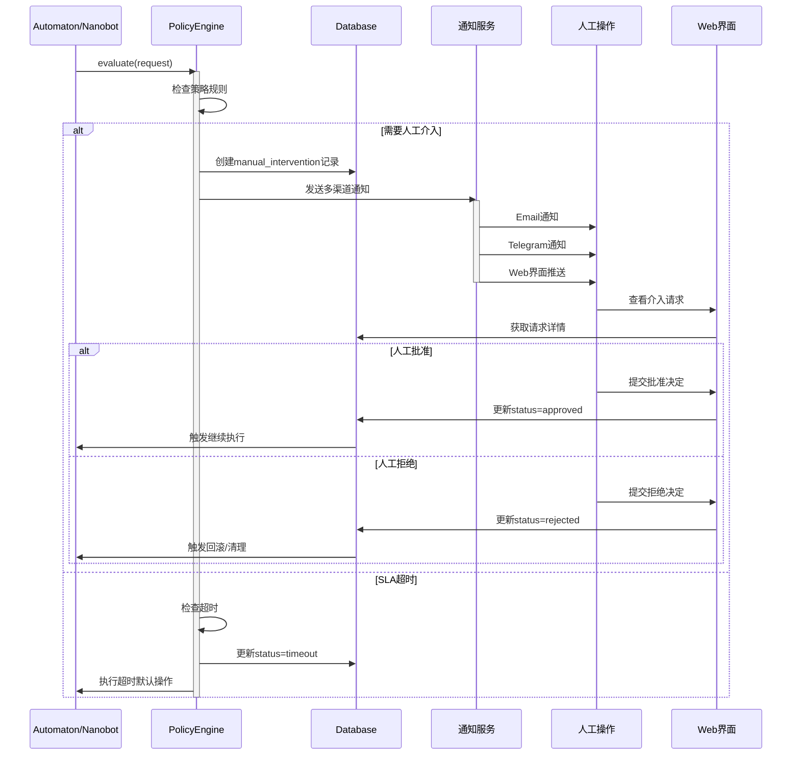
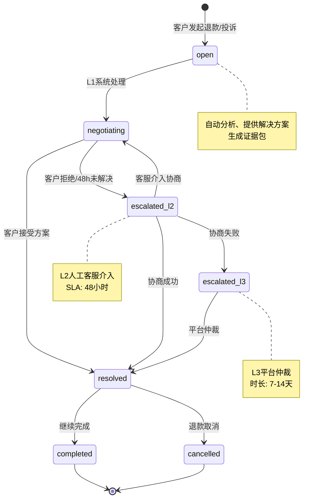
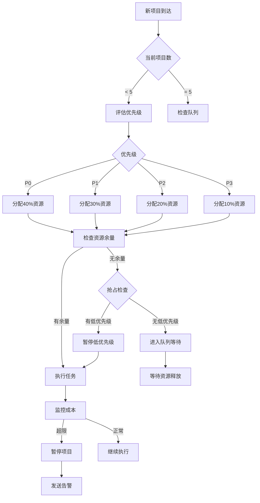
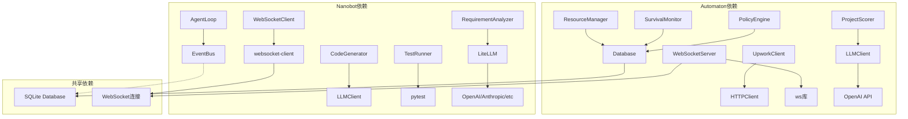

# 详细设计文档：融合Automaton与Nanobot的接单AI代理系统

> **版本**: 1.1.0
> **创建日期**: 2026-03-01
> **最后更新**: 2026-03-01
> **状态**: 设计中 (Architect审查修订)
> **基于**: 需求分析文档 v1.1.0

---

## 文档变更记录

| 版本 | 日期 | 作者 | 变更内容 |
|------|------|------|----------|
| 1.0.0 | 2026-03-01 | Planner | 初始版本 |
| 1.1.0 | 2026-03-01 | Planner | Architect审查修订：明确Nanobot数据库访问机制、补充MVP范围、人工介入超时SOP、外键策略、WebSocket重连协议、成本告警优化 |

---

## 目录

1. [系统架构设计](#1-系统架构设计)
   - [1.5 MVP范围定义](#15-mvp范围定义-phase-1) ⭐ 新增
2. [数据设计](#2-数据设计)
   - [2.1.1 SQLite数据库架构](#211-sqlite数据库架构) - Nanobot数据库访问机制 ⭐ 更新
3. [接口设计](#3-接口设计)
   - [3.2.4 WebSocket重连状态同步协议](#324-websocket重连状态同步协议) ⭐ 新增
4. [核心流程设计](#4-核心流程设计)
   - [4.5.1 人工介入超时SOP](#451-人工介入超时sop-标准操作程序) ⭐ 新增
5. [非功能性设计](#5-非功能性设计)
6. [风险与依赖](#6-风险与依赖)

---

## 1. 系统架构设计

### 1.1 整体架构

#### 1.1.1 混合架构模式 (Phase 1)

基于ADR决策，采用混合架构模式：Phase 1单体应用，后续可演进为微服务。

```
┌─────────────────────────────────────────────────────────────────────────────┐
│                              容器边界                                        │
│  ┌──────────────────────────────────────────────────────────────────────┐  │
│  │                         主应用进程                                     │  │
│  │                                                                      │  │
│  │  ┌──────────────────────┐         ┌──────────────────────┐          │  │
│  │  │     Automaton        │         │      Nanobot         │          │  │
│  │  │    (TypeScript)      │◄───────►│     (Python)         │          │  │
│  │  │                      │  ANP    │                      │          │  │
│  │  │  ┌────────────────┐  │  P2P    │  ┌────────────────┐  │          │  │
│  │  │  │ 治理层         │  │         │  │ 执行层         │  │          │  │
│  │  │  │ - 项目筛选     │  │         │  │ - 需求分析     │  │          │  │
│  │  │  │ - 经济决策     │  │         │  │ - 代码生成     │  │          │  │
│  │  │  │ - 风险管理     │  │         │  │ - 测试执行     │  │          │  │
│  │  │  │ - 人工介入     │  │         │  │ - 客户沟通     │  │          │  │
│  │  │  └────────────────┘  │         │  └────────────────┘  │          │  │
│  │  │                      │         │                      │          │  │
│  │  │  ┌────────────────┐  │         │  ┌────────────────┐  │          │  │
│  │  │  │ WebSocket层    │  │         │  │ WebSocket客户端 │  │          │  │
│  │  │  │ (901行已实现)  │  │         │  │ (927行已实现)  │  │          │  │
│  │  │  └────────────────┘  │         │  └────────────────┘  │          │  │
│  │  └──────────────────────┘         └──────────────────────┘          │  │
│  │                                                                      │  │
│  │  ┌──────────────────────────────────────────────────────────────┐   │  │
│  │  │              SQLite数据库 (Automaton独占访问)                  │   │  │
│  │  │              (~/.automaton/state.db)                          │   │  │
│  │  │       Nanobot通过ANP消息委托Automaton进行所有数据库操作         │   │  │
│  │  └──────────────────────────────────────────────────────────────┘   │  │
│  └──────────────────────────────────────────────────────────────────────┘  │
└─────────────────────────────────────────────────────────────────────────────┘
```

#### 1.1.2 层级划分

| 层级 | 职责 | Automaton组件 | Nanobot组件 | 通信方式 |
|------|------|---------------|-------------|----------|
| **决策层** | 战略决策、经济管理 | PolicyEngine, SurvivalMonitor | - | 内存调用 |
| **协调层** | 任务编排、状态管理 | HeartbeatDaemon | EventBus | WebSocket |
| **执行层** | 具体任务执行 | - | AgentLoop, Skills | WebSocket |
| **传输层** | 消息传递 | InteragentWebSocketServer | WebSocketClient | WebSocket |
| **数据层** | 持久化存储 | better-sqlite3 | - | ANP消息委托 |

### 1.2 组件设计

#### 1.2.1 Automaton组件清单

| 组件 | 文件位置 | 职责 | 优先级 |
|------|----------|------|--------|
| **PolicyEngine** | `agent/policy-engine.ts` | 策略评估、人工介入决策 | P0 |
| **SpendTracker** | `agent/spend-tracker.ts` | 成本追踪、预算控制 | P0 |
| **SurvivalMonitor** | `survival/monitor.ts` | 生存状态监控、级别切换 | P0 |
| **HeartbeatDaemon** | `heartbeat/daemon.ts` | 定时任务调度 | P0 |
| **InteragentWebSocketServer** | `interagent/websocket.ts` | WebSocket服务器 | P0 |
| **UpworkClient** | `upwork/client.ts` (新增) | Upwork API集成 | P0 |
| **ProjectScorer** | `upwork/scorer.ts` (新增) | 项目评分、ICP评估 | P0 |
| **BidGenerator** | `upwork/bid-generator.ts` (新增) | 投标消息生成 | P0 |
| **ResourceManager** | `orchestration/resource-manager.ts` (新增) | 多项目资源调度 | P1 |
| **ExperimentManager** | `experiments/manager.ts` (新增) | A/B测试管理 | P1 |

#### 1.2.2 Nanobot组件清单

| 组件 | 文件位置 | 职责 | 优先级 |
|------|----------|------|--------|
| **AgentLoop** | `agent/loop.py` | 主循环、消息处理 | P0 |
| **WebSocketClient** | `interagent/websocket.py` | WebSocket客户端 | P0 |
| **GenesisPromptHandler** | `anp/handlers.py` (新增) | Genesis Prompt处理 | P0 |
| **ProgressReporter** | `interagent/progress_reporter.py` | 进度报告 | P0 |
| **RequirementAnalyzer** | `skills/requirement.py` (新增) | 需求分析 | P0 |
| **CodeGenerator** | `skills/codegen.py` (新增) | 代码生成 | P0 |
| **TestRunner** | `skills/testing.py` (新增) | 测试执行 | P0 |
| **CustomerMessenger** | `channels/manager.py` | 多渠道消息发送 | P0 |
| **MemoryManager** | `agent/memory.py` | 双层记忆系统 | P1 |
| **KnowledgeBase** | `knowledge/base.py` (新增) | 知识库管理 | P1 |

### 1.3 部署架构

#### 1.3.1 Docker部署 (Phase 1)

```yaml
# docker-compose.yml
services:
  automaton-nanobot:
    build:
      context: .
      dockerfile: Dockerfile
    image: autojiedan:latest
    container_name: automaton-nanobot-main
    restart: unless-stopped

    # 环境变量
    env_file:
      - .env.production
    environment:
      - NODE_ENV=production
      - AUTOMATON_DB_PATH=/data/state.db
      - NANOBOT_LOG_LEVEL=INFO

    # 卷挂载
    volumes:
      - automaton-data:/data
      - ./logs:/app/logs

    # 端口映射
    ports:
      - "3000:3000"  # WebSocket服务
      - "8080:8080"  # 健康检查

    # 资源限制
    deploy:
      resources:
        limits:
          cpus: '2'
          memory: 4G
        reservations:
          cpus: '0.5'
          memory: 1G

    # 健康检查
    healthcheck:
      test: ["CMD", "curl", "-f", "http://localhost:8080/health"]
      interval: 30s
      timeout: 10s
      retries: 3
      start_period: 40s

volumes:
  automaton-data:
    driver: local
```

#### 1.3.2 Kubernetes部署 (Phase 2+)

```yaml
# k8s/deployment.yaml
apiVersion: apps/v1
kind: Deployment
metadata:
  name: automaton-nanobot
  labels:
    app: automaton-nanobot
    version: v1
spec:
  replicas: 1
  strategy:
    type: RollingUpdate
    rollingUpdate:
      maxSurge: 1
      maxUnavailable: 0
  selector:
    matchLabels:
      app: automaton-nanobot
  template:
    metadata:
      labels:
        app: automaton-nanobot
        version: v1
    spec:
      containers:
      - name: automaton-nanobot
        image: autojiedan:latest
        imagePullPolicy: Always
        ports:
        - name: websocket
          containerPort: 3000
          protocol: TCP
        - name: health
          containerPort: 8080
          protocol: TCP
        env:
        - name: AUTOMATON_DB_PATH
          value: /data/state.db
        - name: NAMESPACE
          valueFrom:
            fieldRef:
              fieldPath: metadata.namespace
        volumeMounts:
        - name: data
          mountPath: /data
        resources:
          requests:
            cpu: 500m
            memory: 1Gi
          limits:
            cpu: 2000m
            memory: 4Gi
        livenessProbe:
          httpGet:
            path: /health
            port: health
          initialDelaySeconds: 30
          periodSeconds: 10
          timeoutSeconds: 5
          failureThreshold: 3
        readinessProbe:
          httpGet:
            path: /ready
            port: health
          initialDelaySeconds: 10
          periodSeconds: 5
          timeoutSeconds: 3
          failureThreshold: 2
      volumes:
      - name: data
        persistentVolumeClaim:
          claimName: automaton-pvc
---
apiVersion: v1
kind: Service
metadata:
  name: automaton-nanobot
spec:
  type: ClusterIP
  ports:
  - name: websocket
    port: 3000
    targetPort: websocket
  - name: health
    port: 8080
    targetPort: health
  selector:
    app: automaton-nanobot
---
apiVersion: v1
kind: PersistentVolumeClaim
metadata:
  name: automaton-pvc
spec:
  accessModes:
  - ReadWriteOnce
  resources:
    requests:
      storage: 10Gi
```

### 1.4 技术栈总览

#### 1.4.1 Automaton技术栈

| 分类 | 技术 | 版本 | 用途 |
|------|------|------|------|
| **语言** | TypeScript | 5.9+ | 主要开发语言 |
| **运行时** | Node.js | 20+ | JavaScript运行时 |
| **包管理** | pnpm | 10.x | 依赖管理 |
| **数据库** | better-sqlite3 | latest | 数据持久化 |
| **区块链** | viem | latest | 以太坊/Base集成 |
| **AI推理** | OpenAI API | - | LLM调用 |
| **WebSocket** | ws | latest | 实时通信 |
| **HTTP客户端** | undici | latest | HTTP请求 |
| **测试** | vitest | latest | 单元测试 |

#### 1.4.2 Nanobot技术栈

| 分类 | 技术 | 版本 | 用途 |
|------|------|------|------|
| **语言** | Python | 3.11+ | 主要开发语言 |
| **包管理** | hatch | latest | 依赖管理 |
| **LLM集成** | litellm | latest | 多提供商支持 |
| **验证** | pydantic | v2 | 数据验证 |
| **WebSocket** | websocket-client | latest | WebSocket客户端 |
| **HTTP客户端** | httpx | latest | 异步HTTP |
| **测试** | pytest | latest | 单元测试 |
| **代码质量** | ruff | latest | Linting/格式化 |

### 1.5 MVP范围定义 (Phase 1)

> **设计原则**: 简化Phase 1范围，明确MVP边界，优先交付核心价值。

#### 1.5.1 MVP功能清单

| 功能模块 | 子功能 | 优先级 | MVP必须 | 说明 |
|----------|--------|--------|---------|------|
| **项目发现** | RSS监控 | P0 | ✅ | Upwork RSS订阅 |
| | 项目评分 | P0 | ✅ | 基础ICP评分 |
| | 自动过滤 | P0 | ✅ | 低分项目过滤 |
| **投标管理** | 投标生成 | P0 | ✅ | 基于模板生成 |
| | 投标提交 | P0 | ✅ | API提交 |
| | 投标追踪 | P1 | ❌ | Phase 2 |
| **合同管理** | 合同签署确认 | P0 | ✅ | 人工确认 |
| | 里程碑管理 | P1 | ❌ | Phase 2 |
| **任务执行** | Genesis Prompt | P0 | ✅ | 任务分发 |
| | 需求分析 | P0 | ✅ | 基础分析 |
| | 代码生成 | P0 | ✅ | 单文件生成 |
| | 测试执行 | P0 | ✅ | 单元测试 |
| | 进度报告 | P0 | ✅ | 基础报告 |
| **客户沟通** | 消息发送 | P1 | ❌ | Phase 2 |
| | 多语言支持 | P2 | ❌ | Phase 2 |
| **人工介入** | 合同确认 | P0 | ✅ | 必须 |
| | 大额支出 | P0 | ✅ | 必须 |
| | 纠纷处理 | P1 | ✅ | 必须 |
| **监控告警** | 健康检查 | P0 | ✅ | 基础监控 |
| | 成本告警 | P0 | ✅ | 预算告警 |
| | 错误告警 | P1 | ❌ | Phase 2 |

#### 1.5.2 MVP不包含的功能 (Phase 2+)

| 功能 | 原因 | 计划版本 |
|------|------|----------|
| 多平台支持 (Fiverr等) | 优先验证Upwork | Phase 2 |
| A/B测试框架 | 需要足够数据量 | Phase 2 |
| 高级分析仪表板 | 非核心路径 | Phase 2 |
| 知识库向量搜索 | 复杂度高 | Phase 2 |
| 多租户支持 | 单用户优先 | Phase 3 |
| PostgreSQL迁移 | SQLite足够 | Phase 3 |
| Kubernetes部署 | Docker足够 | Phase 3 |

#### 1.5.3 MVP成功标准

| 指标 | 目标值 | 测量周期 |
|------|--------|----------|
| 项目发现率 | >= 50个/周 | 周 |
| 投标转化率 | >= 5% | 月 |
| 项目完成率 | >= 80% | 月 |
| 客户满意度 | >= 4.0/5.0 | 项目结束 |
| 系统可用性 | >= 99% | 月 |
| 平均响应时间 | < 500ms (P99) | 日 |

---

## 2. 数据设计

### 2.1 数据库架构

#### 2.1.1 SQLite数据库架构

**重要设计决策**: Automaton独占数据库访问，Nanobot通过ANP消息委托Automaton进行所有数据库操作。

```
┌─────────────────────────────────────────────────────────────┐
│                    数据库访问架构                            │
├─────────────────────────────────────────────────────────────┤
│                                                             │
│   ┌─────────────┐                      ┌─────────────┐      │
│   │  Automaton  │◄──────ANP消息───────│   Nanobot   │      │
│   │ (TypeScript)│      (数据库操作请求) │  (Python)   │      │
│   └──────┬──────┘                      └─────────────┘      │
│          │                                                  │
│          │ 直接访问                                         │
│          ▼                                                  │
│   ┌─────────────────────────────────────────────────┐      │
│   │           SQLite Database                        │      │
│   │         (~/.automaton/state.db)                  │      │
│   │                                                  │      │
│   │  WAL模式启用，确保写入安全                        │      │
│   └─────────────────────────────────────────────────┘      │
│                                                             │
└─────────────────────────────────────────────────────────────┘
```

**为什么Nanobot不能直接访问数据库**:
1. SQLite是单写入者数据库，多进程写入会导致`SQLITE_BUSY`错误
2. 避免数据竞争和状态不一致
3. 统一的数据访问层便于审计和监控
4. ANP消息提供了天然的幂等性和重试机制

**Nanobot数据库操作ANP消息类型**:
| 操作类型 | ANP消息 | 说明 |
|----------|---------|------|
| 查询项目 | `DBQueryRequest` | 查询projects表 |
| 更新进度 | `ProgressReport` | 更新goal进度 |
| 记录事件 | `AnalyticsEvent` | 写入analytics_events |
| 创建里程碑 | `MilestoneCreate` | 创建project_milestones |

```
~/.automaton/state.db
├── 现有表 (Schema v10)
│   ├── schema_version
│   ├── identity
│   ├── turns
│   ├── tool_calls
│   ├── heartbeat_entries
│   ├── heartbeat_schedule
│   ├── heartbeat_history
│   ├── transactions
│   ├── policy_decisions
│   ├── spend_tracking
│   ├── modifications
│   ├── skills
│   ├── children
│   ├── registry
│   ├── reputation
│   ├── inbox_messages
│   ├── wake_events
│   └── kv
│
└── 新增表 (Schema v11+)
    ├── projects              # 项目详情
    ├── clients               # 客户信息
    ├── goals                 # 项目目标 (扩展现有表)
    ├── task_graph            # 任务图 (扩展现有表)
    ├── analytics_events      # 埋点事件
    ├── disputes              # 纠纷记录
    ├── experiments           # A/B测试
    ├── experiment_assignments # 实验分配
    ├── experiment_metrics    # 实验指标
    ├── contract_templates    # 合同模板
    ├── invoices              # 发票
    ├── communication_templates # 沟通模板
    ├── knowledge_entries     # 知识库条目
    ├── project_milestones    # 项目里程碑
    ├── bid_history           # 投标历史
    ├── resource_allocations   # 资源分配
    └── manual_interventions   # 人工介入记录
```

### 2.2 数据表设计

#### 2.2.1 核心表DDL

```sql
-- ============================================================================
-- Schema v11 Migration
-- ============================================================================

-- -------------------------------------------------------------------------
-- projects: 项目详情表
-- -------------------------------------------------------------------------
CREATE TABLE IF NOT EXISTS projects (
    id TEXT PRIMARY KEY,                    -- ULID
    platform TEXT NOT NULL,                 -- 'upwork', 'fiverr', etc.
    platform_project_id TEXT NOT NULL,      -- 平台原始项目ID
    title TEXT NOT NULL,
    description TEXT,
    client_id TEXT,                         -- 关联clients表
    status TEXT NOT NULL,                   -- 状态枚举见 2.2.2
    score INTEGER,                          -- ICP评分 (0-100)
    score_factors TEXT,                     -- JSON: 评分因子详情
    bid_id TEXT,                            -- 已提交的投标ID
    contract_id TEXT,                       -- 已签署的合同ID
    budget_cents INTEGER,                   -- 项目预算 (分)
    deadline TEXT,                          -- ISO 8601
    created_at TEXT NOT NULL DEFAULT (datetime('now')),
    updated_at TEXT NOT NULL DEFAULT (datetime('now')),
    discovered_at TEXT NOT NULL DEFAULT (datetime('now')),
    metadata TEXT,                          -- JSON扩展
    FOREIGN KEY (client_id) REFERENCES clients(id) ON DELETE SET NULL
);

CREATE UNIQUE INDEX idx_projects_platform_id ON projects(platform, platform_project_id);
CREATE INDEX idx_projects_status ON projects(status);
CREATE INDEX idx_projects_score ON projects(score);
CREATE INDEX idx_projects_client ON projects(client_id);
CREATE INDEX idx_projects_created_at ON projects(created_at);

-- -------------------------------------------------------------------------
-- clients: 客户信息表
-- -------------------------------------------------------------------------
CREATE TABLE IF NOT EXISTS clients (
    id TEXT PRIMARY KEY,                    -- ULID
    platform TEXT NOT NULL,
    platform_client_id TEXT NOT NULL,       -- 平台原始客户ID
    name TEXT,
    company TEXT,
    rating REAL,                            -- 历史评分 (1-5)
    total_spent_cents INTEGER DEFAULT 0,    -- 累计消费
    payment_verified INTEGER DEFAULT 0,     -- 付款验证率 (0-100)
    country TEXT,
    tier TEXT DEFAULT 'new',                -- 客户等级: 'gold', 'silver', 'bronze', 'new'
    language_preference TEXT DEFAULT 'en',  -- 'en', 'zh', 'auto'
    response_time_hours REAL,               -- 平均响应时间 (小时)
    total_projects INTEGER DEFAULT 0,       -- 累计项目数
    hired_freelancers INTEGER DEFAULT 0,    -- 雇佣过的自由职业者数量
    created_at TEXT NOT NULL DEFAULT (datetime('now')),
    updated_at TEXT NOT NULL DEFAULT (datetime('now')),
    metadata TEXT
);

CREATE UNIQUE INDEX idx_clients_platform_id ON clients(platform, platform_client_id);
CREATE INDEX idx_clients_tier ON clients(tier);
CREATE INDEX idx_clients_rating ON clients(rating);

-- -------------------------------------------------------------------------
-- goals: 项目目标表 (扩展现有表结构)
-- -------------------------------------------------------------------------
-- 现有表结构已存在，这里仅添加迁移
ALTER TABLE goals ADD COLUMN IF NOT EXISTS project_id TEXT;
ALTER TABLE goals ADD COLUMN IF NOT EXISTS source TEXT DEFAULT 'internal';
ALTER TABLE goals ADD COLUMN IF NOT EXISTS genesis_prompt_id TEXT;
ALTER TABLE goals ADD COLUMN IF NOT EXISTS resource_limit_cents INTEGER DEFAULT 0;
ALTER TABLE goals ADD COLUMN IF NOT EXISTS actual_cost_cents INTEGER DEFAULT 0;

CREATE INDEX IF NOT EXISTS idx_goals_project_id ON goals(project_id);
CREATE INDEX IF NOT EXISTS idx_goals_source ON goals(source);

-- -------------------------------------------------------------------------
-- analytics_events: 埋点事件表
-- -------------------------------------------------------------------------
CREATE TABLE IF NOT EXISTS analytics_events (
    id TEXT PRIMARY KEY,                    -- ULID
    event_type TEXT NOT NULL,               -- 事件类型枚举见 2.2.3
    timestamp TEXT NOT NULL DEFAULT (datetime('now')),
    properties TEXT,                        -- JSON: 事件属性
    session_id TEXT,
    project_id TEXT,
    client_id TEXT,
    user_id TEXT,                           -- 内部用户ID
    created_at TEXT NOT NULL DEFAULT (datetime('now')),
    FOREIGN KEY (project_id) REFERENCES projects(id) ON DELETE SET NULL,
    FOREIGN KEY (client_id) REFERENCES clients(id) ON DELETE SET NULL
);

CREATE INDEX idx_analytics_events_type ON analytics_events(event_type);
CREATE INDEX idx_analytics_events_timestamp ON analytics_events(timestamp);
CREATE INDEX idx_analytics_events_project_id ON analytics_events(project_id);
CREATE INDEX idx_analytics_events_session_id ON analytics_events(session_id);

-- -------------------------------------------------------------------------
-- disputes: 纠纷记录表
-- -------------------------------------------------------------------------
CREATE TABLE IF NOT EXISTS disputes (
    id TEXT PRIMARY KEY,                    -- ULID
    project_id TEXT NOT NULL,
    client_id TEXT NOT NULL,
    reason TEXT NOT NULL,
    status TEXT NOT NULL,                   -- 'open', 'negotiating', 'resolved', 'escalated', 'closed'
    level INTEGER NOT NULL DEFAULT 1,       -- 1, 2, 3
    resolution TEXT,
    refund_amount_cents INTEGER DEFAULT 0,
    escalation_reason TEXT,
    created_at TEXT NOT NULL DEFAULT (datetime('now')),
    resolved_at TEXT,
    updated_at TEXT NOT NULL DEFAULT (datetime('now')),
    metadata TEXT,
    FOREIGN KEY (project_id) REFERENCES projects(id) ON DELETE SET NULL,
    FOREIGN KEY (client_id) REFERENCES clients(id) ON DELETE SET NULL
);

CREATE INDEX idx_disputes_status ON disputes(status);
CREATE INDEX idx_disputes_level ON disputes(level);
CREATE INDEX idx_disputes_project_id ON disputes(project_id);

-- -------------------------------------------------------------------------
-- experiments: A/B测试表
-- -------------------------------------------------------------------------
CREATE TABLE IF NOT EXISTS experiments (
    id TEXT PRIMARY KEY,                    -- ULID
    name TEXT NOT NULL UNIQUE,
    description TEXT,
    variants TEXT NOT NULL,                 -- JSON: Variant[]
    status TEXT NOT NULL DEFAULT 'draft',   -- 'draft', 'running', 'paused', 'completed'
    traffic_allocation INTEGER DEFAULT 100, -- 0-100
    success_metric TEXT NOT NULL,
    min_sample_size INTEGER DEFAULT 100,
    confidence_level REAL DEFAULT 0.95,
    started_at TEXT,
    ended_at TEXT,
    created_at TEXT NOT NULL DEFAULT (datetime('now')),
    updated_at TEXT NOT NULL DEFAULT (datetime('now'))
);

CREATE INDEX idx_experiments_status ON experiments(status);

-- -------------------------------------------------------------------------
-- experiment_assignments: 实验分配表
-- -------------------------------------------------------------------------
CREATE TABLE IF NOT EXISTS experiment_assignments (
    id TEXT PRIMARY KEY,                    -- ULID
    experiment_id TEXT NOT NULL,
    variant_id TEXT NOT NULL,
    entity_type TEXT NOT NULL,              -- 'project' or 'client'
    entity_id TEXT NOT NULL,
    assigned_at TEXT NOT NULL DEFAULT (datetime('now')),
    FOREIGN KEY (experiment_id) REFERENCES experiments(id) ON DELETE CASCADE
);

CREATE INDEX idx_experiment_assignments_experiment_id ON experiment_assignments(experiment_id);
CREATE INDEX idx_experiment_assignments_entity ON experiment_assignments(entity_type, entity_id);

-- -------------------------------------------------------------------------
-- experiment_metrics: 实验指标表
-- -------------------------------------------------------------------------
CREATE TABLE IF NOT EXISTS experiment_metrics (
    id TEXT PRIMARY KEY,                    -- ULID
    experiment_id TEXT NOT NULL,
    variant_id TEXT NOT NULL,
    metric_name TEXT NOT NULL,
    metric_value REAL,
    recorded_at TEXT NOT NULL DEFAULT (datetime('now')),
    FOREIGN KEY (experiment_id) REFERENCES experiments(id) ON DELETE CASCADE
);

CREATE INDEX idx_experiment_metrics_experiment_id ON experiment_metrics(experiment_id);

-- -------------------------------------------------------------------------
-- contract_templates: 合同模板表
-- -------------------------------------------------------------------------
CREATE TABLE IF NOT EXISTS contract_templates (
    id TEXT PRIMARY KEY,                    -- ULID
    name TEXT NOT NULL UNIQUE,
    type TEXT NOT NULL,                     -- 'fixed', 'hourly', 'custom'
    terms TEXT NOT NULL,                    -- JSON: 合同条款
    milestones TEXT,                        -- JSON: 里程碑定义
    is_default INTEGER DEFAULT 0,
    created_at TEXT NOT NULL DEFAULT (datetime('now')),
    updated_at TEXT NOT NULL DEFAULT (datetime('now'))
);

-- -------------------------------------------------------------------------
-- invoices: 发票表
-- -------------------------------------------------------------------------
CREATE TABLE IF NOT EXISTS invoices (
    id TEXT PRIMARY KEY,                    -- ULID
    project_id TEXT NOT NULL,
    client_id TEXT NOT NULL,
    invoice_number TEXT NOT NULL UNIQUE,
    amount_cents INTEGER NOT NULL,
    tax_cents INTEGER NOT NULL DEFAULT 0,
    total_cents INTEGER NOT NULL,
    currency TEXT NOT NULL DEFAULT 'USD',
    status TEXT NOT NULL DEFAULT 'draft',   -- 'draft', 'sent', 'paid', 'overdue', 'cancelled'
    due_date TEXT NOT NULL,
    paid_at TEXT,
    created_at TEXT NOT NULL DEFAULT (datetime('now')),
    updated_at TEXT NOT NULL DEFAULT (datetime('now')),
    pdf_url TEXT,
    notes TEXT,
    FOREIGN KEY (project_id) REFERENCES projects(id) ON DELETE SET NULL,
    FOREIGN KEY (client_id) REFERENCES clients(id) ON DELETE SET NULL
);

CREATE INDEX idx_invoices_status ON invoices(status);
CREATE INDEX idx_invoices_due_date ON invoices(due_date);
CREATE INDEX idx_invoices_project_id ON invoices(project_id);

-- -------------------------------------------------------------------------
-- communication_templates: 沟通模板表
-- -------------------------------------------------------------------------
CREATE TABLE IF NOT EXISTS communication_templates (
    id TEXT PRIMARY KEY,                    -- ULID
    name TEXT NOT NULL UNIQUE,
    type TEXT NOT NULL,                     -- 'bid', 'progress', 'delivery', 'review_request', 'error'
    language TEXT DEFAULT 'en',             -- 'en', 'zh'
    tier TEXT DEFAULT 'all',                -- 'gold', 'silver', 'bronze', 'new', 'all'
    subject TEXT,
    body TEXT NOT NULL,
    variables TEXT,                         -- JSON: 可用变量列表
    is_default INTEGER DEFAULT 0,
    version INTEGER DEFAULT 1,
    created_at TEXT NOT NULL DEFAULT (datetime('now')),
    updated_at TEXT NOT NULL DEFAULT (datetime('now'))
);

CREATE INDEX idx_comm_templates_type ON communication_templates(type);
CREATE INDEX idx_comm_templates_language ON communication_templates(language);

-- -------------------------------------------------------------------------
-- knowledge_entries: 知识库条目表
-- -------------------------------------------------------------------------
CREATE TABLE IF NOT EXISTS knowledge_entries (
    id TEXT PRIMARY KEY,                    -- ULID
    type TEXT NOT NULL,                     -- 'solution', 'pattern', 'trap', 'template', 'communication'
    category TEXT NOT NULL,
    title TEXT NOT NULL,
    content TEXT NOT NULL,
    tags TEXT,                              -- JSON: 标签数组
    embedding BLOB,                         -- 向量嵌入
    source_project_id TEXT,
    usage_count INTEGER DEFAULT 0,
    success_rate REAL,                      -- 基于结果的成功率
    created_at TEXT NOT NULL DEFAULT (datetime('now')),
    updated_at TEXT NOT NULL DEFAULT (datetime('now'))
);

CREATE INDEX idx_knowledge_entries_type ON knowledge_entries(type);
CREATE INDEX idx_knowledge_entries_category ON knowledge_entries(category);

-- -------------------------------------------------------------------------
-- embedding_queue: 嵌入任务队列表 (Phase 2)
-- -------------------------------------------------------------------------
CREATE TABLE IF NOT EXISTS embedding_queue (
    id TEXT PRIMARY KEY,                    -- ULID
    knowledge_entry_id TEXT NOT NULL,       -- 关联的知识条目
    content TEXT NOT NULL,                  -- 待嵌入内容
    status TEXT NOT NULL DEFAULT 'pending', -- 'pending', 'processing', 'completed', 'failed'
    retry_count INTEGER DEFAULT 0,
    max_retries INTEGER DEFAULT 3,
    error TEXT,                             -- 错误信息
    created_at TEXT NOT NULL DEFAULT (datetime('now')),
    updated_at TEXT NOT NULL DEFAULT (datetime('now')),
    FOREIGN KEY (knowledge_entry_id) REFERENCES knowledge_entries(id) ON DELETE CASCADE
);

CREATE INDEX idx_embedding_queue_status ON embedding_queue(status);
CREATE INDEX idx_embedding_queue_created ON embedding_queue(created_at);

-- -------------------------------------------------------------------------
-- project_milestones: 项目里程碑表
-- -------------------------------------------------------------------------
CREATE TABLE IF NOT EXISTS project_milestones (
    id TEXT PRIMARY KEY,                    -- ULID
    project_id TEXT NOT NULL,
    goal_id TEXT NOT NULL,
    name TEXT NOT NULL,
    description TEXT,
    percentage INTEGER NOT NULL,            -- 付款百分比
    due_date TEXT,
    status TEXT NOT NULL DEFAULT 'pending', -- 'pending', 'in_progress', 'completed', 'skipped'
    completed_at TEXT,
    delivered_at TEXT,
    approved_at TEXT,
    amount_cents INTEGER,
    created_at TEXT NOT NULL DEFAULT (datetime('now')),
    updated_at TEXT NOT NULL DEFAULT (datetime('now')),
    FOREIGN KEY (project_id) REFERENCES projects(id) ON DELETE SET NULL,
    FOREIGN KEY (goal_id) REFERENCES goals(id) ON DELETE SET NULL
);

CREATE INDEX idx_milestones_project_id ON project_milestones(project_id);
CREATE INDEX idx_milestones_status ON project_milestones(status);

-- -------------------------------------------------------------------------
-- bid_history: 投标历史表
-- -------------------------------------------------------------------------
CREATE TABLE IF NOT EXISTS bid_history (
    id TEXT PRIMARY KEY,                    -- ULID
    project_id TEXT NOT NULL,
    template_id TEXT,
    cover_letter TEXT NOT NULL,
    bid_amount_cents INTEGER,
    duration_days INTEGER,
    submitted_at TEXT,
    status TEXT NOT NULL DEFAULT 'draft',   -- 'draft', 'submitted', 'accepted', 'rejected', 'withdrawn'
    interview_invited INTEGER DEFAULT 0,
    response_received_at TEXT,
    created_at TEXT NOT NULL DEFAULT (datetime('now')),
    updated_at TEXT NOT NULL DEFAULT (datetime('now')),
    FOREIGN KEY (project_id) REFERENCES projects(id) ON DELETE SET NULL
);

CREATE INDEX idx_bid_history_project_id ON bid_history(project_id);
CREATE INDEX idx_bid_history_status ON bid_history(status);

-- -------------------------------------------------------------------------
-- resource_allocations: 资源分配表
-- -------------------------------------------------------------------------
CREATE TABLE IF NOT EXISTS resource_allocations (
    id TEXT PRIMARY KEY,                    -- ULID
    project_id TEXT NOT NULL,
    goal_id TEXT NOT NULL,
    priority TEXT NOT NULL,                 -- 'P0', 'P1', 'P2', 'P3'
    cpu_quota REAL,                         -- CPU核心数配额
    token_quota_hour INTEGER,               -- 每小时token配额
    cost_quota_cents INTEGER,               -- 成本配额
    allocated_at TEXT NOT NULL DEFAULT (datetime('now')),
    active INTEGER DEFAULT 1,
    created_at TEXT NOT NULL DEFAULT (datetime('now')),
    updated_at TEXT NOT NULL DEFAULT (datetime('now')),
    FOREIGN KEY (project_id) REFERENCES projects(id) ON DELETE SET NULL,
    FOREIGN KEY (goal_id) REFERENCES goals(id) ON DELETE SET NULL
);

CREATE INDEX idx_resource_allocations_project_id ON resource_allocations(project_id);
CREATE INDEX idx_resource_allocations_priority ON resource_allocations(priority);

-- -------------------------------------------------------------------------
-- manual_interventions: 人工介入记录表
-- -------------------------------------------------------------------------
CREATE TABLE IF NOT EXISTS manual_interventions (
    id TEXT PRIMARY KEY,                    -- ULID
    intervention_type TEXT NOT NULL,        -- 'contract_sign', 'large_spend', 'project_start', 'refund', etc.
    project_id TEXT,
    goal_id TEXT,
    reason TEXT NOT NULL,
    context TEXT,                           -- JSON: 上下文信息
    status TEXT NOT NULL DEFAULT 'pending', -- 'pending', 'approved', 'rejected', 'timeout'
    requested_at TEXT NOT NULL DEFAULT (datetime('now')),
    responded_at TEXT,
    responder TEXT,
    decision TEXT,                          -- 'approve', 'reject', 'timeout_action'
    notes TEXT,
    sla_deadline TEXT,
    created_at TEXT NOT NULL DEFAULT (datetime('now'))
);

CREATE INDEX idx_manual_interventions_type ON manual_interventions(intervention_type);
CREATE INDEX idx_manual_interventions_status ON manual_interventions(status);
CREATE INDEX idx_manual_interventions_project_id ON manual_interventions(project_id);

-- 更新schema版本
INSERT OR REPLACE INTO schema_version (version, applied_at)
VALUES (11, datetime('now'));
```

#### 2.2.2 项目状态枚举

```typescript
// 项目状态枚举
export type ProjectStatus =
  | "discovered"     // 发现项目，待评分
  | "scored"         // 评分完成，待决策
  | "filtered"       // 被过滤，不符合条件
  | "bidding"        // 已提交投标，等待响应
  | "deferred"       // 等待人工复核
  | "rejected"       // 已拒绝
  | "negotiating"    // 面试/谈判中
  | "contracted"     // 合同已签署，待启动
  | "pending_start"  // 等待启动确认
  | "active"         // 执行中
  | "paused"         // 已暂停
  | "completed"      // 已完成，待客户确认
  | "disputed"       // 纠纷中
  | "resolved"       // 纠纷已解决
  | "escalated"      // 已升级至平台
  | "cancelled"      // 已取消
  | "closed";        // 已关闭
```

#### 2.2.3 埋点事件类型枚举

```typescript
// 埋点事件类型
export type AnalyticsEventType =
  // 项目相关
  | "project_viewed"       // 项目出现在搜索结果
  | "project_scored"       // 项目评分完成
  | "project_filtered"     // 项目被过滤
  | "project_deferred"     // 项目进入复核队列

  // 投标相关
  | "bid_created"          // 投标创建
  | "bid_submitted"        // 投标提交
  | "bid_withdrawn"        // 投标撤回

  // 转化相关
  | "interview_invited"    // 收到面试邀请
  | "interview_accepted"   // 接受面试
  | "contract_signed"      // 合同签署

  // 执行相关
  | "project_started"      // 项目启动
  | "milestone_completed"  // 里程碑完成
  | "project_completed"    // 项目完成
  | "project_cancelled"    // 项目取消

  // 质量相关
  | "review_received"      // 收到评价
  | "dispute_opened"       // 纠纷开启
  | "dispute_resolved"     // 纠纷解决

  // 系统相关
  | "llm_call"             // LLM调用
  | "error_occurred"       // 错误发生
  | "manual_intervention"  // 人工介入
  | "customer_message"     // 客户消息
  | "repeat_contract";     // 复购合同
```

### 2.3 数据关系图 (ERD)

```
┌─────────────┐
│   clients   │
│  (客户信息)  │
└──────┬──────┘
       │ 1
       │
       │ N
┌──────▼──────┐       ┌──────────────┐       ┌─────────────┐
│  projects   │────N──│ project_mile│────N──│    goals    │
│  (项目详情)  │       │  stones      │       │  (项目目标)  │
└──────┬──────┘       └──────────────┘       └──────┬──────┘
       │ 1                                         │
       │                                           │ 1
       │ N                                         │
┌──────▼──────────────┐                   ┌────────▼────────┐
│   bid_history      │                   │ task_graph      │
│   (投标历史)        │                   │  (任务图)        │
└─────────────────────┘                   └─────────────────┘

┌─────────────────┐       ┌──────────────┐
│  experiments    │────N──│experiment_   │
│  (A/B测试)       │       │_assignments  │
└─────────────────┘       └──────────────┘

┌─────────────────┐       ┌──────────────┐
│   disputes      │       │    invoices  │
│   (纠纷记录)     │       │    (发票)     │
└─────────────────┘       └──────────────┘
```

### 2.4 数据迁移策略

#### 2.4.1 Schema版本管理

```typescript
// automaton/src/state/schema.ts

export const SCHEMA_VERSION = 11;

export const MIGRATION_V11 = `
  -- 所有新表DDL见上方 2.2.1
`;

// 迁移执行函数
export function applyMigrations(db: Database.Database): void {
  const currentVersion = getCurrentSchemaVersion(db);

  for (let v = currentVersion + 1; v <= SCHEMA_VERSION; v++) {
    const migration = getMigration(v);
    if (migration) {
      db.exec(migration);
      logger.info(`Applied migration v${v}`);
    }
  }
}
```

#### 2.4.2 数据备份与恢复

```bash
# 备份脚本
#!/bin/bash
# backup.sh

BACKUP_DIR="/backups"
DB_PATH="$HOME/.automaton/state.db"
TIMESTAMP=$(date +%Y%m%d_%H%M%S)
BACKUP_FILE="$BACKUP_DIR/state_db_$TIMESTAMP.sql"

mkdir -p "$BACKUP_DIR"

# 使用SQLite备份命令
sqlite3 "$DB_PATH" ".backup $BACKUP_FILE"

# 压缩备份
gzip "$BACKUP_FILE"

# 保留最近30天的备份
find "$BACKUP_DIR" -name "state_db_*.sql.gz" -mtime +30 -delete

echo "Backup completed: $BACKUP_FILE.gz"
```

---

## 3. 接口设计

### 3.1 ANP消息接口

#### 3.1.1 消息信封

```typescript
// automaton/src/anp/message.ts
// nanobot/nanobot/anp/types.py

/**
 * ANP消息信封
 */
interface ANPMessage {
  "@context": string[];
  "@type": "ANPMessage";
  id: string;                    // ULID
  timestamp: string;             // ISO 8601
  actor: string;                 // 发送方DID
  target: string;                // 接收方DID
  type: ANPMessageType;
  object: ANPPayload;
  signature: ANPSignature;
}

/**
 * ANP消息类型
 */
type ANPMessageType =
  // 任务管理
  | "TaskCreate"
  | "TaskUpdate"
  | "TaskComplete"
  | "TaskFail"
  // 协议协商
  | "ProtocolNegotiate"
  | "ProtocolAccept"
  | "ProtocolReject"
  // 能力发现
  | "CapabilityQuery"
  | "CapabilityResponse"
  // 状态同步
  | "StatusRequest"
  | "StatusResponse"
  // 事件通知
  | "ProgressEvent"
  | "ErrorEvent"
  | "HeartbeatEvent"
  // 经济相关
  | "BudgetUpdate"
  | "PaymentRequest"
  // Genesis Prompt
  | "GenesisPrompt";
```

#### 3.1.2 Genesis Prompt接口

```typescript
/**
 * Genesis Prompt - 任务分发核心消息
 *
 * 从Automaton发送到Nanobot，用于启动新的开发任务
 */
interface GenesisPromptPayload {
  "@type": "genesis:GenesisPrompt";

  // 项目标识
  "genesis:projectId": string;        // "upwork-123456"
  "genesis:platform": string;         // "upwork"

  // 需求摘要
  "genesis:requirementSummary": string;

  // 技术约束
  "genesis:technicalConstraints": {
    "@type": "genesis:TechnicalConstraints";
    "genesis:requiredStack": string[];   // ["React", "TypeScript", "TailwindCSS"]
    "genesis:prohibitedStack": string[]; // ["jQuery"]
    "genesis:targetPlatform"?: string;   // "Vercel"
  };

  // 商务条款
  "genesis:contractTerms": {
    "@type": "genesis:ContractTerms";
    "genesis:totalBudget": {
      "@type": "schema:MonetaryAmount";
      "schema:value": number;            // 50000 (cents)
      "schema:currency": string;         // "USD"
    };
    "genesis:deadline": string;          // ISO 8601
    "genesis:milestones"?: Array<{
      "@type": "genesis:Milestone";
      "genesis:name": string;
      "genesis:percentage": number;
      "genesis:dueDate": string;
    }>;
  };

  // 资源限制
  "genesis:resourceLimits": {
    "@type": "genesis:ResourceLimits";
    "genesis:maxTokensPerTask": number;  // 1000000
    "genesis:maxCostCents": number;      // 15000
    "genesis:maxDurationMs": number;     // 86400000
  };

  // 特殊指示
  "genesis:specialInstructions"?: {
    "@type": "genesis:SpecialInstructions";
    "genesis:priorityLevel": "low" | "normal" | "high";
    "genesis:riskFlags": string[];
    "genesis:humanReviewRequired": boolean;
  };
}

/**
 * 示例Genesis Prompt
 */
const exampleGenesisPrompt: GenesisPromptPayload = {
  "@type": "genesis:GenesisPrompt",
  "genesis:projectId": "upwork-123456789",
  "genesis:platform": "upwork",
  "genesis:requirementSummary": "开发一个React电商前端，支持产品浏览、购物车和结账功能",
  "genesis:technicalConstraints": {
    "@type": "genesis:TechnicalConstraints",
    "genesis:requiredStack": ["React", "TypeScript", "TailwindCSS"],
    "genesis:prohibitedStack": ["jQuery", "Bootstrap"],
    "genesis:targetPlatform": "Vercel"
  },
  "genesis:contractTerms": {
    "@type": "genesis:ContractTerms",
    "genesis:totalBudget": {
      "@type": "schema:MonetaryAmount",
      "schema:value": 500000,  // $5000
      "schema:currency": "USD"
    },
    "genesis:deadline": "2026-03-15T23:59:59Z",
    "genesis:milestones": [
      {
        "@type": "genesis:Milestone",
        "genesis:name": "UI原型",
        "genesis:percentage": 30,
        "genesis:dueDate": "2026-03-05T23:59:59Z"
      },
      {
        "@type": "genesis:Milestone",
        "genesis:name": "功能开发",
        "genesis:percentage": 50,
        "genesis:dueDate": "2026-03-12T23:59:59Z"
      },
      {
        "@type": "genesis:Milestone",
        "genesis:name": "测试交付",
        "genesis:percentage": 20,
        "genesis:dueDate": "2026-03-15T23:59:59Z"
      }
    ]
  },
  "genesis:resourceLimits": {
    "@type": "genesis:ResourceLimits",
    "genesis:maxTokensPerTask": 1000000,
    "genesis:maxCostCents": 15000,
    "genesis:maxDurationMs": 1209600000  // 14天
  },
  "genesis:specialInstructions": {
    "@type": "genesis:SpecialInstructions",
    "genesis:priorityLevel": "normal",
    "genesis:riskFlags": ["strict_deadline"],
    "genesis:humanReviewRequired": true
  }
};
```

#### 3.1.3 进度报告接口

```typescript
/**
 * 进度报告 - 从Nanobot发送到Automaton
 */
interface ProgressReportPayload {
  "@type": "anp:ProgressReport";
  "anp:taskId": string;
  "anp:progress": number;                    // 0-100
  "anp:currentPhase": string;
  "anp:completedSteps": string[];
  "anp:nextSteps": string[];
  "anp:etaSeconds"?: number;
  "anp:blockers": string[];
}

/**
 * 进度报告示例
 */
const exampleProgressReport: ProgressReportPayload = {
  "@type": "anp:ProgressReport",
  "anp:taskId": "upwork-123456789",
  "anp:progress": 45,
  "anp:currentPhase": "development",
  "anp:completedSteps": [
    "requirement_analysis",
    "architecture_design",
    "project_setup",
    "component_development"
  ],
  "anp:nextSteps": [
    "integration_testing",
    "deployment"
  ],
  "anp:etaSeconds": 345600,  // 4天
  "anp:blockers": []
};
```

#### 3.1.4 错误报告接口

```typescript
/**
 * 错误报告 - 从Nanobot发送到Automaton
 */
interface ErrorReportPayload {
  "@type": "anp:ErrorReport";
  "anp:taskId": string;
  "anp:severity": "warning" | "error" | "critical";
  "anp:errorCode": string;
  "anp:message": string;
  "anp:context": Record<string, unknown>;
  "anp:recoverable": boolean;
  "anp:suggestedAction"?: string;
}

/**
 * 错误报告示例
 */
const exampleErrorReport: ErrorReportPayload = {
  "@type": "anp:ErrorReport",
  "anp:taskId": "upwork-123456789",
  "anp:severity": "error",
  "anp:errorCode": "BUILD_FAILURE",
  "anp:message": "TypeScript编译失败",
  "anp:context": {
    "file": "src/components/Header.tsx",
    "line": 42,
    "error": "Type 'string' is not assignable to type 'number'"
  },
  "anp:recoverable": true,
  "anp:suggestedAction": "检查类型定义并修复"
};
```

### 3.2 WebSocket传输接口

#### 3.2.1 连接管理

```typescript
// automaton/src/interagent/websocket.ts

/**
 * WebSocket服务器配置
 */
interface WebSocketServerConfig {
  port: number;                    // 默认 3000
  host: string;                    // 默认 "0.0.0.0"
  path: string;                    // 默认 "/anp"
  pingInterval: number;            // 默认 30000ms
  pongTimeout: number;             // 默认 5000ms
  maxPayload: number;              // 默认 10MB
  tls?: {
    cert: string;                  // TLS证书路径
    key: string;                   // TLS私钥路径
  };
}

/**
 * 连接状态
 */
type ConnectionState =
  | "connecting"
  | "connected"
  | "disconnecting"
  | "disconnected";

/**
 * 连接元数据
 */
interface ConnectionMetadata {
  connectionId: string;
  did: string;                      // 去中心化身份
  connectedAt: string;             // ISO 8601
  lastActivity: string;            // ISO 8601
  messagesSent: number;
  messagesReceived: number;
  bytesReceived: number;
  bytesSent: number;
}

/**
 * 连接池统计
 */
interface PoolStats {
  totalConnections: number;
  activeConnections: number;
  idleConnections: number;
  totalAcquisitions: number;
  reusedConnections: number;
}
```

#### 3.2.2 消息发送

```typescript
/**
 * 发送ANP消息
 */
async function sendANPMessage(
  message: ANPMessage,
  options?: {
    timeout?: number;              // 默认 30000ms
    retries?: number;              // 默认 3
    compress?: boolean;            // 默认 false
    encrypt?: boolean;             // 默认 false (Phase 1)
  }
): Promise<{
  success: boolean;
  messageId: string;
  error?: string;
}>;

/**
 * 批量发送消息
 */
async function sendBatchANPMessages(
  messages: ANPMessage[],
  options?: {
    maxConcurrent?: number;        // 默认 10
    timeout?: number;
  }
): Promise<Array<{
    message: ANPMessage;
    success: boolean;
    error?: string;
  }>>;
```

#### 3.2.3 心跳机制

```typescript
/**
 * 心跳事件
 */
interface HeartbeatEvent {
  type: "status.heartbeat";
  payload: {
    status: "healthy" | "degraded" | "unhealthy";
    uptime: number;                 // 秒
    activeTasks: number;
    queuedTasks: number;
    memoryUsage: number;            // MB
    cpuUsage: number;               // 百分比
  };
}

/**
 * 心跳配置
 */
interface HeartbeatConfig {
  interval: number;                 // 默认 20000ms
  timeout: number;                  // 默认 10000ms
  maxMissed: number;                // 默认 3
}
```

#### 3.2.4 WebSocket重连状态同步协议

> **设计目标**: 确保断连期间的状态变更能够正确同步，避免数据丢失和状态不一致。

**重连流程概览**:

```
┌─────────────────────────────────────────────────────────────────────┐
│                    WebSocket重连状态同步                              │
├─────────────────────────────────────────────────────────────────────┤
│                                                                     │
│  Nanobot                        Automaton                           │
│    │                              │                                 │
│    │ ◄──── 连接断开 ────────────│                                 │
│    │                              │                                 │
│    │ ──── 1. 重连请求 ─────────►│                                 │
│    │      {lastSeq: 12345}       │                                 │
│    │                              │                                 │
│    │ ◄─── 2. 状态同步响应 ──────│                                 │
│    │      {missedEvents:[...]}   │                                 │
│    │                              │                                 │
│    │ ──── 3. 确认同步完成 ──────►│                                 │
│    │                              │                                 │
│    │ ◄─── 4. 恢复正常通信 ──────│                                 │
│    │                              │                                 │
└─────────────────────────────────────────────────────────────────────┘
```

**消息持久化策略**:

| 消息类型 | 持久化 | TTL | 说明 |
|----------|--------|-----|------|
| GenesisPrompt | ✅ 是 | 24h | 任务启动消息，必须持久化 |
| ProgressReport | ✅ 是 | 1h | 进度报告，短时持久化 |
| ErrorReport | ✅ 是 | 24h | 错误报告，用于排查 |
| HeartbeatEvent | ❌ 否 | - | 心跳不持久化 |
| StatusRequest | ❌ 否 | - | 实时查询，不持久化 |

**重连协议接口定义**:

```typescript
/**
 * 重连请求消息
 */
interface ReconnectRequest {
  "@type": "anp:ReconnectRequest";
  "anp:connectionId": string;         // 原连接ID
  "anp:lastSequenceNumber": number;   // 最后收到的消息序号
  "anp:reconnectReason": "network_error" | "timeout" | "server_close";
}

/**
 * 状态同步响应
 */
interface StateSyncResponse {
  "@type": "anp:StateSyncResponse";
  "anp:connectionId": string;
  "anp:syncRequired": boolean;
  "anp:missedEvents": Array<{
    sequence: number;
    timestamp: string;
    type: string;
    payload: unknown;
  }>;
  "anp:currentState": {
    activeTasks: string[];
    pendingMessages: number;
    lastKnownState: Record<string, unknown>;
  };
  "anp:syncFrom": string;             // 同步起始时间戳
  "anp:syncTo": string;               // 同步结束时间戳
}

/**
 * 同步完成确认
 */
interface SyncCompleteAck {
  "@type": "anp:SyncCompleteAck";
  "anp:connectionId": string;
  "anp:lastSyncedSequence": number;
  "anp:syncDuration": number;         // 毫秒
}
```

**重连处理逻辑**:

```typescript
/**
 * Nanobot端重连处理
 */
class ReconnectionHandler {
  private messageBuffer: MessageBuffer;
  private sequenceNumber: number = 0;

  /**
   * 处理重连
   */
  async handleReconnect(ws: WebSocket, lastSeq: number): Promise<void> {
    // 1. 发送重连请求
    const reconnectRequest: ReconnectRequest = {
      "@type": "anp:ReconnectRequest",
      "anp:connectionId": this.connectionId,
      "anp:lastSequenceNumber": lastSeq,
      "anp:reconnectReason": "network_error",
    };

    ws.send(JSON.stringify(reconnectRequest));

    // 2. 等待状态同步响应
    const syncResponse = await this.waitForSyncResponse(ws, 30000);

    if (syncResponse["anp:syncRequired"]) {
      // 3. 处理错过的消息
      for (const event of syncResponse["anp:missedEvents"]) {
        await this.processMissedEvent(event);
      }

      // 4. 发送同步完成确认
      const ack: SyncCompleteAck = {
        "@type": "anp:SyncCompleteAck",
        "anp:connectionId": this.connectionId,
        "anp:lastSyncedSequence": syncResponse["anp:missedEvents"][
          syncResponse["anp:missedEvents"].length - 1
        ]?.sequence || lastSeq,
        "anp:syncDuration": Date.now() - this.reconnectStartTime,
      };

      ws.send(JSON.stringify(ack));
    }

    // 5. 恢复正常消息处理
    this.resumeNormalOperation();
  }

  /**
   * 处理错过的消息
   */
  private async processMissedEvent(event: MissedEvent): Promise<void> {
    switch (event.type) {
      case "GenesisPrompt":
        // 重新启动任务（如果尚未开始）
        await this.handleGenesisPrompt(event.payload);
        break;

      case "ProgressReport":
        // 更新本地状态（幂等操作）
        await this.updateLocalProgress(event.payload);
        break;

      case "ErrorReport":
        // 记录错误
        await this.logError(event.payload);
        break;

      default:
        logger.warn(`Unknown missed event type: ${event.type}`);
    }
  }
}

/**
 * Automaton端消息持久化
 */
class MessagePersistence {
  private db: Database.Database;

  /**
   * 持久化消息
   */
  async persistMessage(message: ANPMessage): Promise<void> {
    const config = MESSAGE_PERSISTENCE_CONFIG[message.type];

    if (!config?.persist) {
      return; // 不需要持久化
    }

    await this.db.run(`
      INSERT INTO message_buffer (
        id, connection_id, sequence, type, payload, expires_at
      ) VALUES (?, ?, ?, ?, ?, datetime('now', '+${config.ttl} hours'))
    `, [
      message.id,
      message.connectionId,
      this.nextSequence(),
      message.type,
      JSON.stringify(message),
    ]);
  }

  /**
   * 获取错过的消息
   */
  async getMissedEvents(
    connectionId: string,
    lastSequence: number
  ): Promise<MissedEvent[]> {
    return await this.db.all(`
      SELECT sequence, type, payload, created_at as timestamp
      FROM message_buffer
      WHERE connection_id = ? AND sequence > ?
        AND expires_at > datetime('now')
      ORDER BY sequence ASC
    `, [connectionId, lastSequence]);
  }

  /**
   * 清理过期消息
   */
  async cleanupExpiredMessages(): Promise<void> {
    await this.db.run(`
      DELETE FROM message_buffer
      WHERE expires_at < datetime('now')
    `);
  }
}

/**
 * 消息持久化配置
 */
const MESSAGE_PERSISTENCE_CONFIG: Record<string, {
  persist: boolean;
  ttl: number;  // 小时
}> = {
  "GenesisPrompt": { persist: true, ttl: 24 },
  "ProgressReport": { persist: true, ttl: 1 },
  "ErrorReport": { persist: true, ttl: 24 },
  "HeartbeatEvent": { persist: false, ttl: 0 },
  "StatusRequest": { persist: false, ttl: 0 },
  "StatusResponse": { persist: false, ttl: 0 },
};
```

**重连超时处理**:

| 场景 | 超时时间 | 处理策略 |
|------|----------|----------|
| 重连请求无响应 | 30秒 | 指数退避重试，最多5次 |
| 状态同步超时 | 60秒 | 请求完整状态快照 |
| 同步确认超时 | 10秒 | 重新发送同步响应 |
| 总重连时间超过 | 5分钟 | 标记任务为"需要人工检查" |

### 3.3 Upwork API接口

#### 3.3.1 API端点清单

| 功能 | 端点 | 方法 | 限流 | 优先级 |
|------|------|------|------|--------|
| 搜索项目 | `/api/v3/search/jobs` | GET | 40次/分钟 | P1 |
| 获取项目详情 | `/api/v3/jobs/{job_id}` | GET | 60次/分钟 | P1 |
| 提交投标 | `/api/v3/proposals` | POST | 20次/小时 | P0 |
| 获取投标列表 | `/api/v3/proposals` | GET | 60次/分钟 | P1 |
| 撤回投标 | `/api/v3/proposals/{bid_id}` | DELETE | 20次/小时 | P2 |
| 发送消息 | `/api/messages/v3` | POST | 100次/小时 | P1 |
| 获取合同 | `/api/hr/contracts/{contract_id}` | GET | 60次/分钟 | P2 |
| 提交里程碑 | `/api/hr/submissions` | POST | 20次/小时 | P0 |

#### 3.3.2 限流策略

```typescript
/**
 * 限流器配置
 */
interface RateLimiterConfig {
  search: {
    requests: number;               // 40
    window: number;                 // 60000 (1分钟)
  };
  bid: {
    requests: number;               // 20
    window: number;                 // 3600000 (1小时)
  };
  message: {
    requests: number;               // 100
    window: number;                 // 3600000 (1小时)
  };
}

/**
 * 限流令牌桶实现
 */
class TokenBucketRateLimiter {
  private bucketSize: number;
  private refillRate: number;        // 每毫秒补充的令牌数
  private tokens: number;
  private lastRefill: number;

  constructor(bucketSize: number, refillRate: number) {
    this.bucketSize = bucketSize;
    this.refillRate = refillRate;
    this.tokens = bucketSize;
    this.lastRefill = Date.now();
  }

  /**
   * 尝试消费令牌
   * @param tokens 需要消费的令牌数
   * @returns {allowed: boolean, waitMs: number} 是否允许及需要等待的时间
   */
  tryConsume(tokens: number = 1): {
    allowed: boolean;
    waitMs: number;
  } {
    this.refill();

    if (this.tokens >= tokens) {
      this.tokens -= tokens;
      return { allowed: true, waitMs: 0 };
    }

    const tokensNeeded = tokens - this.tokens;
    const waitMs = Math.ceil(tokensNeeded / this.refillRate);

    return { allowed: false, waitMs };
  }

  private refill(): void {
    const now = Date.now();
    const elapsed = now - this.lastRefill;
    const tokensToAdd = elapsed * this.refillRate;

    this.tokens = Math.min(this.bucketSize, this.tokens + tokensToAdd);
    this.lastRefill = now;
  }
}

// 使用示例
const searchLimiter = new TokenBucketRateLimiter(40, 40 / 60000);  // 40次/分钟
const bidLimiter = new TokenBucketRateLimiter(20, 20 / 3600000);   // 20次/小时
const messageLimiter = new TokenBucketRateLimiter(100, 100 / 3600000);  // 100次/小时
```

#### 3.3.3 API响应封装

```typescript
/**
 * Upwork API响应封装
 */
interface UpworkAPIResponse<T = unknown> {
  success: boolean;
  data?: T;
  error?: {
    code: string;
    message: string;
    details?: unknown;
  };
  rateLimit?: {
    remaining: number;
    resetAt: string;
  };
  requestDuration: number;
}

/**
 * Upwork API客户端
 */
class UpworkAPIClient {
  private baseUrl: string;
  private accessToken: string;
  private refreshThreshold: number = 300000;  // 5分钟提前刷新

  /**
   * 获取项目列表
   */
  async searchJobs(params: {
    query?: string;
    category?: string;
    subcategory?: string;
    jobType?: "fixed" | "hourly";
    duration?: "less_than_week" | "week_to_month" | "one_to_three_months" | "ongoing";
    workload?: "as_needed" | "part_time" | "full_time";
    status?: "open" | "closed" | "in_review";
    sort?: "recency" | "client_invitation" | "relevance";
    limit?: number;
    offset?: number;
  }): Promise<UpworkAPIResponse<{
    jobs: Array<{
      id: string;
      title: string;
      description: string;
      client: {
        id: string;
        name: string;
        payment_verified: boolean;
        reviews_count: number;
        total_spent: number;
      };
      budget: number;
      duration: string;
      skills: string[];
      status: string;
      created_at: string;
    }>;
    total: number;
  }>>;

  /**
   * 提交投标
   */
  async submitProposal(params: {
    jobId: string;
    coverLetter: string;
    bidAmount: number;
    durationDays?: number;
    milestoneDescription?: string;
    attachments?: Array<{
      name: string;
      url: string;
    }>;
  }): Promise<UpworkAPIResponse<{
    proposalId: string;
    status: string;
  }>>;

  /**
   * 发送消息
   */
  async sendMessage(params: {
    roomId: string;
    message: string;
    attachments?: Array<{
      name: string;
      url: string;
    }>;
  }): Promise<UpworkAPIResponse<{
    messageId: string;
    sentAt: string;
  }>>;
}
```

### 3.4 内部API接口

#### 3.4.1 Automaton内部API

```typescript
/**
 * 项目评分服务
 */
interface ProjectScorerService {
  /**
   * 计算ICP评分
   */
  calculateICPScore(client: {
    companySize: number;
    rating: number;
    totalSpent: number;
    paymentVerified: boolean;
    responseTime: number;
    hasRepeatProjects: boolean;
  }): number;

  /**
   * 计算项目评分
   */
  calculateProjectScore(project: {
    title: string;
    description: string;
    budget: number;
    deadline: string;
    skills: string[];
    client: unknown;
  }): {
    score: number;
    factors: {
      technicalMatch: number;
      budgetReasonable: number;
      deliveryFeasible: number;
      clientQuality: number;
      strategicValue: number;
    };
    reason: string;
  };
}

/**
 * 投标生成服务
 */
interface BidGeneratorService {
  /**
   * 生成投标消息
   */
  generateBid(params: {
    project: unknown;
    client: unknown;
    template?: string;
    language: "en" | "zh";
  }): {
    coverLetter: string;
    bidAmount: number;
    durationDays: number;
    milestoneDescription?: string;
  };
}

/**
 * 人工介入服务
 */
interface ManualInterventionService {
  /**
   * 创建介入请求
   */
  createRequest(params: {
    type: string;
    project?: string;
    reason: string;
    context: unknown;
    slaDeadline: string;
  }): string;

  /**
   * 等待响应
   */
  awaitResponse(requestId: string): Promise<{
    decision: "approve" | "reject" | "timeout";
    responder?: string;
    notes?: string;
  }>;
}

/**
 * 资源管理服务
 */
interface ResourceManagerService {
  /**
   * 分配资源
   */
  allocate(params: {
    projectId: string;
    goalId: string;
    priority: "P0" | "P1" | "P2" | "P3";
  }): {
    allocated: boolean;
    quota: {
      cpu: number;
      tokensPerHour: number;
      costCents: number;
    };
  };

  /**
   * 释放资源
   */
  release(projectId: string): void;

  /**
   * 获取资源使用情况
   */
  getUsage(): Array<{
    projectId: string;
    cpuUsed: number;
    tokensUsed: number;
    costUsed: number;
  }>;
}
```

#### 3.4.2 Nanobot内部API

```python
# nanobot/nanobot/services/interfaces.py

from typing import Dict, List, Optional, Any
from datetime import datetime
from pydantic import BaseModel

class RequirementAnalyzerService:
    """
    需求分析服务
    """

    async def analyze(self, project_description: str) -> "RequirementAnalysis":
        """
        分析项目需求，生成澄清问题
        """
        pass

    async def clarify(self, questions: List[str]) -> Dict[str, Any]:
        """
        通过多轮对话澄清需求
        """
        pass

class RequirementAnalysis(BaseModel):
    """
    需求分析结果
    """
    scope: str
    features: List[str]
    constraints: Dict[str, Any]
    assumptions: List[str]
    questions: List[str]
    success_criteria: List[str]
    edge_cases: List[str]

class CodeGeneratorService:
    """
    代码生成服务
    """

    async def generate_component(self, spec: "ComponentSpec") -> str:
        """
        生成组件代码
        """
        pass

    async def generate_tests(self, code: str, coverage_target: float = 0.9) -> str:
        """
        生成测试代码
        """
        pass

    async def fix_error(self, code: str, error: str) -> str:
        """
        修复错误
        """
        pass

class ComponentSpec(BaseModel):
    """
    组件规格
    """
    name: str
    type: str
    props: Dict[str, Any]
    description: str
    dependencies: List[str]
    language: str
    framework: str

class TestRunnerService:
    """
    测试执行服务
    """

    async def run_unit_tests(self, path: str) -> "TestResult":
        """
        运行单元测试
        """
        pass

    async def run_integration_tests(self, path: str) -> "TestResult":
        """
        运行集成测试
        """
        pass

    async def run_e2e_tests(self, path: str) -> "TestResult":
        """
        运行E2E测试
        """
        pass

    async def get_coverage(self, path: str) -> float:
        """
        获取测试覆盖率
        """
        pass

class TestResult(BaseModel):
    """
    测试结果
    """
    passed: int
    failed: int
    skipped: int
    duration_ms: int
    coverage: float
    errors: List[str]

class ProgressReporterService:
    """
    进度报告服务
    """

    async def report_progress(self, task_id: str, progress: "ProgressReport"):
        """
        发送进度报告给Automaton
        """
        pass

    async def report_error(self, task_id: str, error: "ErrorReport"):
        """
        发送错误报告给Automaton
        """
        pass

class ProgressReport(BaseModel):
    """
    进度报告
    """
    task_id: str
    progress: int  # 0-100
    current_phase: str
    completed_steps: List[str]
    next_steps: List[str]
    eta_seconds: Optional[int] = None
    blockers: List[str] = []

class ErrorReport(BaseModel):
    """
    错误报告
    """
    task_id: str
    severity: str  # warning, error, critical
    error_code: str
    message: str
    context: Dict[str, Any]
    recoverable: bool
    suggested_action: Optional[str] = None

class CustomerMessengerService:
    """
    客户消息服务
    """

    async def send_message(self, params: "MessageParams"):
        """
        发送消息到客户
        """
        pass

    async def get_template(self, template_type: str, language: str = "en") -> str:
        """
        获取消息模板
        """
        pass

class MessageParams(BaseModel):
    """
    消息参数
    """
    channel: str  # telegram, slack, email, upwork
    recipient_id: str
    template_id: str
    variables: Dict[str, Any]
    language: str = "en"
```

### 3.5 幂等性设计

#### 3.5.1 幂等键生成

```typescript
/**
 * 幂等键生成器
 */
class IdempotencyKeyGenerator {
  /**
   * 生成幂等键
   * 格式: {operation}:{resource_id}:{timestamp_hash}
   */
  static generate(operation: string, resourceId: string): string {
    const timestamp = Date.now();
    const hash = createHash('sha256')
      .update(`${operation}:${resourceId}:${timestamp}`)
      .digest('hex')
      .substring(0, 16);
    return `${operation}:${resourceId}:${hash}`;
  }
}

/**
 * 幂等请求检查
 */
function checkIdempotency(
  db: Database.Database,
  key: string,
  windowMs: number = 86400000  // 24小时
): { exists: boolean; result?: unknown } {
  const row = db.prepare(`
    SELECT result, created_at
    FROM idempotency_keys
    WHERE key = ? AND created_at > datetime('now', '-' || ? || ' seconds')
  `).get(key, Math.floor(windowMs / 1000)) as { result: string; created_at: string } | undefined;

  if (row) {
    return { exists: true, result: JSON.parse(row.result) };
  }
  return { exists: false };
}

/**
 * 存储幂等结果
 */
function storeIdempotentResult(
  db: Database.Database,
  key: string,
  result: unknown
): void {
  db.prepare(`
    INSERT INTO idempotency_keys (key, result, created_at)
    VALUES (?, ?, datetime('now'))
  `).run(key, JSON.stringify(result));
}
```

### 3.6 双层记忆系统接口 (Phase 1定义, Phase 2实现)

#### 3.6.1 记忆架构概览

双层记忆系统为AI代理提供持久化记忆能力，支持短期和长期记忆的分层管理。

| 记忆类型 | 存储位置 | 用途 | 实现Phase |
|---------|---------|------|-----------|
| 短期记忆 | `~/.nanobot/notes/YYYY-MM-DD.md` | 每日笔记，临时想法，待办事项 | Phase 2 |
| 长期记忆 | SQLite `knowledge_entries` 表 | 主题化知识库，持久化存储 | Phase 2 |

**Phase 1**: 仅定义ANP接口规范，不实现具体存储逻辑
**Phase 2**: 实现笔记写入/检索功能，向量化功能延后至Phase 3

#### 3.6.2 ANP对接设计

Nanobot通过ANP消息委托Automaton操作数据库，实现跨系统记忆管理。

| ANP消息类型 | 方向 | 用途 | Phase |
|------------|------|------|-------|
| MemoryWriteRequest | Nanobot→Automaton | 写入笔记/知识条目 | Phase 2 |
| MemoryQueryRequest | Nanobot→Automaton | 检索历史记忆 | Phase 2 |
| MemoryQueryResponse | Automaton→Nanobot | 返回检索结果 | Phase 2 |

```typescript
/**
 * 记忆写入请求
 */
interface MemoryWriteRequest {
  type: 'MemoryWriteRequest';
  id: string;
  timestamp: string;
  sender: string;  // Nanobot DID
  payload: {
    category: 'note' | 'knowledge';
    content: string;
    project?: string;    // 关联项目ID
    tags?: string[];     // 标签用于检索
    metadata?: Record<string, unknown>;
  };
}

/**
 * 记忆检索请求
 */
interface MemoryQueryRequest {
  type: 'MemoryQueryRequest';
  id: string;
  timestamp: string;
  sender: string;
  payload: {
    query: string;
    category?: 'note' | 'knowledge' | 'all';
    dateRange?: {
      start: string;  // ISO 8601
      end: string;
    };
    tags?: string[];
    project?: string;
    limit?: number;   // 默认10
  };
}

/**
 * 记忆检索响应
 */
interface MemoryQueryResponse {
  type: 'MemoryQueryResponse';
  id: string;
  timestamp: string;
  inReplyTo: string;  // 对应的MemoryQueryRequest.id
  payload: {
    results: Array<{
      id: string;
      category: 'note' | 'knowledge';
      content: string;
      timestamp: string;
      project?: string;
      tags?: string[];
      relevanceScore?: number;  // Phase 3 向量检索时使用
    }>;
    total: number;
    hasMore: boolean;
  };
}
```

#### 3.6.3 短期记忆格式

短期记忆使用Markdown文件存储，采用front matter格式便于解析。

```markdown
---
date: 2026-03-01
project: autoJieDan
tags: [design, memory-system]
created_at: 2026-03-01T10:30:00Z
---

# 每日笔记 - 2026-03-01

## 设计讨论
- 确定双层记忆系统架构
- ANP消息类型定义完成

## 待办事项
- [ ] 实现MemoryWriteRequest处理器
- [ ] 编写单元测试

## 临时想法
考虑使用向量数据库优化语义检索...
```

**文件命名规范**:
- 路径: `~/.nanobot/notes/YYYY-MM-DD.md`
- 编码: UTF-8
- 权限: 0600 (仅用户可读写)

#### 3.6.4 长期记忆数据结构

长期记忆复用现有 `knowledge_entries` 表结构。

```sql
-- 知识条目表 (复用现有结构)
CREATE TABLE IF NOT EXISTS knowledge_entries (
  id TEXT PRIMARY KEY,
  category TEXT NOT NULL,          -- 'note' | 'knowledge'
  content TEXT NOT NULL,
  project TEXT,
  tags TEXT,                       -- JSON数组
  metadata TEXT,                   -- JSON对象
  embedding BLOB,                  -- 向量嵌入 (Phase 3)
  created_at TEXT NOT NULL,
  updated_at TEXT NOT NULL
);

-- 索引优化
CREATE INDEX IF NOT EXISTS idx_knowledge_category
  ON knowledge_entries(category);
CREATE INDEX IF NOT EXISTS idx_knowledge_project
  ON knowledge_entries(project);
CREATE INDEX IF NOT EXISTS idx_knowledge_created_at
  ON knowledge_entries(created_at);
```

#### 3.6.5 记忆检索接口定义

```typescript
/**
 * 记忆管理器接口 (Phase 2实现)
 */
interface MemoryManager {
  /**
   * 写入记忆
   */
  write(request: MemoryWriteRequest): Promise<{ success: boolean; id: string }>;

  /**
   * 检索记忆
   */
  query(request: MemoryQueryRequest): Promise<MemoryQueryResponse['payload']>;

  /**
   * 按日期范围检索笔记
   */
  getNotesByDateRange(start: Date, end: Date): Promise<NoteEntry[]>;

  /**
   * 按标签检索
   */
  getByTags(tags: string[], matchAll?: boolean): Promise<KnowledgeEntry[]>;

  /**
   * 归档旧笔记到长期记忆
   */
  archiveToLongTerm(noteId: string): Promise<void>;
}

/**
 * 笔记条目类型
 */
interface NoteEntry {
  id: string;
  date: string;
  content: string;
  project?: string;
  tags: string[];
  createdAt: Date;
}

/**
 * 知识条目类型
 */
interface KnowledgeEntry {
  id: string;
  category: 'note' | 'knowledge';
  content: string;
  project?: string;
  tags: string[];
  metadata?: Record<string, unknown>;
  createdAt: Date;
  updatedAt: Date;
}
```

#### 3.6.6 自动归档机制 (Phase 2实现)

系统自动将超过7天的短期记忆归档到长期记忆库。

```typescript
/**
 * 归档配置
 */
const ARCHIVE_CONFIG = {
  noteRetentionDays: 7,      // 短期记忆保留天数
  archiveSchedule: '0 3 * * *',  // 每天凌晨3点执行
  batchSize: 100,            // 批量处理大小
};

/**
 * 归档处理器
 */
async function archiveOldNotes(): Promise<void> {
  const cutoffDate = new Date();
  cutoffDate.setDate(cutoffDate.getDate() - ARCHIVE_CONFIG.noteRetentionDays);

  // 1. 扫描过期笔记文件
  const oldNotes = await scanNotesOlderThan(cutoffDate);

  // 2. 批量转换为知识条目
  for (const batch of chunk(oldNotes, ARCHIVE_CONFIG.batchSize)) {
    await Promise.all(
      batch.map(note => convertToKnowledgeEntry(note))
    );
  }

  // 3. 清理已归档的笔记文件
  await cleanupArchivedNotes(oldNotes.map(n => n.path));
}
```

### 3.7 知识库向量化检索 (Phase 2)

#### 3.7.1 向量嵌入生成
- 模型: text-embedding-3-small (OpenAI)
- 维度: 1536
- 批处理大小: 10

#### 3.7.2 向量数据库选型

| 方案 | 优势 | 劣势 | Phase |
|------|------|------|-------|
| SQLite + 扩展 | 无额外依赖 | 性能受限 | Phase 2 |
| 独立向量DB (Qdrant) | 性能好 | 增加基础设施 | Phase 3 |

**推荐**: Phase 2使用sqlite-vss扩展，Phase 3评估Qdrant

#### 3.7.3 相似度计算
- 算法: 余弦相似度
- 阈值: 0.75

#### 3.7.4 检索API设计

```typescript
/**
 * 向量检索请求
 */
interface VectorSearchRequest {
  query: string;                    // 查询文本
  topK: number;                     // 返回结果数量 (默认: 10)
  threshold: number;                // 相似度阈值 (默认: 0.75)
  filters?: Record<string, unknown>; // 可选过滤条件
}

/**
 * 向量检索响应
 */
interface VectorSearchResponse {
  results: Array<{
    id: string;
    content: string;
    score: number;                  // 相似度分数 (0-1)
    metadata?: Record<string, unknown>;
  }>;
  total: number;
  queryTime: number;                // 查询耗时(ms)
}

/**
 * 向量存储管理接口
 */
interface VectorStore {
  /**
   * 添加向量
   */
  upsert(id: string, embedding: number[], metadata?: Record<string, unknown>): Promise<void>;

  /**
   * 批量添加向量
   */
  upsertBatch(entries: Array<{ id: string; embedding: number[]; metadata?: Record<string, unknown> }>): Promise<void>;

  /**
   * 相似度搜索
   */
  search(request: VectorSearchRequest): Promise<VectorSearchResponse>;

  /**
   * 删除向量
   */
  delete(id: string): Promise<void>;

  /**
   * 获取向量数量
   */
  count(): Promise<number>;
}

/**
 * 嵌入生成器接口
 */
interface EmbeddingGenerator {
  /**
   * 生成单个文本的嵌入向量
   */
  embed(text: string): Promise<number[]>;

  /**
   * 批量生成嵌入向量
   */
  embedBatch(texts: string[]): Promise<number[][]>;

  /**
   * 获取嵌入维度
   */
  getDimension(): number;
}
```

#### 3.7.5 增量更新策略

**嵌入队列数据结构**:

```typescript
/**
 * 嵌入任务队列项
 */
interface EmbeddingQueueItem {
  id: string;
  knowledgeEntryId: string;
  content: string;
  status: 'pending' | 'processing' | 'completed' | 'failed';
  retryCount: number;
  maxRetries: number;
  createdAt: Date;
  updatedAt: Date;
  error?: string;
}

/**
 * 嵌入队列配置
 */
const EMBEDDING_QUEUE_CONFIG = {
  maxRetries: 3,                    // 最大重试次数
  batchSize: 10,                    // 批处理大小
  baseDelayMs: 1000,                // 初始退避延迟
  maxDelayMs: 30000,                // 最大退避延迟
  processingIntervalMs: 5000,       // 队列处理间隔
};

/**
 * 指数退避重试策略
 */
function calculateBackoffDelay(retryCount: number): number {
  const delay = Math.min(
    EMBEDDING_QUEUE_CONFIG.baseDelayMs * Math.pow(2, retryCount),
    EMBEDDING_QUEUE_CONFIG.maxDelayMs
  );
  return delay + Math.random() * 1000; // 添加抖动
}

/**
 * 嵌入队列处理器
 */
async function processEmbeddingQueue(): Promise<void> {
  const pendingItems = await db.query<EmbeddingQueueItem>(`
    SELECT * FROM embedding_queue
    WHERE status IN ('pending', 'failed')
      AND retry_count < ?
    ORDER BY created_at ASC
    LIMIT ?
  `, [EMBEDDING_QUEUE_CONFIG.maxRetries, EMBEDDING_QUEUE_CONFIG.batchSize]);

  for (const item of pendingItems) {
    try {
      // 1. 生成嵌入
      const embedding = await embeddingGenerator.embed(item.content);

      // 2. 存储向量
      await vectorStore.upsert(item.knowledgeEntryId, embedding, {
        entryId: item.knowledgeEntryId,
      });

      // 3. 更新状态
      await db.execute(`
        UPDATE embedding_queue
        SET status = 'completed', updated_at = datetime('now')
        WHERE id = ?
      `, [item.id]);

    } catch (error) {
      // 4. 处理失败
      const newRetryCount = item.retryCount + 1;
      const status = newRetryCount >= EMBEDDING_QUEUE_CONFIG.maxRetries
        ? 'failed'
        : 'pending';

      await db.execute(`
        UPDATE embedding_queue
        SET status = ?, retry_count = ?, error = ?, updated_at = datetime('now')
        WHERE id = ?
      `, [status, newRetryCount, error.message, item.id]);

      // 5. 调度重试
      if (status === 'pending') {
        const delay = calculateBackoffDelay(newRetryCount);
        await scheduleRetry(item.id, delay);
      }
    }
  }
}
```

**新条目自动嵌入流程**:

1. 新知识条目写入 `knowledge_entries` 表
2. 触发器自动插入 `embedding_queue` 表 (status=pending)
3. 后台队列处理器定期消费队列
4. 成功后更新 `knowledge_entries.embedding` 字段

### 3.8 错误码规范

```typescript
/**
 * 系统错误码
 */
export enum ErrorCode {
  // 通用错误 (1xxx)
  UNKNOWN_ERROR = "1000",
  INVALID_REQUEST = "1001",
  UNAUTHORIZED = "1002",
  FORBIDDEN = "1003",
  NOT_FOUND = "1004",
  TIMEOUT = "1005",
  RATE_LIMITED = "1006",

  // 项目相关 (2xxx)
  PROJECT_NOT_FOUND = "2001",
  PROJECT_ALREADY_EXISTS = "2002",
  PROJECT_STATUS_INVALID = "2003",
  PROJECT_SCORE_FAILED = "2004",
  PROJECT_FILTERED = "2005",

  // 投标相关 (3xxx)
  BID_NOT_FOUND = "3001",
  BID_ALREADY_SUBMITTED = "3002",
  BID_SUBMISSION_FAILED = "3003",
  BID_WITHDRAWAL_FAILED = "3004",

  // 客户相关 (4xxx)
  CLIENT_NOT_FOUND = "4001",
  CLIENT_INVALID_TIER = "4002",
  CLIENT_PAYMENT_FAILED = "4003",

  // 合同相关 (5xxx)
  CONTRACT_NOT_FOUND = "5001",
  CONTRACT_ALREADY_SIGNED = "5002",
  CONTRACT_CREATION_FAILED = "5003",

  // 任务相关 (6xxx)
  TASK_NOT_FOUND = "6001",
  TASK_ALREADY_STARTED = "6002",
  TASK_START_FAILED = "6003",
  TASK_TIMEOUT = "6004",
  TASK_FAILED = "6005",

  // 资源相关 (7xxx)
  RESOURCE_EXHAUSTED = "7001",
  RESOURCE_ALLOCATION_FAILED = "7002",
  QUOTA_EXCEEDED = "7003",

  // 通信相关 (8xxx)
  WEBSOCKET_DISCONNECTED = "8001",
  MESSAGE_SEND_FAILED = "8002",
  MESSAGE_PARSE_FAILED = "8003",
  ANP_MESSAGE_INVALID = "8004",

  // API相关 (9xxx)
  UPWORK_API_ERROR = "9001",
  UPWORK_AUTH_FAILED = "9002",
  UPWORK_RATE_LIMITED = "9003",
  UPWORK_TOKEN_EXPIRED = "9004",

  // 人工介入 (Axxx)
  INTERVENTION_REQUIRED = "A001",
  INTERVENTION_TIMEOUT = "A002",
  INTERVENTION_REJECTED = "A003",
}

/**
 * 错误响应格式
 */
interface ErrorResponse {
  error: {
    code: ErrorCode;
    message: string;
    details?: unknown;
    timestamp: string;
    requestId: string;
  };
}
```

---

## 4. 核心流程设计

### 4.1 项目发现与筛选流程



### 4.2 合同签署与项目启动流程



### 4.3 Genesis Prompt分发流程

```mermaid
sequenceDiagram
    participant Automaton as Automaton
    participant WS as WebSocketServer
    participant Nanobot as Nanobot
    participant Handler as GenesisPromptHandler
    participant Agent as AgentLoop

    Automaton->>Automaton: 构建Genesis Prompt
    note right of Automaton
        包含: projectId, requirements,
        技术约束, 预算, 里程碑,
        资源限制
    end note

    Automaton->>DB: 创建goal记录
    Automaton->>DB: 创建resource_allocation

    Automaton->>WS: sendANPMessage(genesisPrompt)
    activate WS
    WS->>Nanobot: WebSocket传输
    deactivate WS

    activate Nanobot
    Nanobot->>Handler: 处理Genesis Prompt
    Handler->>Handler: 验证消息签名
    Handler->>Handler: 解析payload
    Handler->>Handler: 验证资源限制

    alt 验证通过
        Handler->>Agent: 启动新任务
        Agent->>Agent: 初始化任务上下文
        Agent->>Automaton: 发送ProgressReport(accepted)
    else 验证失败
        Handler->>Automaton: 发送ErrorReport(rejected)
    end
    deactivate Nanobot
```

### 4.4 开发执行与进度报告流程



### 4.5 人工介入流程



#### 4.5.1 人工介入超时SOP (标准操作程序)

> **设计目标**: 明确每种介入类型的超时默认行为，确保系统在人工无响应时能够安全降级。

**超时策略总览**:

| 介入类型 | SLA时限 | 超时默认操作 | 通知客户 | 影响ICP评分 |
|----------|---------|--------------|----------|-------------|
| `contract_sign` | 24小时 | **自动取消项目** | ✅ 发送取消通知 | ❌ 不影响 |
| `project_start` | 24小时 | **自动取消项目** | ✅ 发送取消通知 | ❌ 不影响 |
| `large_spend` | 4小时 | **拒绝支出** | ❌ 不通知 | ❌ 不影响 |
| `refund` | 48小时 | **执行全额退款** | ✅ 发送退款通知 | ⚠️ 轻微影响 |
| `dispute_l2` | 48小时 | **升级至L3** | ✅ 通知升级 | ⚠️ 中度影响 |
| `dispute_l3` | 7天 | **接受客户方案** | ✅ 发送确认 | ✅ 严重影响 |
| `quality_review` | 12小时 | **自动通过** | ❌ 不通知 | ❌ 不影响 |
| `customer_complaint` | 6小时 | **发送道歉模板** | ✅ 发送道歉 | ⚠️ 轻微影响 |

**超时操作详细定义**:

```typescript
/**
 * 人工介入超时配置
 */
interface InterventionTimeoutConfig {
  type: string;
  slaHours: number;
  defaultAction: 'cancel' | 'approve' | 'reject' | 'escalate' | 'refund';
  notifyClient: boolean;
  icpImpact: 'none' | 'minor' | 'moderate' | 'severe';
  clientMessage?: string;
}

const INTERVENTION_TIMEOUT_CONFIGS: Record<string, InterventionTimeoutConfig> = {
  contract_sign: {
    type: 'contract_sign',
    slaHours: 24,
    defaultAction: 'cancel',
    notifyClient: true,
    icpImpact: 'none',
    clientMessage: 'We apologize, but we were unable to proceed with your project at this time. Please feel free to repost your requirements.',
  },
  project_start: {
    type: 'project_start',
    slaHours: 24,
    defaultAction: 'cancel',
    notifyClient: true,
    icpImpact: 'none',
    clientMessage: 'We apologize for the delay. Your project has been cancelled. Please contact support if you have questions.',
  },
  large_spend: {
    type: 'large_spend',
    slaHours: 4,
    defaultAction: 'reject',
    notifyClient: false,
    icpImpact: 'none',
    // 不通知客户，内部记录即可
  },
  refund: {
    type: 'refund',
    slaHours: 48,
    defaultAction: 'refund',
    notifyClient: true,
    icpImpact: 'minor',
    clientMessage: 'Your refund has been processed. Please allow 3-5 business days for the funds to appear.',
  },
  dispute_l2: {
    type: 'dispute_l2',
    slaHours: 48,
    defaultAction: 'escalate',
    notifyClient: true,
    icpImpact: 'moderate',
    clientMessage: 'Your case has been escalated to our senior support team for review.',
  },
  dispute_l3: {
    type: 'dispute_l3',
    slaHours: 168, // 7天
    defaultAction: 'approve', // 接受客户方案
    notifyClient: true,
    icpImpact: 'severe',
    clientMessage: 'We have accepted your proposed resolution. The agreed terms will be processed shortly.',
  },
};

/**
 * 执行超时默认操作
 */
async function executeTimeoutAction(
  intervention: ManualIntervention,
  config: InterventionTimeoutConfig
): Promise<void> {
  // 1. 更新介入记录状态
  await db.execute(`
    UPDATE manual_interventions
    SET status = 'timeout',
        decision = ?,
        responded_at = datetime('now'),
        notes = 'SLA timeout - automatic action'
    WHERE id = ?
  `, [config.defaultAction, intervention.id]);

  // 2. 记录ICP影响
  if (config.icpImpact !== 'none') {
    await recordICPImpact(intervention.client_id, config.icpImpact);
  }

  // 3. 发送客户通知
  if (config.notifyClient && config.clientMessage) {
    await sendClientMessage(intervention.client_id, config.clientMessage);
  }

  // 4. 执行具体操作
  switch (config.defaultAction) {
    case 'cancel':
      await cancelProject(intervention.project_id);
      break;
    case 'refund':
      await processRefund(intervention.project_id, 'full');
      break;
    case 'escalate':
      await escalateDispute(intervention.project_id, 'l3');
      break;
    // ... 其他操作
  }
}
```

**超时监控告警**:

| 告警级别 | 触发条件 | 通知渠道 |
|----------|----------|----------|
| INFO | 超时前1小时 | Web界面 |
| WARNING | 超时前30分钟 | Web + Telegram |
| CRITICAL | 已超时 | Web + Telegram + Email + 电话 |

### 4.6 纠纷处理流程



### 4.7 资源调度流程



---

## 5. 非功能性设计

### 5.1 性能设计

#### 5.1.1 性能目标

| 指标 | 目标值 | 测量方法 | 优先级 |
|------|--------|----------|--------|
| API响应时间 (P99) | < 500ms | `inference_costs.latency_ms` | P0 |
| WebSocket消息延迟 | < 100ms | 消息时间戳差值 | P0 |
| 代码生成速度 | < 30s/模块 | 计时统计 | P1 |
| 测试执行时间 | < 5min/套 | CI流水线 | P1 |
| 并发项目数 | >= 5 | 负载测试 | P0 |
| 数据库查询 | < 50ms (P95) | 查询日志 | P1 |

#### 5.1.2 性能优化策略

```typescript
/**
 * 连接池配置
 */
const connectionPoolConfig = {
  // HTTP连接池
  http: {
    maxSockets: 100,
    maxFreeSockets: 10,
    timeout: 30000,
    keepAlive: true,
    keepAliveMsecs: 1000,
  },

  // WebSocket连接池
  websocket: {
    minSize: 2,
    maxSize: 10,
    idleTimeout: 60000,
    maxLifetime: 3600000,
    healthCheckInterval: 30000,
  },

  // 数据库连接池
  database: {
    max: 10,
    min: 2,
    idleTimeoutMillis: 30000,
    acquireTimeoutMillis: 5000,
  },
};

/**
 * 缓存策略
 */
const cacheConfig = {
  // 项目信息缓存 (1小时)
  projectInfo: {
    ttl: 3600000,
    maxSize: 1000,
  },

  // 客户信息缓存 (24小时)
  clientInfo: {
    ttl: 86400000,
    maxSize: 5000,
  },

  // ICP评分缓存 (12小时)
  icpScores: {
    ttl: 43200000,
    maxSize: 10000,
  },

  // 模板缓存 (永久)
  templates: {
    ttl: 0,
    maxSize: 100,
  },
};

/**
 * 批处理配置
 */
const batchConfig = {
  // 消息批处理
  messageBatch: {
    maxSize: 100,
    maxWaitMs: 5000,
    maxBytes: 1024 * 1024,  // 1MB
  },

  // 数据库批处理
  dbBatch: {
    maxSize: 1000,
    maxWaitMs: 10000,
  },

  // LLM调用批处理
  llmBatch: {
    maxSize: 10,
    maxWaitMs: 30000,
  },
};
```

#### 5.1.3 负载测试计划

```yaml
# k6负载测试脚本
import http from 'k6/http';
import { check, sleep } from 'k6';
import { Rate } from 'k6/metrics';

const errorRate = new Rate('errors');

export const options = {
  scenarios: {
    constant_load: {
      executor: 'constant-vus',
      vus: 10,
      duration: '5m',
      gracefulStop: '30s',
    },
    spike_test: {
      executor: 'ramping-vus',
      startVUs: 0,
      stages: [
        { duration: '1m', target: 50 },
        { duration: '2m', target: 50 },
        { duration: '1m', target: 0 },
      ],
      gracefulRampDown: '30s',
    },
  },
  thresholds: {
    http_req_duration: ['p(95)<500', 'p(99)<1000'],
    http_req_failed: ['rate<0.01'],
    errors: ['rate<0.05'],
  },
};

export default function () {
  const res = http.post('http://localhost:3000/api/v1/projects/score', {
    title: 'Test Project',
    description: 'Test Description',
  });

  errorRate.add(res.status !== 200);

  check(res, {
    'status is 200': (r) => r.status === 200,
    'response time < 500ms': (r) => r.timings.duration < 500,
  });

  sleep(1);
}
```

### 5.2 安全设计

#### 5.2.1 安全措施清单

| 威胁 | 防护措施 | 实施位置 | 优先级 |
|------|----------|----------|--------|
| SQL注入 | 参数化查询 | Database层 | P0 |
| XSS | 输入过滤、转义 | 消息处理 | P0 |
| CSRF | Token验证 | Web API | P1 |
| 敏感数据泄露 | 加密存储、访问控制 | 全局 | P0 |
| 中间人攻击 | TLS/HTTPS | 传输层 | P0 |
| 重放攻击 | 幂等键、时间戳 | API层 | P1 |
| DoS | 限流、熔断 | API网关 | P0 |

#### 5.2.2 数据加密

```typescript
/**
 * 敏感数据加密
 */
import { createCipheriv, createDecipheriv, randomBytes, scryptSync } from 'crypto';

/**
 * 加密配置
 */
const encryptionConfig = {
  algorithm: 'aes-256-gcm',
  keyLength: 32,
  ivLength: 16,
  saltLength: 32,
  authTagLength: 16,
};

/**
 * 加密函数
 */
function encrypt(plaintext: string, password: string): {
  encrypted: string;
  salt: string;
  iv: string;
  authTag: string;
} {
  const salt = randomBytes(encryptionConfig.saltLength);
  const key = scryptSync(password, salt, encryptionConfig.keyLength);
  const iv = randomBytes(encryptionConfig.ivLength);

  const cipher = createCipheriv(encryptionConfig.algorithm, key, iv);

  let encrypted = cipher.update(plaintext, 'utf8', 'hex');
  encrypted += cipher.final('hex');

  const authTag = cipher.getAuthTag();

  return {
    encrypted,
    salt: salt.toString('hex'),
    iv: iv.toString('hex'),
    authTag: authTag.toString('hex'),
  };
}

/**
 * 解密函数
 */
function decrypt(
  encrypted: string,
  password: string,
  salt: string,
  iv: string,
  authTag: string
): string {
  const key = scryptSync(
    password,
    Buffer.from(salt, 'hex'),
    encryptionConfig.keyLength
  );

  const decipher = createDecipheriv(
    encryptionConfig.algorithm,
    key,
    Buffer.from(iv, 'hex')
  );

  decipher.setAuthTag(Buffer.from(authTag, 'hex'));

  let decrypted = decipher.update(encrypted, 'hex', 'utf8');
  decrypted += decipher.final('utf8');

  return decrypted;
}
```

#### 5.2.3 访问控制

```typescript
/**
 * 权限级别
 */
enum AuthorityLevel {
  PUBLIC = 'public',
  AUTHENTICATED = 'authenticated',
  TRUSTED = 'trusted',
  ADMIN = 'admin',
}

/**
 * 资源权限
 */
interface ResourcePermission {
  resource: string;
  action: 'read' | 'write' | 'delete' | 'admin';
  requiredLevel: AuthorityLevel;
}

/**
 * 权限检查
 */
function checkPermission(
  userLevel: AuthorityLevel,
  permission: ResourcePermission
): boolean {
  const levelHierarchy = {
    [AuthorityLevel.PUBLIC]: 0,
    [AuthorityLevel.AUTHENTICATED]: 1,
    [AuthorityLevel.TRUSTED]: 2,
    [AuthorityLevel.ADMIN]: 3,
  };

  return levelHierarchy[userLevel] >= levelHierarchy[permission.requiredLevel];
}

/**
 * API权限矩阵
 */
const apiPermissions: Record<string, ResourcePermission> = {
  'GET /api/v1/projects': {
    resource: 'projects',
    action: 'read',
    requiredLevel: AuthorityLevel.AUTHENTICATED,
  },
  'POST /api/v1/projects': {
    resource: 'projects',
    action: 'write',
    requiredLevel: AuthorityLevel.TRUSTED,
  },
  'DELETE /api/v1/projects/:id': {
    resource: 'projects',
    action: 'delete',
    requiredLevel: AuthorityLevel.ADMIN,
  },
};
```

### 5.3 可靠性设计

#### 5.3.1 可靠性目标

| 指标 | 目标值 | 测量方法 |
|------|--------|----------|
| 系统可用性 | > 99.5% | `heartbeat_history`统计 |
| 故障恢复时间 | < 5min | 监控日志 |
| 数据零丢失 | 100% | WAL模式 + 备份验证 |
| 消息可靠性 | > 99.9% | DLQ统计 |

#### 5.3.2 熔断器模式

```typescript
/**
 * 熔断器状态
 */
type CircuitState = 'closed' | 'open' | 'half-open';

/**
 * 熔断器配置
 */
interface CircuitBreakerConfig {
  failureThreshold: number;      // 失败阈值
  successThreshold: number;      // 恢复阈值
  timeout: number;               // open状态持续时间
  monitoringPeriod: number;      // 监控周期
}

/**
 * 熔断器实现
 */
class CircuitBreaker {
  private state: CircuitState = 'closed';
  private failureCount = 0;
  private successCount = 0;
  private lastFailureTime = 0;
  private nextAttempt = 0;

  constructor(private config: CircuitBreakerConfig) {}

  /**
   * 执行受保护的操作
   */
  async execute<T>(fn: () => Promise<T>): Promise<T> {
    if (this.state === 'open') {
      if (Date.now() < this.nextAttempt) {
        throw new Error('Circuit breaker is OPEN');
      }
      this.state = 'half-open';
    }

    try {
      const result = await fn();
      this.onSuccess();
      return result;
    } catch (error) {
      this.onFailure();
      throw error;
    }
  }

  private onSuccess(): void {
    this.failureCount = 0;

    if (this.state === 'half-open') {
      this.successCount++;
      if (this.successCount >= this.config.successThreshold) {
        this.state = 'closed';
      }
    }
  }

  private onFailure(): void {
    this.failureCount++;
    this.lastFailureTime = Date.now();

    if (this.failureCount >= this.config.failureThreshold) {
      this.state = 'open';
      this.nextAttempt = Date.now() + this.config.timeout;
    }
  }

  getState(): CircuitState {
    return this.state;
  }
}

// 使用示例
const upworkCircuitBreaker = new CircuitBreaker({
  failureThreshold: 5,
  successThreshold: 2,
  timeout: 60000,  // 1分钟
  monitoringPeriod: 10000,
});

async function safeUpworkCall<T>(fn: () => Promise<T>): Promise<T> {
  return upworkCircuitBreaker.execute(fn);
}
```

#### 5.3.3 重试策略

```typescript
/**
 * 重试配置
 */
interface RetryConfig {
  maxAttempts: number;
  baseDelay: number;
  maxDelay: number;
  backoffMultiplier: number;
  retryableErrors: string[];
}

/**
 * 指数退避重试
 */
async function retryWithBackoff<T>(
  fn: () => Promise<T>,
  config: RetryConfig
): Promise<T> {
  let lastError: Error;
  let delay = config.baseDelay;

  for (let attempt = 1; attempt <= config.maxAttempts; attempt++) {
    try {
      return await fn();
    } catch (error) {
      lastError = error as Error;

      if (!isRetryable(error, config.retryableErrors)) {
        throw error;
      }

      if (attempt < config.maxAttempts) {
        await sleep(delay);
        delay = Math.min(
          delay * config.backoffMultiplier,
          config.maxDelay
        );
      }
    }
  }

  throw lastError!;
}

function isRetryable(error: Error, retryableErrors: string[]): boolean {
  return retryableErrors.some(code =>
    error.message.includes(code) ||
    (error as any).code === code
  );
}

function sleep(ms: number): Promise<void> {
  return new Promise(resolve => setTimeout(resolve, ms));
}

// 使用示例
const retryConfig: RetryConfig = {
  maxAttempts: 3,
  baseDelay: 1000,
  maxDelay: 10000,
  backoffMultiplier: 2,
  retryableErrors: ['ECONNRESET', 'ETIMEDOUT', '429', '503'],
};
```

### 5.4 可观测性设计

#### 5.4.1 监控指标

```typescript
/**
 * 监控指标定义
 */
interface MetricDefinition {
  name: string;
  type: 'counter' | 'gauge' | 'histogram';
  description: string;
  labels: string[];
}

const metrics: MetricDefinition[] = [
  // 业务指标
  { name: 'projects_discovered', type: 'counter', description: '发现的项目数', labels: ['platform'] },
  { name: 'projects_scored', type: 'counter', description: '评分的项目数', labels: ['score_range'] },
  { name: 'bids_submitted', type: 'counter', description: '提交的投标数', labels: ['template'] },
  { name: 'bids_accepted', type: 'counter', description: '被接受的投标数', labels: [] },
  { name: 'contracts_signed', type: 'counter', description: '签署的合同数', labels: ['client_tier'] },
  { name: 'projects_completed', type: 'counter', description: '完成的项目数', labels: ['status'] },

  // 性能指标
  { name: 'api_request_duration', type: 'histogram', description: 'API请求耗时', labels: ['endpoint', 'status'] },
  { name: 'websocket_message_latency', type: 'histogram', description: 'WebSocket消息延迟', labels: ['message_type'] },
  { name: 'llm_request_duration', type: 'histogram', description: 'LLM请求耗时', labels: ['model'] },
  { name: 'code_generation_duration', type: 'histogram', description: '代码生成耗时', labels: ['component_type'] },

  // 资源指标
  { name: 'active_projects', type: 'gauge', description: '活跃项目数', labels: [] },
  { name: 'llm_tokens_used', type: 'counter', description: '使用的LLM token数', labels: ['model'] },
  { name: 'cost_cents', type: 'counter', description: '成本（分）', labels: ['category'] },
  { name: 'cpu_usage', type: 'gauge', description: 'CPU使用率', labels: [] },
  { name: 'memory_usage', type: 'gauge', description: '内存使用量', labels: [] },

  // 错误指标
  { name: 'errors_total', type: 'counter', description: '错误总数', labels: ['type', 'severity'] },
  { name: 'manual_interventions', type: 'counter', description: '人工介入次数', labels: ['type'] },
];
```

#### 5.4.2 日志规范

```typescript
/**
 * 日志级别
 */
enum LogLevel {
  DEBUG = 'debug',
  INFO = 'info',
  WARN = 'warn',
  ERROR = 'error',
}

/**
 * 结构化日志
 */
interface StructuredLog {
  timestamp: string;
  level: LogLevel;
  message: string;
  context?: {
    module: string;
    function?: string;
    line?: number;
  };
  data?: Record<string, unknown>;
  error?: {
    name: string;
    message: string;
    stack?: string;
    code?: string;
  };
}

/**
 * 日志记录器
 */
class Logger {
  constructor(private module: string) {}

  debug(message: string, data?: Record<string, unknown>): void {
    this.log(LogLevel.DEBUG, message, data);
  }

  info(message: string, data?: Record<string, unknown>): void {
    this.log(LogLevel.INFO, message, data);
  }

  warn(message: string, data?: Record<string, unknown>): void {
    this.log(LogLevel.WARN, message, data);
  }

  error(message: string, error?: Error, data?: Record<string, unknown>): void {
    this.log(LogLevel.ERROR, message, data, error);
  }

  private log(
    level: LogLevel,
    message: string,
    data?: Record<string, unknown>,
    error?: Error
  ): void {
    const logEntry: StructuredLog = {
      timestamp: new Date().toISOString(),
      level,
      message,
      context: { module: this.module },
      data,
    };

    if (error) {
      logEntry.error = {
        name: error.name,
        message: error.message,
        stack: error.stack,
        code: (error as any).code,
      };
    }

    // 输出到日志系统
    console.log(JSON.stringify(logEntry));

    // 同时写入数据库
    this.writeToDatabase(logEntry);
  }

  private writeToDatabase(logEntry: StructuredLog): void {
    // 实现数据库写入
  }
}
```

#### 5.4.3 告警规则

```yaml
# Prometheus告警规则
groups:
  - name: automaton_alerts
    interval: 30s
    rules:
      # 系统健康告警
      - alert: HighErrorRate
        expr: rate(errors_total[5m]) > 0.05
        for: 5m
        labels:
          severity: warning
        annotations:
          summary: "High error rate detected"
          description: "Error rate is {{ $value }} errors/sec"

      - alert: CriticalErrorRate
        expr: rate(errors_total[5m]) > 0.2
        for: 1m
        labels:
          severity: critical
        annotations:
          summary: "Critical error rate"
          description: "Error rate is {{ $value }} errors/sec"

      # 性能告警
      - alert: HighAPILatency
        expr: histogram_quantile(0.99, api_request_duration) > 1000
        for: 5m
        labels:
          severity: warning
        annotations:
          summary: "High API latency"
          description: "P99 latency is {{ $value }}ms"

      # 资源告警 - 基于项目预算的动态百分比
      - alert: ProjectCostWarning
        expr: |
          (project_cost_cents / project_budget_cents) > 0.5
          and project_budget_cents > 0
        for: 5m
        labels:
          severity: warning
        annotations:
          summary: "Project cost exceeds 50% of budget"
          description: "Project {{ $labels.project_id }} cost is {{ $value | humanizePercentage }} of budget"

      - alert: ProjectCostCritical
        expr: |
          (project_cost_cents / project_budget_cents) > 0.8
          and project_budget_cents > 0
        for: 5m
        labels:
          severity: critical
        annotations:
          summary: "Project cost exceeds 80% of budget"
          description: "Project {{ $labels.project_id }} cost is {{ $value | humanizePercentage }} of budget - immediate review required"

      - alert: ProjectBudgetExceeded
        expr: |
          project_cost_cents > project_budget_cents
          and project_budget_cents > 0
        labels:
          severity: critical
        annotations:
          summary: "Project budget exceeded"
          description: "Project {{ $labels.project_id }} has exceeded its budget by {{ $value }} cents"

      - alert: DailySystemCostHigh
        expr: rate(cost_cents{category="system"}[24h]) > 1000
        for: 1h
        labels:
          severity: warning
        annotations:
          summary: "Daily system cost high"
          description: "System-wide daily cost is {{ $value }} cents - consider optimization"

      # 业务告警
      - alert: NoProjectsDiscovered
        expr: rate(projects_discovered[1h]) == 0
        for: 2h
        labels:
          severity: warning
        annotations:
          summary: "No new projects discovered"
          description: "No projects discovered in the last 2 hours"

      - alert: LowBidAcceptanceRate
        expr: rate(bids_accepted[24h]) / rate(bids_submitted[24h]) < 0.1
        for: 6h
        labels:
          severity: warning
        annotations:
          summary: "Low bid acceptance rate"
          description: "Acceptance rate is {{ $value }}"
```

#### 5.4.4 埋点事件采集流程 (Phase 1)

##### 5.4.4.1 采集时机表

| 事件类型 | 触发时机 | 采集方式 | 优先级 |
|----------|----------|----------|--------|
| project_viewed | 项目出现在搜索结果 | 自动 | P0 |
| project_scored | 评分完成 | 自动 | P0 |
| bid_created | 投标创建 | 自动 | P0 |
| bid_submitted | 投标提交成功 | 自动 | P0 |
| interview_invited | 收到面试邀请 | 自动 | P0 |
| contract_signed | 合同签署完成 | 自动 | P0 |
| llm_call | LLM调用完成 | 自动 | P0 |
| error_occurred | 错误发生 | 自动 | P0 |
| manual_intervention | 人工介入触发 | 自动 | P1 |
| customer_message | 客户消息收发 | 自动 | P1 |

##### 5.4.4.2 批处理策略

```typescript
const batchConfig = {
  maxSize: 100,           // 最大批次大小
  maxWaitMs: 5000,        // 最大等待时间
  retryAttempts: 3,       // 重试次数
  retryDelayMs: 1000,     // 重试延迟
};
```

##### 5.4.4.3 隐私合规处理

| 数据类型 | 处理方式 | 说明 |
|----------|----------|------|
| 客户PII | 脱敏存储 | 姓名、邮箱哈希化 |
| 项目详情 | 敏感词过滤 | 移除可能的敏感信息 |
| IP地址 | 截断存储 | 保留前3段 |

##### 5.4.4.4 数据归档规则

- 热数据: 7天 (内存缓存)
- 温数据: 90天 (SQLite)
- 冷数据: 1年 (压缩归档)

### 5.5 扩展性设计

#### 5.5.1 水平扩展策略

```typescript
/**
 * 扩展配置
 */
interface ScalingConfig {
  minReplicas: number;
  maxReplicas: number;
  targetCPUUtilization: number;
  targetMemoryUtilization: number;
  scaleUpCooldown: number;
  scaleDownCooldown: number;
}

const scalingConfig: ScalingConfig = {
  minReplicas: 1,
  maxReplicas: 10,
  targetCPUUtilization: 70,  // 百分比
  targetMemoryUtilization: 80,
  scaleUpCooldown: 300000,   // 5分钟
  scaleDownCooldown: 600000, // 10分钟
};

/**
 * HPA配置 (Kubernetes)
 */
apiVersion: autoscaling/v2
kind: HorizontalPodAutoscaler
metadata:
  name: automaton-nanobot-hpa
spec:
  scaleTargetRef:
    apiVersion: apps/v1
    kind: Deployment
    name: automaton-nanobot
  minReplicas: 1
  maxReplicas: 10
  metrics:
  - type: Resource
    resource:
      name: cpu
      target:
        type: Utilization
        averageUtilization: 70
  - type: Resource
    resource:
      name: memory
      target:
        type: Utilization
        averageUtilization: 80
  behavior:
    scaleDown:
      stabilizationWindowSeconds: 600
      policies:
      - type: Percent
        value: 50
        periodSeconds: 60
    scaleUp:
      stabilizationWindowSeconds: 0
      policies:
      - type: Percent
        value: 100
        periodSeconds: 30
      - type: Pods
        value: 2
        periodSeconds: 60
      selectPolicy: Max
```

#### 5.5.2 数据库扩展路径

```sql
-- Phase 2: 迁移到PostgreSQL

-- 1. 数据类型映射
-- SQLite -> PostgreSQL
-- TEXT -> TEXT 或 VARCHAR(n)
-- INTEGER -> INTEGER 或 BIGINT
-- REAL -> NUMERIC 或 DOUBLE PRECISION
-- BLOB -> BYTEA
-- JSON (TEXT存储) -> JSONB

-- 2. 外键约束增强
ALTER TABLE projects
ADD CONSTRAINT fk_projects_client
FOREIGN KEY (client_id) REFERENCES clients(id)
ON DELETE SET NULL
ON UPDATE CASCADE;

-- 3. 索引优化
CREATE INDEX CONCURRENTLY idx_projects_composite
ON projects(status, score DESC, created_at DESC);

-- 4. 分区表 (按时间分区)
CREATE TABLE analytics_events_partitioned (
    id TEXT NOT NULL,
    event_type TEXT NOT NULL,
    timestamp TEXT NOT NULL DEFAULT (datetime('now')),
    -- 其他字段...
) PARTITION BY RANGE (created_at);

-- 创建分区
CREATE TABLE analytics_events_2026_03
PARTITION OF analytics_events_partitioned
FOR VALUES FROM ('2026-03-01') TO ('2026-04-01');
```

---

## 6. 风险与依赖

### 6.1 技术风险

| 风险 | 可能性 | 影响 | 缓解措施 | 责任人 |
|------|--------|------|----------|--------|
| **Upwork API变更** | 中 | 高 | 版化API客户端、订阅变更通知、预留适配时间 | 后端团队 |
| **LLM API不稳定** | 中 | 高 | 多提供商备份、降级策略、本地模型备用 | AI团队 |
| **SQLite并发限制** | 低 | 中 | WAL模式、连接池、预留PostgreSQL迁移路径 | 后端团队 |
| **WebSocket断连** | 中 | 中 | 心跳机制、自动重连、HTTP轮询回退 | 前端团队 |
| **第三方服务中断** | 低 | 高 | 熔断器、降级方案、人工介入流程 | 运维团队 |

### 6.2 业务风险

| 风险 | 可能性 | 影响 | 缓解措施 | 监控指标 |
|------|--------|------|----------|----------|
| **客户不满意** | 中 | 高 | 持续沟通、里程碑确认、快速响应 | 客户评分 |
| **项目超预算** | 中 | 高 | 成本追踪、预算告警、人工复核 | cost_cents vs budget |
| **质量不达标** | 低 | 高 | 90%测试覆盖、代码审查、E2E测试 | 测试通过率 |
| **竞标失败率高** | 中 | 中 | A/B测试优化、案例库积累 | 面试率 |
| **法律纠纷** | 低 | 高 | 合同模板、证据保留、平台仲裁 | 纠纷数量 |

### 6.3 外部依赖

| 依赖 | 版本 | 类型 | 备选方案 | 风险等级 |
|------|------|------|----------|----------|
| **Upwork API** | v3 | 服务 | Fiverr, Freelancer.com | 高 |
| **OpenAI API** | - | 服务 | Anthropic, 本地模型 | 高 |
| **Node.js** | 20+ | 运行时 | 22 LTS (当前) | 低 |
| **Python** | 3.11+ | 运行时 | 3.12, 3.13 | 低 |
| **better-sqlite3** | latest | 库 | PostgreSQL | 中 |
| **WebSocket** | ws@latest | 协议 | HTTP轮询 | 中 |

### 6.4 内部依赖



### 6.5 开发与部署依赖

#### 6.5.1 开发环境

```yaml
# .tool-versions
nodejs 20.11.0
python 3.11.8
pnpm 10.0.0

# 开发工具
- TypeScript 5.9
- vitest (测试)
- ruff (Python linting)
- pytest (Python测试)
- Docker 24.0+
- kubectl (K8s CLI)
```

#### 6.5.2 生产环境

```yaml
# 最低配置
CPU: 2核
内存: 4GB
存储: 10GB SSD
网络: 100Mbps

# 推荐配置
CPU: 4核
内存: 8GB
存储: 20GB SSD
网络: 1Gbps

# 依赖服务
- Docker Runtime
- Kubernetes 1.28+ (可选)
- PostgreSQL 15+ (Phase 2)
- Redis 7+ (缓存, Phase 2)
- Prometheus + Grafana (监控)
```

### 6.6 合规与法律风险

| 风险项 | 法规要求 | 合规措施 | 状态 |
|--------|----------|----------|------|
| **数据保护** | GDPR/CCPA | 加密存储、数据导出、删除权 | 待实施 |
| **隐私政策** | 各国法律 | 隐私政策、数据处理协议 | 待制定 |
| **合同合规** | 合同法 | 标准合同模板、法律审查 | 待审查 |
| **税务合规** | 税法 | 发票系统、税务报告、7年保留 | 待实施 |
| **知识产权** | 著作权法 | 代码归属明确、开源合规 | 待确认 |

### 6.7 风险监控计划

```typescript
/**
 * 风险检查项
 */
interface RiskCheckItem {
  id: string;
  name: string;
  category: 'technical' | 'business' | 'legal' | 'operational';
  level: 'low' | 'medium' | 'high' | 'critical';
  check: () => Promise<{
    passed: boolean;
    value: number;
    message: string;
  }>;
  notification: {
    enabled: boolean;
    channels: ('email' | 'telegram' | 'slack')[];
  };
  remediation: string;
}

const riskChecks: RiskCheckItem[] = [
  {
    id: 'upwork_api_health',
    name: 'Upwork API健康检查',
    category: 'technical',
    level: 'high',
    check: async () => {
      // 检查API可用性
    },
    notification: { enabled: true, channels: ['telegram', 'email'] },
    remediation: '切换到备用平台或人工模式',
  },
  {
    id: 'cost_budget_ratio',
    name: '成本预算比',
    category: 'business',
    level: 'medium',
    check: async () => {
      // 检查成本是否超过预算
    },
    notification: { enabled: true, channels: ['telegram'] },
    remediation: '暂停非必要支出、切换低成本模型',
  },
  {
    id: 'client_satisfaction',
    name: '客户满意度',
    category: 'business',
    level: 'high',
    check: async () => {
      // 检查近期评分
    },
    notification: { enabled: true, channels: ['email'] },
    remediation: '分析差评原因、改进流程',
  },
];
```

---

## 附录

### A. 术语表

| 术语 | 定义 |
|------|------|
| **Automaton** | 自主生存型AI经济主体（TypeScript实现） |
| **Nanobot** | 超轻量级AI代理框架（Python实现） |
| **ANP** | Agent Network Protocol，智能体网络协议 |
| **DID** | Decentralized Identifier，去中心化身份标识 |
| **Genesis Prompt** | 任务启动的标准接口格式 |
| **ICP** | Ideal Customer Profile，理想客户画像 |
| **SLA** | Service Level Agreement，服务等级协议 |
| **DLQ** | Dead Letter Queue，死信队列 |
| **WAL** | Write-Ahead Logging，预写日志 |
| **HPA** | Horizontal Pod Autoscaler，水平Pod自动扩展 |

### B. 参考文档

- [需求分析文档 v1.1.0](./requirements-analysis-v2.md)
- [ANP协议规范](https://w3id.org/anp)
- [W3C DID标准](https://www.w3.org/TR/did-core/)
- [Upwork API文档](https://developers.upwork.com/)
- [Automaton CLAUDE.md](../automaton/CLAUDE.md)
- [Nanobot CLAUDE.md](../nanobot/CLAUDE.md)

### C. 变更历史

| 版本 | 日期 | 作者 | 变更内容 |
|------|------|------|----------|
| 1.0.0 | 2026-03-01 | Planner | 初始版本 |

---

*文档结束*
