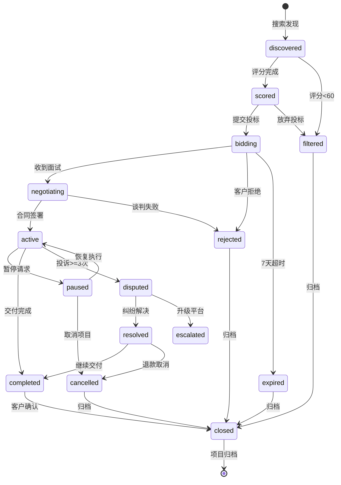

# 需求分析文档：接单AI代理系统

> **版本**: 2.1.0
> **创建日期**: 2026-02-28
> **修订日期**: 2026-03-01
> **状态**: 深度分析优化版 (基于架构评审调整指标、补充风险、优化结构)
> **评估评分**: 合理性 7.5/10 | 严谨性 7/10 | 可实施性 8/10

---

## 1. 执行摘要

### 1.1 项目目标与核心价值

本项目旨在构建端到端自动化的接单AI代理系统，实现"商务-技术-运营"三位一体的自动化闭环。

**核心目标**:
- 7×24小时无人值守运行
- 自主完成从项目筛选到代码交付的全流程
- 实现经济可持续性（收支平衡）

**核心价值主张**:

| 维度 | 传统外包 | 本系统 | 优势来源 |
|------|----------|--------|----------|
| **响应时效** | 工作时间内、时区限制 | 7×24小时即时响应 | 自动化运行、无疲劳 |
| **成本结构** | 固定人力成本(60-70%) | 边际成本递减(~20%算力) | 无薪资福利、效率提升 |
| **质量一致性** | 个体能力差异、人员流动 | 标准化输出、经验可继承 | 统一模型、知识沉淀 |
| **可扩展性** | 招聘培训周期长(数月) | 分钟级实例扩展 | 云原生架构 |

### 1.2 关键决策摘要

| 决策 | 选择 | 理由 |
|------|------|------|
| 架构 | 单系统(MVP) | 降低复杂度，复用现有基础设施 (~70%代码已就绪) |
| 协议 | HTTP REST | 快速实现，低频消息场景足够 |
| 平台 | Upwork优先 | API开放度高，全球最大自由职业平台 |
| 范围 | Web应用 | 技术栈成熟，自动化潜力高 |

### 1.3 关键成功指标 (务实版)

> **v2.1调整说明**: 基于架构评审，下调了部分MVP目标以确保可行性

| KPI | MVP目标 | 最终目标 | 测量方法 | 调整说明 |
|-----|---------|----------|----------|----------|
| 接单成功率 | >**10%** | >30% | `SELECT COUNT(*) FILTER (WHERE status = 'completed') * 100.0 / COUNT(*) FROM goals WHERE status IN ('completed', 'closed') AND created_at >= date('now', '-1 month')` | 原15%对新账号冷启动过于乐观；分母改为仅统计进入执行阶段的项目 |
| 交付准时率 | >80% | >85% | `SELECT COUNT(*) FILTER (WHERE completed_at <= deadline AND client_delay_hours = 0) * 100.0 / COUNT(*) FROM goals WHERE status = 'completed'` | 排除客户导致的延期 |
| 客户满意度 | >3.5 | >4.0 | `SELECT AVG(score) FROM reputation WHERE created_at >= date('now', '-1 month')` | - |
| 运营成本占比 | <40% | <30% | `SELECT (SUM(cost_cents) FILTER (WHERE type = 'inference') + SUM(platform_fee_cents)) * 100.0 / SUM(CASE WHEN type IN ('transfer_in','credit_purchase') THEN amount_cents ELSE 0 END) FROM transactions WHERE created_at >= date('now', '-3 months')` | - |
| 系统可用性 | >**95%** | >99.5% | `SELECT COUNT(*) FILTER (WHERE result = 'success') * 100.0 / COUNT(*) FROM heartbeat_history WHERE started_at >= datetime('now', '-30 days')` | 原99%对单点架构过于激进 |
| 测试覆盖率 | >**50%** | >90% | `vitest --coverage` | 原70%在2-3周MVP内不现实 |

---

## 2. 产品定义

### 2.1 系统边界与职责

**系统负责**:
- ✅ **Web应用开发**: 企业官网/CMS、电商平台、SaaS MVP、RESTful API
- ✅ **项目类型**: 标准化Web应用（专注React/Next.js/TypeScript技术栈）
- ✅ **平台集成**: Upwork（首要优先级）

**系统不负责**:
- ❌ 大规模分布式系统
- ❌ 安全关键系统（医疗/金融核心/工业控制）
- ❌ 高度定制化创意设计
- ❌ 移动端原生应用开发
- ❌ 底层基础设施/运维工具

### 2.2 目标客户画像 (ICP)

**理想客户特征**:

| 维度 | 标准 | 权重 | 评分方法 | 数据来源 |
|------|------|------|----------|----------|
| **企业规模** | 中小企业(10-200人)或个人创业者 | 20% | 10-200人: 100分, <10人或>200人: 50分, >500人: 0分 | Upwork公司信息 |
| **技术成熟度** | 有基本技术背景，能提供清晰需求 | 15% | 历史项目描述技术细节清晰度评分 | NLP分析历史项目描述 |
| **预算范围** | $1000-$30000的项目 | 20% | $1K-30K: 100分, $500-1K或$30K-50K: 60分, <$500: 0分 | 项目报价区间 |
| **付款记录** | 历史付款率>90% | 20% | 付款率 × 100 | Upwork付款验证API |
| **沟通响应** | 平均响应时间<12小时 | 15% | <12h: 100分, 12-24h: 60分, >24h: 20分 | 消息历史分析 |
| **长期潜力** | 有重复需求或多项目可能 | 10% | 公司规模+业务类型评估 | 公司信息+项目类型分析 |

**非目标客户** (明确排除):
- **大型企业** (>500人): 决策流程复杂、审批周期长、需求变更频繁
- **低预算项目** (<$500): 成本覆盖风险高、利润率不足以支撑运营
- **低评分历史客户** (<3.0分): 纠纷风险高、沟通成本大
- **首次发布大项目** (> $50,000的新客户): 风险不可控、缺乏信任基础

**ICP评分应用**:
- 项目筛选算法中的"客户质量"维度直接使用ICP评分
- ICP评分 < 60分的客户自动过滤
- ICP评分 > 80分的客户进入快速通道

### 2.3 客户旅程地图

#### 阶段1: 项目发布
- **客户行为**: 在Upwork平台发布项目需求，描述技术栈、预算、时间要求
- **系统触点**: Upwork项目列表、搜索结果展示
- **客户情绪**: 期待遇到合适的开发者，略带焦虑（担心项目被理解）
- **成功指标**: 需求被准确理解、收到专业且有针对性的投标

#### 阶段2: 投标筛选
- **客户行为**: 查看收到的投标、评估候选人资质、比较报价和方案
- **系统触点**: 投标消息、profile展示、技术案例展示
- **客户情绪**: 比较不同选项时的犹豫、对技术方案的审慎评估
- **成功指标**: 快速收到专业响应、技术方案清晰展示相关经验

#### 阶段3: 合同签署
- **客户行为**: 确认合作意向、签署合同、设置里程碑付款
- **系统触点**: 合同确认通知、人工确认流程
- **客户情绪**: 期待项目启动，略有不安全感（首次与AI合作）
- **成功指标**: 合同条款清晰明确、人工确认流程顺畅、风险条款被充分解释

#### 阶段4: 项目执行
- **客户行为**: 等待进度更新、提供反馈、回答澄清问题
- **系统触点**: 进度报告（每4小时）、消息更新、里程碑通知
- **客户情绪**: 从最初的不确定性逐步建立信任、对透明度的满意度
- **成功指标**: 定期收到进度更新（至少每4小时）、问题在24小时内得到响应、可预测的交付时间线

#### 阶段5: 交付验收
- **客户行为**: 审核交付物、测试功能、提供反馈意见
- **系统触点**: 交付通知、演示链接、测试报告、部署文档
- **客户情绪**: 期待查看成果、谨慎评估质量
- **成功指标**: 交付物符合预期需求、测试全部通过、文档完整清晰、演示顺利进行

#### 阶段6: 项目收尾
- **客户行为**: 评价反馈、确认最终付款、考虑复购可能性
- **系统触点**: 评价请求、发票发送、复购意向询问
- **客户情绪**: 满意/不满（取决于交付质量）、对整体合作的总结评估
- **成功指标**: 评分>4.0/5.0、表达复购意向或推荐意愿、支付确认无纠纷

### 2.4 明确排除范围

| 排除类别 | 具体内容 | 排除原因 |
|----------|----------|----------|
| **技术领域** | 区块链核心、AI模型训练、嵌入式开发 | 技术复杂度高，自动化困难 |
| **项目规模** | >$50,000项目、团队协作项目 | 风险不可控，需人工主导 |
| **安全等级** | 医疗设备、金融交易核心、工业控制 | 合规要求高，责任重大 |
| **创意类** | UI/UX设计、品牌设计、视频制作 | 主观性强，AI能力有限 |

---

## 3. 功能需求

### 3.1 核心功能流程 (端到端)

```
项目发现 → 评分筛选 → 投标管理 → 合同确认 → 需求分析 → 代码生成 → 测试验证 → 交付部署 → 客户验收 → 复购跟进
```

### 3.2 Automaton功能 (治理层)

#### 3.2.1 项目筛选算法

**多因子加权评分模型**:

| 评估维度 | 权重 | 说明 |
|----------|------|------|
| 技术匹配度 | 25% | 技术栈重合度（React/TypeScript优先） |
| 预算合理性 | 20% | 报价/工作量比值、付款记录 |
| 交付可行性 | 20% | 时间约束、需求清晰度 |
| 客户质量 | 20% | Upwork历史评分、纠纷记录 |
| 战略价值 | 15% | 技能扩展、长期合作潜力 |

**评分输出**:
- 高分项目 (>80分) → 自动投标
- 中分项目 (60-80分) → 人工复核（项目启动前需确认）
- 低分项目 (<60分) → 直接过滤

#### 3.2.2 动态报价策略

**报价计算公式**:
```
报价 = 基准成本 × (1 + 风险溢价) × (1 + 利润率) × 紧急系数 × (1 + 平台佣金系数)
```

| 因子 | 计算方式 | 范围 | 说明 |
|------|----------|------|------|
| **基准成本** | 预估工时 × 时薪 | **$60-100/h** | v2.1缩小范围，减少报价波动 |
| **风险溢价** | `(100 - 需求清晰度评分) / 100 × 0.3` | 0-30% | 明确计算公式 |
| **利润率** | 目标利润率 | 20-40% | - |
| **紧急系数** | `1 + max(0, (7 - 剩余天数) × 0.1)` | 1.0-1.5 | 避免与风险溢价双重叠加，取max |
| **平台佣金** | Upwork 10-20% | 1.1-1.2 | **v2.1新增**，需计入报价 |

**报价示例**:
```
项目: React电商前端，预估40小时，7天交付，需求清晰度70分
基准成本 = 40h × $80/h = $3200
风险溢价 = (100-70)/100 × 0.3 = 9%
紧急系数 = 1.0 (7天不触发)
平台佣金 = 1.1 (10%)
报价 = $3200 × 1.09 × 1.25 × 1.0 × 1.1 = $4,796
```

#### 3.2.3 客户分级管理

| 等级 | 定义 | 累计消费阈值 | 权益 | 服务标准 |
|------|------|-------------|------|----------|
| **金牌** | 高价值长期合作客户 | >$10,000 | 优先响应、10%折扣 | 1小时响应 |
| **银牌** | 稳定合作客户 | >$3,000 | 优先排队、5%折扣 | 4小时响应 |
| **铜牌** | 正常合作客户 | >$500 | 标准服务 | 24小时响应 |
| **新客户** | 首次合作 | <$500 | 评估期服务 | 48小时响应 |

#### 3.2.4 经济生存与资源管理

**生存状态级别**:

| 状态 | 触发条件 | 系统行为 |
|------|----------|----------|
| **正常运营** | 生存指数 > 70，余额>3个月成本 | 全功能运行，积极拓展 |
| **省电模式** | 生存指数 40-70，余额1-3个月 | 降级低成本模型，暂停非核心功能 |
| **求生模式** | 生存指数 < 40，余额<1个月 | 激进接单，紧急融资 |

**多项目并发资源管理**:

| 项目优先级 | 资源配额 | LLM调用限制 | 适用场景 |
|------------|----------|-------------|----------|
| **P0: 紧急** | 40% | 无限制 | Deadline<24小时、VIP客户 |
| **P1: 高** | 30% | 100K tokens/h | 正常执行中项目 |
| **P2: 中** | 20% | 50K tokens/h | 新项目评估 |
| **P3: 低** | 10% | 20K tokens/h | 候补队列 |

**并发限制**: 最大并发项目数5个

#### 3.2.5 人工介入环节

| 环节 | 触发条件 | 介入方式 | SLA | 超时处理 |
|------|----------|----------|-----|----------|
| **合同签署** | 所有合同 | 需人工确认 | <12小时 | 超时自动取消投标 |
| **大额支出** | >$100 | 需人工批准 | <2小时 | 超时自动拒绝 |
| **项目启动** | 每个新项目 | 需人工确认 | <24小时 | 超时自动启动（可配置） |
| **退款请求** | 客户发起退款 | 人工审核 | <48小时 | 超时自动部分退款（50%） |
| **纠纷升级** | 客户投诉>3次 | 人工介入 | <4小时 | 超时暂停+通知平台 |

#### 3.2.6 退款与纠纷处理

**退款规则**:
- **未开始项目**: 全额退款（扣除平台手续费）
- **进行中项目**: 按里程碑完成比例退款
  - 完成<25%: 退款70%
  - 完成25-50%: 退款50%
  - 完成50-75%: 退款30%
  - 完成>75%: 不支持退款

**纠纷升级流程**:

| 级别 | 触发条件 | 处理方式 | 时限 |
|------|----------|----------|------|
| **L1: 系统处理** | 初次投诉 | 自动分析、提供解决方案 | 24小时 |
| **L2: 人工介入** | L1未解决 | 客服介入调解 | 48小时 |
| **L3: 平台仲裁** | 升级至平台 | Upwork Dispute Resolution | 7-14天 |

### 3.3 Nanobot功能 (执行层)

#### 3.3.1 需求分析与沟通模块

**多轮对话澄清机制**:
1. 功能范围 - 使用示例驱动方法暴露隐含假设
2. 质量约束 - 将模糊形容词转化为可量化指标
3. 边界条件 - 识别边界情况与错误处理期望

**双层记忆系统**:
- 短期记忆: 每日笔记 `~/.nanobot/notes/YYYY-MM-DD.md`
- 长期记忆: 按主题组织的知识库（空库启动，逐步积累）

**客户沟通语言**: 双语支持（中/英自动切换）

#### 3.3.2 代码生成与开发模块

**支持技术栈**:
- 前端: React/Next.js/TypeScript/TailwindCSS
- 后端: Python/FastAPI
- 部署: Docker/K8s/Vercel

**开发工具链**:
- 文件系统操作（workspace限制）
- Shell命令执行（安全约束）
- 网页搜索（技术文档、最佳实践）

#### 3.3.3 测试与质量保证模块

**测试覆盖率要求**: **50%+ (MVP)**, 90%+ (最终)

| 测试层级 | 覆盖目标 | 质量门禁 |
|----------|----------|----------|
| 单元测试 | 函数/方法级 | 行覆盖率>**50%**，分支覆盖率>40% |
| 集成测试 | 模块协作 | 核心接口100%覆盖 |
| E2E测试 | 完整用户流程 | 关键路径通过率100% |

#### 3.3.4 反馈迭代与知识管理

**需求变更处理**: 变更影响分析、版本对比、客户确认

**项目复盘流程**:
- 每个项目完成后自动生成复盘报告
- 复盘维度: 技术挑战、沟通问题、时间估算准确性、客户满意度
- 成功模式沉淀到知识库、失败案例归因分析

### 3.4 异常处理与容错机制

> **v2.1新增**: 补充遗漏的异常场景处理

#### 3.4.1 网络与API故障处理

| 场景 | 触发条件 | 处理策略 | 恢复机制 |
|------|----------|----------|----------|
| **网络分区** | 网络中断 > 5min | 1. 本地缓存操作<br>2. 暂停心跳上报<br>3. 进入离线模式 | 重连后同步本地缓存 |
| **Upwork API不可用** | 连续3次失败 | 1. 切换RSS订阅模式<br>2. 暂停投标操作 | API恢复后自动切换 |
| **LLM API降级** | 主模型不可用 | 1. 切换备用模型<br>2. 降级到低成本模型 | 主模型恢复后切换 |

#### 3.4.2 客户交互异常

| 场景 | 触发条件 | 处理策略 | 升级机制 |
|------|----------|----------|----------|
| **客户失联** | 72小时无响应 | 1. 发送提醒消息<br>2. 暂停非关键工作<br>3. 记录等待时间 | 7天后自动暂停项目 |
| **需求变更冲突** | 变更影响>30%工期 | 1. 重新评估报价<br>2. 人工介入确认<br>3. 更新合同条款 | 客户拒绝则协商取消 |
| **部分交付** | 里程碑部分完成 | 1. 按完成比例结算<br>2. 记录未完成项<br>3. 协商后续处理 | 客户可接受部分或继续 |

#### 3.4.3 系统内部故障

| 场景 | 触发条件 | 处理策略 | 告警级别 |
|------|----------|----------|----------|
| **LLM输出异常** | 格式错误/幻觉 | 1. 重试(最多3次)<br>2. 切换模型<br>3. 人工介入 | P1 |
| **数据库锁定** | 写入超时 > 10s | 1. 重试队列<br>2. 降级到内存缓存 | P2 |
| **资源耗尽** | 内存/CPU > 90% | 1. 暂停新任务<br>2. 清理缓存<br>3. 降级运行 | P0 |

#### 3.4.4 熔断与降级策略

```typescript
// 熔断器配置
const circuitBreaker = {
  // API熔断
  api: {
    failureThreshold: 5,      // 连续失败5次触发
    resetTimeout: 60000,      // 60秒后尝试恢复
    fallback: 'cached_data'   // 降级到缓存
  },
  // LLM熔断
  llm: {
    failureThreshold: 3,
    resetTimeout: 30000,
    fallback: 'backup_model'  // 降级到备用模型
  }
};
```

### 3.5 双系统协同接口

#### 3.4.1 Genesis Prompt标准接口

```typescript
interface GenesisPrompt {
  // 项目标识
  projectId: string;           // "upwork-123456"
  platform: string;            // "upwork"

  // 需求摘要
  requirementSummary: string;  // "开发一个React电商前端"
  technicalConstraints: {
    requiredStack: string[];   // ["React", "TypeScript", "TailwindCSS"]
    prohibitedStack: string[]; // ["jQuery"]
    targetPlatform: string;    // "Vercel"
  };

  // 商务条款
  contractTerms: {
    totalBudget: number;       // 50000 (cents)
    deadline: string;          // ISO 8601
    milestones: Milestone[];
  };

  // 资源限制
  resourceLimits: {
    maxTokensPerTask: number;  // 1000000
    maxCostCents: number;      // 15000
    maxDurationMs: number;     // 86400000
  };
}
```

#### 3.4.2 进度报告与状态同步

| 报告类型 | 频率 | 内容 |
|----------|------|------|
| 进度报告 | 每4小时 | 完成步骤、下一步、阻塞项 |
| 资源报告 | 每日 | LLM调用次数、成本消耗 |
| 异常报告 | 实时 | 错误详情、影响范围 |
| 质量报告 | 里程碑 | 测试覆盖率、代码质量指标 |

### 3.5 项目状态流转

#### 3.5.1 核心状态定义 (MVP 10种)

> **v2.1新增**: `expired`、`cancelled` 状态，修复状态机死锁问题

| 状态 | 说明 | 可转换至 | 触发条件 |
|------|------|----------|----------|
| **discovered** | 发现项目，待评分 | scored, filtered | RSS/API获取新项目 |
| **scored** | 已评分，待决策 | bidding, filtered | 评分完成 |
| **bidding** | 已提交投标，等待响应 | negotiating, rejected, **expired** | 投标提交成功 |
| **negotiating** | 面试/谈判中 | contracted, rejected | 收到面试邀请 |
| **active** | 执行中 | paused, completed, disputed | 合同签署确认 |
| **paused** | 已暂停 | active, **cancelled** | 客户/系统暂停 |
| **completed** | 已完成，待客户确认 | closed | 交付物提交 |
| **disputed** | 纠纷中 | **resolved**, escalated | 客户投诉>3次 |
| **resolved** | 纠纷已解决 | completed, cancelled | **v2.1新增**，解决后明确流向 |
| **expired** | 投标/合同超时 | closed | **v2.1新增**，7天无响应 |
| **rejected** | 投标/谈判失败 | closed | 客户拒绝 |
| **cancelled** | 项目取消 | closed | 双方同意取消 |
| **filtered** | 评分未通过 | closed | 评分<60 |
| **closed** | 已关闭（终态） | - | 项目归档 |

#### 3.5.2 状态转换表

| 起始状态 | 目标状态 | 触发事件 | 条件 |
|----------|----------|----------|------|
| discovered | scored | 评分完成 | - |
| discovered | filtered | 评分完成 | score < 60 |
| scored | bidding | 提交投标 | score >= 60 && 人工确认(MVP) |
| scored | filtered | 放弃投标 | score < 80 && 选择放弃 |
| bidding | negotiating | 收到面试 | 客户响应 |
| bidding | rejected | 客户拒绝 | 客户明确拒绝 |
| bidding | expired | 超时 | 7天无响应 |
| negotiating | active | 合同签署 | 人工确认 |
| negotiating | rejected | 谈判失败 | 无法达成一致 |
| active | paused | 暂停请求 | 客户/系统触发 |
| active | completed | 交付完成 | 所有里程碑完成 |
| active | disputed | 客户投诉 | 投诉计数 >= 3 |
| paused | active | 恢复执行 | 暂停原因解决 |
| paused | cancelled | 取消项目 | 双方同意 |
| completed | closed | 客户确认 | 客户验收通过 |
| disputed | resolved | 纠纷解决 | 达成解决方案 |
| disputed | escalated | 升级平台 | L2处理失败 |
| resolved | completed | 继续交付 | 解决后继续 |
| resolved | cancelled | 取消项目 | 解决为退款 |
| expired/rejected/cancelled/filtered | closed | 归档 | 自动/手动归档 |

#### 3.5.3 状态流转图



---

## 4. 非功能需求

### 4.1 性能需求

| 指标 | 目标值 | 验证方法 |
|------|--------|----------|
| API响应时间 | <500ms P99 | `SELECT PERCENTILE(latency_ms, 99) FROM inference_costs` |
| 代码生成速度 | <30s/模块 | 集成测试计时 |
| 测试执行时间 | <5min/套 | CI流水线监控 |
| 并发项目处理 | >=5个 | 负载测试 |

### 4.2 安全需求

| 需求 | 实现 |
|------|------|
| OWASP Top 10防护 | 输入验证、SQL参数化、XSS过滤 |
| 端到端加密 | ECDH密钥交换 + AES-256-GCM |
| 审计日志 | 保留90天，`modifications`表 |
| 密钥管理 | 环境变量，定期轮换 |

**账户安全措施**:

| 安全措施 | 实现方式 | 触发条件 |
|----------|----------|----------|
| **异常登录检测** | IP/设备指纹分析 | 异地登录、新设备 |
| **操作审计** | 全量日志记录 | 所有敏感操作 |
| **定期密码轮换** | 90天强制更新 | 到期提醒 |

### 4.3 可靠性与SLA

| 指标 | MVP目标 | 最终目标 | 计费补偿 |
|------|---------|----------|----------|
| **系统可用性** | **95%** | 99.5% | 每降0.1%退款10% |
| **API响应时间** | P99<500ms | P99<200ms | 超出退款5% |
| **项目交付准时率** | 80% | 90% | 延误按比例退款 |
| **数据零丢失** | 100% | 100% | 数据丢失全额退款 |

> **v2.1说明**: MVP可用性95%考虑单点故障风险，Phase 3升级到99.5%

### 4.4 可观测性

| 指标 | 采集方法 | 告警阈值 |
|------|----------|----------|
| 消息延迟 | WebSocket时间戳差值 | P99 > 1000ms |
| 连接健康 | `getConnectionStats()` | 断开 > 5min |
| 消息失败率 | DLQ记录 | > 5% |

### 4.5 埋点与A/B测试

#### 4.5.1 核心转化漏斗

| 漏斗阶段 | 埋点事件 | 目标转化率 |
|----------|----------|------------|
| **曝光** | `project_viewed` | 100% (基准) |
| **投标** | `bid_submitted` | >15% |
| **面试** | `interview_invited` | >30% |
| **成单** | `contract_signed` | >50% |
| **交付** | `project_completed` | >90% |

#### 4.5.2 关键埋点事件

| 事件名称 | 触发时机 | 优先级 |
|----------|----------|--------|
| **project_scored** | 项目评分完成 | P0 |
| **bid_created** | 投标创建 | P0 |
| **llm_call** | LLM调用 | P0 |
| **error_occurred** | 错误发生 | P0 |
| **manual_intervention** | 人工介入 | P1 |

#### 4.5.3 A/B测试框架

| 实验类型 | 变量 | 成功指标 | 最小样本量 |
|----------|------|----------|------------|
| **投标消息** | 消息模板 | 面试率 | 100次/组 |
| **定价策略** | 报价系数 | 成单率、利润率 | 50次/组 |
| **投标时机** | 延迟时间 | 面试率 | 100次/组 |

---

## 5. 数据需求

### 5.1 核心数据模型 (MVP 4表)

#### 5.1.1 goals 表 (项目目标)

```sql
CREATE TABLE goals (
  id TEXT PRIMARY KEY,              -- ULID
  project_id TEXT NOT NULL,         -- 关联项目ID
  title TEXT NOT NULL,              -- 目标标题
  description TEXT,                 -- 详细描述
  status TEXT NOT NULL,             -- 状态
  priority INTEGER DEFAULT 0,       -- 优先级 (0-10)
  budget_cents INTEGER NOT NULL,    -- 预算(分)
  cost_cents INTEGER DEFAULT 0,     -- 实际成本(分)
  deadline TEXT,                    -- 截止时间 ISO 8601
  created_at TEXT NOT NULL,
  updated_at TEXT NOT NULL,
  started_at TEXT,
  completed_at TEXT,
  metadata TEXT                     -- JSON扩展字段
);
CREATE INDEX idx_goals_status ON goals(status);
CREATE INDEX idx_goals_project_id ON goals(project_id);
```

#### 5.1.2 projects 表 (项目详情)

```sql
CREATE TABLE projects (
  id TEXT PRIMARY KEY,              -- upwork-123456
  platform TEXT NOT NULL,           -- upwork/fiverr/...
  platform_project_id TEXT NOT NULL,
  title TEXT NOT NULL,
  description TEXT,
  client_id TEXT,
  status TEXT NOT NULL,
  score INTEGER,                    -- 评分(0-100)
  score_factors TEXT,               -- JSON评分因子
  bid_id TEXT,
  contract_id TEXT,
  created_at TEXT NOT NULL,
  updated_at TEXT NOT NULL,
  FOREIGN KEY (client_id) REFERENCES clients(id)
);
CREATE UNIQUE INDEX idx_projects_platform_id ON projects(platform, platform_project_id);
```

#### 5.1.3 clients 表 (客户信息)

```sql
CREATE TABLE clients (
  id TEXT PRIMARY KEY,
  platform TEXT NOT NULL,
  platform_client_id TEXT NOT NULL,
  name TEXT,
  company TEXT,
  rating REAL,                      -- 历史评分
  total_spent_cents INTEGER DEFAULT 0,
  payment_verified INTEGER DEFAULT 0,
  country TEXT,
  tier TEXT DEFAULT 'new',          -- gold/silver/bronze/new
  created_at TEXT NOT NULL,
  updated_at TEXT NOT NULL,
  metadata TEXT
);
CREATE UNIQUE INDEX idx_clients_platform_id ON clients(platform, platform_client_id);
```

#### 5.1.4 transactions 表 (交易记录)

```sql
CREATE TABLE transactions (
  id TEXT PRIMARY KEY,
  goal_id TEXT,
  type TEXT NOT NULL,               -- transfer_in/transfer_out/inference/credit_purchase
  amount_cents INTEGER NOT NULL,
  cost_cents INTEGER DEFAULT 0,
  platform_fee_cents INTEGER DEFAULT 0, -- 平台费用
  description TEXT,
  created_at TEXT NOT NULL,
  metadata TEXT,
  FOREIGN KEY (goal_id) REFERENCES goals(id)
);
CREATE INDEX idx_transactions_type ON transactions(type);
CREATE INDEX idx_transactions_created_at ON transactions(created_at);
```

### 5.2 存储策略

| 数据类别 | 存储方案 | 保留期限 |
|----------|----------|----------|
| 项目数据 | SQLite | 项目结束后90天 |
| 客户数据 | 加密存储 | 合同结束后3年 |
| 运营日志 | 时序数据库 | 90天热 + 1年冷 |
| 知识库 | 向量数据库 | 永久 |

### 5.3 安全与隐私

- 敏感数据加密: AES-256-GCM
- 密钥存储: 环境变量（不提交代码库）
- 访问控制: DID身份验证
- 自动清理: 过期数据定期归档
- 备份策略: 每日增量 + 每周全量

---

## 6. 接口需求

### 6.1 双系统通信协议

**MVP方案: HTTP REST + JSON**

| 接口 | 方法 | 端点 | 用途 |
|------|------|------|------|
| 任务创建 | POST | `/api/tasks` | 发送Genesis Prompt |
| 进度报告 | POST | `/api/progress` | Nanobot上报进度 |
| 状态查询 | GET | `/api/tasks/{id}` | 查询任务状态 |
| 资源报告 | POST | `/api/resources` | 上报资源消耗 |

**Phase 2升级**: 引入WebSocket实现实时双向通信

### 6.2 外部平台API (Upwork)

| 功能 | API端点 | 状态 |
|------|---------|------|
| 搜索项目 | `/search/jobs` | 待集成 |
| 提交投标 | `/proposals` | 待集成 |
| 获取合同 | `/contracts` | 待集成 |
| 消息通信 | `/messages` | 待集成 |

**API限流策略**:

| API类型 | 限流规则 | 处理策略 |
|---------|----------|----------|
| **搜索API** | 40次/分钟 | 令牌桶限流、智能缓存 |
| **投标API** | 20次/小时 | 智能调度、优先级队列 |
| **消息API** | 100次/小时 | 批量合并、延迟发送 |

**错误处理**:

| 错误码 | 处理方式 | 重试策略 |
|--------|----------|----------|
| **429** | 指数退避 | 1s, 2s, 4s, 8s |
| **401** | 刷新Token | 立即重试1次 |
| **500** | 重试3次 | 2s, 4s, 8s |
| **503** | 切换备用 | 立即重试1次 |

### 6.3 客户沟通渠道

**支持渠道**: Telegram, Slack, Email, Discord

### 6.4 运维接口

| 接口 | 端点 | 用途 |
|------|------|------|
| 健康检查 | `/health` | K8s liveness/readiness |
| 指标采集 | `/metrics` | Prometheus |
| 配置热更新 | `/config/reload` | 运维操作 |
| 应急停机 | `/emergency/stop` | 一键暂停所有自动化操作 |

---

## 7. 风险与约束

### 7.1 技术约束

| 约束 | 说明 |
|------|------|
| 运行环境 | Node.js 20+ / Python 3.11+ |
| 包管理 | pnpm 10.x / hatch |
| 离线支持 | 网络中断时降级运行 |
| 测试覆盖 | **50%+ (MVP)**, 90%+ (最终) |

### 7.2 业务约束

| 约束 | 值 |
|------|-----|
| 启动资金 | $500-1000 |
| 月度运营预算 | $200-500 |
| 单项目预算上限 | $50,000 |
| 目标平台 | Upwork |
| 任务类型 | 仅Web应用 |

### 7.3 关键风险矩阵

> **v2.1更新**: 新增R7-R11风险，调整R3/R6等级

#### 致命风险 (P0) - 生存威胁

| 风险 | 触发条件 | 缓解措施 | 监控指标 |
|------|----------|----------|----------|
| **R1: Upwork账号封禁** | 平台检测自动化行为 | 1. 投标前人工确认<br>2. 限制投标频率<br>3. 研究ToS合规性 | 账号状态检查 |
| **R2: Upwork ToS违规** | 自动化投标违反条款 | 1. 法务咨询<br>2. 声明AI辅助开发<br>3. 保留人工介入点 | ToS变更监控 |
| **R3: 经济失败检测过晚** | **14天**无收入 | ~~30天~~→14天预警；自动切换求生模式 | `生存指数 < 40` |
| **R6: 质量危机** | 投诉率>5% | ~~10%~~→5%触发；强制人工Review；暂停新投标 | `投诉率 = disputes / completed` |
| **R7: LLM输出不可控** | 代码生成格式错误/幻觉 | 结构化输出约束(JSON Schema)；重试机制(3次)；人工代码Review | `代码编译失败率` |
| **R9: 客户数据泄露** | 日志/消息暴露敏感信息 | 数据脱敏；访问控制(DID)；敏感字段加密 | 审计日志扫描 |

#### 高风险 (P1) - 业务影响

| 风险 | 触发条件 | 缓解措施 | 监控指标 |
|------|----------|----------|----------|
| **R5: API单点故障** | Upwork/LLM API不可用 | 多LLM提供商(OpenAI/Anthropic)；本地模型备份 | API响应时间/错误率 |
| **R8: 知识产权纠纷** | 生成代码侵权 | 代码相似度检测；使用开源许可证检查 | 代码查重率 |
| **R10: 依赖服务中断** | OpenAI/Upwork服务不可用 | 多提供商备份；降级运行模式 | 服务健康检查 |
| **R11: 配置漂移** | 环境配置不一致 | 配置版本控制(Git)；配置校验启动检查 | 配置diff告警 |

#### 中风险 (P2) - 可控影响

| 风险 | 触发条件 | 缓解措施 | 监控指标 |
|------|----------|----------|----------|
| **R4: 人工介入SLA** | 12小时合同确认 | 增加工作时段配置；超时自动处理 | SLA达成率 |

#### 风险等级调整说明

| 风险 | 原等级 | 新等级 | 调整原因 |
|------|--------|--------|----------|
| R3: 经济失败 | P1 | **P0** | 生存威胁，需提前预警 |
| R6: 质量危机 | P1 | **P0** | 口碑影响难以恢复 |
| R4: 人工SLA | P1 | **P2** | 12h已调整为合理范围 |

### 7.4 隐含假设与验证

| 隐含假设 | 风险等级 | 验证建议 |
|----------|----------|----------|
| Upwork允许自动化投标 | 🔴 高 | 研究ToS，咨询法务 |
| 客户愿意与AI合作 | 🟠 中 | 小规模测试验证 |
| AI生成代码可直接交付 | 🔴 高 | 增加人工Review环节 |
| 单一开发者可维护系统 | 🟠 中 | 评估工作量 |

---

## 8. 验收标准

### 8.1 功能验收 (GWT格式)

**AC-001: 项目自动筛选**
- **Given**: Upwork上有10个新发布的Web开发项目
- **When**: 系统执行每日筛选任务
- **Then**: 系统对所有10个项目进行ICP评分，评分>80自动投标，60-80人工复核，<60过滤

**AC-002: 投标消息生成**
- **Given**: 项目需求为"React电商网站开发，预算$5000，2周交付"
- **When**: 系统生成投标消息
- **Then**: 消息包含技术方案、相关案例、报价范围、预计工期

**AC-003: Genesis Prompt解析**
- **Given**: Automaton决定启动项目并生成Genesis Prompt
- **When**: 发送Genesis Prompt到执行层
- **Then**: 正确解析projectId、技术约束、预算和里程碑

**AC-004: 需求分析与澄清**
- **Given**: 客户需求描述为"开发一个用户管理系统"
- **When**: 执行需求分析
- **Then**: 生成至少5个澄清问题，识别边界条件

**AC-005: 代码生成与测试**
- **Given**: 需求分析完成
- **When**: 执行代码生成
- **Then**: 生成可运行代码，单元测试覆盖率>**50%**（MVP），所有测试通过

**AC-006: 进度报告**
- **Given**: 项目处于执行状态
- **When**: 每4小时报告周期
- **Then**: 生成进度报告包含已完成步骤、下一步计划、阻塞项

**AC-007: 人工介入处理**
- **Given**: 项目状态为待启动
- **When**: 人工确认启动
- **Then**: 状态更新为active，触发任务执行

**AC-008: 退款处理**
- **Given**: 客户在项目进行中发起退款
- **When**: 系统收到退款请求
- **Then**: 创建退款工单，暂停项目，通知人工审核

### 8.2 性能验收

| 指标 | 目标 | 验证方法 |
|------|------|----------|
| 交付周期 | <2周（标准化Web应用） | `SELECT AVG(completion_days) FROM goals` |
| 并发能力 | >=5个项目 | 负载测试 |
| 效率提升 | >30% vs人工 | 成本对比分析 |

### 8.3 安全验收

| 标准 | 验收条件 |
|------|----------|
| OWASP扫描 | 通过OWASP ZAP安全扫描 |
| 数据加密 | 敏感数据加密存储验证 |
| 审计完整 | `SELECT COUNT(*) FROM modifications` 有记录 |

### 8.4 交付物清单

- [ ] 可执行程序（Docker镜像）
- [ ] K8s部署配置
- [ ] API文档
- [ ] 运维手册
- [ ] 测试报告

---

## 9. 实施路线图

> **v2.1重构**: 优化Phase边界，聚焦核心假设验证

### 9.1 Phase 1: 投标自动化 (2周)

**核心目标**: 验证"客户愿意与AI合作"这一关键假设

**聚焦范围**:

| 功能模块 | 实现内容 | 现有代码覆盖 |
|----------|----------|--------------|
| **项目发现** | RSS订阅 + 3维度评分 | 90% (scorer.ts) |
| **投标生成** | 模板投标 + 人工确认 | 80% (bid-generator.ts) |
| **合同确认** | 人工确认(24h SLA) | 30% (需新建通知系统) |
| **数据表迁移** | goals/projects/clients/transactions | 95% (schema.ts V11) |

**MVP不做**:
- ❌ 代码生成 (延后Phase 2)
- ❌ 自动投标 (保持人工确认)
- ❌ A/B测试 (延后Phase 3)

**技术架构**:
- 单TypeScript进程 (复用automaton)
- HTTP REST通信 (4个接口)
- SQLite存储
- 无Python执行层

**验收标准**:
- [ ] 每日获取10+项目并评分
- [ ] 投标人工确认率100%
- [ ] 提交5+投标，获得1+面试
- [ ] 核心路径测试50%+

**关键验证点**:
1. 面试率 > 20% → 证明投标质量可接受
2. 客户对AI开发的接受度 → 决定是否继续Phase 2

### 9.2 Phase 2: 执行自动化 (3周)

**前置条件**: Phase 1验证通过（获得至少1个合同）

**核心目标**: 验证"AI代码生成可交付"

**新增功能**:

| 功能模块 | 实现内容 | 优先级 |
|----------|----------|--------|
| **代码生成** | 模板化生成 + 人工Review | P0 |
| **进度报告** | 每4小时自动报告 | P1 |
| **需求澄清** | 多轮对话机制 | P1 |
| **WebSocket** | 实时双向通信 | P2 |

**代码生成策略**:
1. **MVP**: 仅支持3种模板项目类型
   - React Landing Page
   - REST API (FastAPI)
   - Admin Dashboard
2. **质量门禁**:
   - 编译通过 + Lint通过 + 50%测试覆盖
   - 人工Review后才能交付

**验收标准**:
- [ ] 完成交付1+项目
- [ ] 客户评分 > 3.5
- [ ] 代码编译通过率 > 90%

### 9.3 Phase 3: 闭环优化 (4周)

**前置条件**: Phase 2交付2+项目，评分>3.5

**核心目标**: 提升自动化程度和盈利能力

**新增功能**:

| 功能模块 | 实现内容 | 优先级 |
|----------|----------|--------|
| **A/B测试** | 投标模板/定价策略 | P1 |
| **知识库** | 项目经验沉淀 | P1 |
| **自动投标** | 高分项目(>85)自动 | P2 |
| **多平台** | Fiverr集成 | P2 |

**技术升级**:
- 向量数据库 (知识库)
- K8s水平扩展
- 灰度发布能力

**验收标准**:
- [ ] 接单成功率 > 15%
- [ ] 运营成本占比 < 40%
- [ ] 月收入 > $1000

### 9.4 现有代码复用评估

| 模块 | 现有文件 | 覆盖度 | Phase 1可用 |
|------|----------|--------|-------------|
| 项目评分 | `automaton/src/upwork/scorer.ts` | 95% | ✅ |
| 投标生成 | `automaton/src/biz/bid-generator.ts` | 85% | ✅ |
| 进度报告 | `nanobot/interagent/progress_reporter.py` | 100% | Phase 2 |
| Genesis Prompt | `automaton/src/interagent/genesis-prompt.ts` | 100% | Phase 2 |
| 心跳调度 | `automaton/src/heartbeat/scheduler.ts` | 100% | ✅ |
| 生存监控 | `automaton/src/survival/monitor.ts` | 100% | ✅ |
| Policy Engine | `automaton/src/agent/policy-engine.ts` | 100% | ✅ |
| Upwork API | `nanobot/channels/upwork/api_client.py` | 70% | 需升级 |
| **代码生成** | ❌ 无 | 0% | Phase 2新建 |

**总体评估**: 约70%基础设施已就绪，Phase 1聚焦投标自动化是务实选择

---

## 10. 架构决策记录 (ADR)

### ADR-001: 双系统通信协议选择

| 项目 | 内容 |
|------|------|
| **Decision** | MVP使用HTTP REST + JSON |
| **Drivers** | 快速实现、降低调试复杂度 |
| **Alternatives** | ANP协议、WebSocket实时通信 |
| **Why Chosen** | 低频消息场景HTTP足够，Phase 2可升级 |
| **Consequences** | 安全性需额外实现(API Key + HTTPS) |

### ADR-002: 目标平台选择

| 项目 | 内容 |
|------|------|
| **Decision** | Upwork作为首要集成平台 |
| **Drivers** | API开放度高、全球最大自由职业平台 |
| **Why Chosen** | 用户确认优先级 |

### ADR-003: 任务类型聚焦

| 项目 | 内容 |
|------|------|
| **Decision** | 专注于Web应用开发 |
| **Drivers** | 技术栈成熟、需求模式可预测、自动化潜力高 |
| **Why Chosen** | 用户确认范围，降低初期复杂度 |

### ADR-004: MVP架构简化

| 项目 | 内容 |
|------|------|
| **Decision** | MVP阶段采用单系统架构(TypeScript) |
| **Drivers** | 降低复杂度、快速验证核心假设 |
| **Alternatives** | 双系统架构、全Python架构 |
| **Why Chosen** | 复用现有automaton基础设施，减少集成成本 |
| **Consequences** | Phase 2需评估是否引入Python执行层 |

### ADR-005: 测试覆盖率策略

| 项目 | 内容 |
|------|------|
| **Decision** | MVP **50%**覆盖率，最终90%覆盖率 |
| **Drivers** | 平衡效率与质量 |
| **Alternatives** | 70%覆盖率 (原方案) |
| **Why Changed** | 2-3周MVP期内70%不现实，50%可覆盖核心路径 |
| **Consequences** | Phase 2需补充测试至70%+ |

### ADR-006: 人工介入SLA

| 项目 | 内容 |
|------|------|
| **Decision** | 合同确认12小时，项目启动24小时 |
| **Drivers** | 用户体验与可行性的平衡 |
| **Why Chosen** | 原4小时过于激进，12小时更务实 |

---

## 附录

### A. 术语表

| 术语 | 定义 |
|------|------|
| **Automaton** | 自主生存型AI经济主体（TypeScript实现） |
| **Nanobot** | 超轻量级AI代理框架（Python实现） |
| **ANP** | Agent Network Protocol，智能体网络协议 |
| **DID** | Decentralized Identifier，去中心化身份标识 |
| **Genesis Prompt** | 任务启动的标准接口格式 |
| **ICP** | Ideal Customer Profile，理想客户画像 |

### B. 参考文档

- [ANP协议规范](https://w3id.org/anp)
- [W3C DID标准](https://www.w3.org/TR/did-core/)
- [Automaton CLAUDE.md](../automaton/CLAUDE.md)
- [Nanobot CLAUDE.md](../nanobot/CLAUDE.md)
- [ANP通信设计](./anp-communication-design.md)

### C. 变更历史

| 版本 | 日期 | 变更内容 |
|------|------|----------|
| **2.1.0** | 2026-03-01 | **深度分析优化版**: 基于架构评审全面优化<br>**KPI调整**: 接单成功率15%→10%，系统可用性99%→95%，测试覆盖率70%→50%<br>**定价优化**: 缩小时薪范围($60-100)，新增平台佣金因子<br>**状态机完善**: 新增expired/resolved状态，补充状态转换表<br>**风险补充**: 新增R7-R11风险，调整R3/R6为P0<br>**路线图重构**: Phase 1聚焦投标自动化，Phase 2执行自动化<br>**异常处理**: 新增网络分区、LLM降级、客户失联等场景 |
| 2.0.0 | 2026-03-01 | **重构版**: 优化章节结构<br>- 整合附录B风险分析到第7章<br>- 新增第9章实施路线图<br>- 精简KPI为务实版<br>- 新增ADR-004/005/006 |
| 1.2.0 | 2026-03-01 | 深度分析与风险评估: 新增附录B |
| 1.1.0 | 2026-02-28 | PRD补充计划完善: 新增21项补充内容 |
| 1.0.0 | 2026-02-28 | 初始版本 |

### D. 数据表DDL完整版

**analytics_events 表 (埋点事件)**:
```sql
CREATE TABLE analytics_events (
  id TEXT PRIMARY KEY,
  event_type TEXT NOT NULL,
  timestamp TEXT NOT NULL,
  properties TEXT,                  -- JSON: 事件属性
  session_id TEXT,
  project_id TEXT,
  client_id TEXT,
  FOREIGN KEY (project_id) REFERENCES projects(id)
);
CREATE INDEX idx_analytics_events_type ON analytics_events(event_type);
CREATE INDEX idx_analytics_events_timestamp ON analytics_events(timestamp);
```

**disputes 表 (纠纷记录)**:
```sql
CREATE TABLE disputes (
  id TEXT PRIMARY KEY,
  project_id TEXT NOT NULL,
  client_id TEXT NOT NULL,
  reason TEXT NOT NULL,
  status TEXT NOT NULL,             -- open/negotiating/resolved/escalated/closed
  level INTEGER NOT NULL,           -- 1/2/3
  resolution TEXT,
  created_at TEXT NOT NULL,
  resolved_at TEXT,
  metadata TEXT,
  FOREIGN KEY (project_id) REFERENCES projects(id),
  FOREIGN KEY (client_id) REFERENCES clients(id)
);
CREATE INDEX idx_disputes_status ON disputes(status);
```

**experiments 表 (A/B测试)**:
```sql
CREATE TABLE experiments (
  id TEXT PRIMARY KEY,
  name TEXT NOT NULL,
  description TEXT,
  variants TEXT NOT NULL,           -- JSON: Variant[]
  status TEXT NOT NULL,             -- running/paused/completed
  traffic_allocation INTEGER,       -- 0-100
  success_metric TEXT NOT NULL,
  min_sample_size INTEGER DEFAULT 100,
  confidence_level REAL DEFAULT 0.95,
  started_at TEXT NOT NULL,
  ended_at TEXT,
  created_at TEXT NOT NULL
);
CREATE INDEX idx_experiments_status ON experiments(status);
```

**inference_costs 表 (LLM成本)**:
```sql
CREATE TABLE inference_costs (
  id TEXT PRIMARY KEY,
  goal_id TEXT,
  model TEXT NOT NULL,
  tokens_used INTEGER NOT NULL,
  latency_ms INTEGER NOT NULL,
  cost_cents INTEGER NOT NULL,
  created_at TEXT NOT NULL,
  metadata TEXT,
  FOREIGN KEY (goal_id) REFERENCES goals(id)
);
CREATE INDEX idx_inference_costs_created_at ON inference_costs(created_at);
```

**reputation 表 (客户评价)**:
```sql
CREATE TABLE reputation (
  id TEXT PRIMARY KEY,
  goal_id TEXT NOT NULL,
  client_id TEXT NOT NULL,
  score INTEGER NOT NULL,           -- 1-5
  feedback TEXT,
  created_at TEXT NOT NULL,
  FOREIGN KEY (goal_id) REFERENCES goals(id),
  FOREIGN KEY (client_id) REFERENCES clients(id)
);
CREATE INDEX idx_reputation_created_at ON reputation(created_at);
```

**heartbeat_history 表 (心跳记录)**:
```sql
CREATE TABLE heartbeat_history (
  id TEXT PRIMARY KEY,
  task_name TEXT NOT NULL,
  result TEXT NOT NULL,             -- success/failure
  started_at TEXT NOT NULL,
  completed_at TEXT,
  duration_ms INTEGER,
  error_message TEXT,
  metadata TEXT
);
CREATE INDEX idx_heartbeat_history_started_at ON heartbeat_history(started_at);
```

**modifications 表 (修改审计)**:
```sql
CREATE TABLE modifications (
  id TEXT PRIMARY KEY,
  table_name TEXT NOT NULL,
  record_id TEXT NOT NULL,
  operation TEXT NOT NULL,          -- INSERT/UPDATE/DELETE
  old_value TEXT,
  new_value TEXT,
  created_at TEXT NOT NULL
);
CREATE INDEX idx_modifications_created_at ON modifications(created_at);
```

### E. 沟通模板库

| 场景 | 模板类型 | 变量占位符 | 自动触发条件 |
|------|----------|-----------|-------------|
| **投标** | 项目方案提案 | {project_title}, {tech_stack}, {timeline}, {budget_range}, {relevant_cases} | 提交投标时 |
| **进度更新** | 阶段性报告 | {completed_steps}, {next_steps}, {blockers}, {progress_percentage} | 每4小时或里程碑完成时 |
| **交付通知** | 交付确认消息 | {demo_url}, {test_results}, {documentation_link}, {feature_summary} | 里程碑完成时 |
| **评价请求** | 满意度调查 | {project_name}, {rating_link}, {feedback_request} | 项目关闭后3天 |

**模板自动选择逻辑**:
- 根据客户语言偏好选择中文/英文模板
- 根据客户等级调整语气（金牌客户更正式）
- 根据历史反馈优化模板内容（A/B测试驱动）

---

*文档结束*
