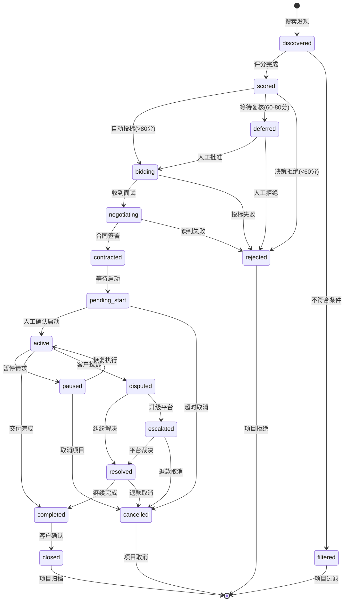

# 需求分析文档：融合Automaton与Nanobot的接单AI代理系统

> **版本**: 1.1.0
> **创建日期**: 2026-02-28
> **修订日期**: 2026-02-28
> **状态**: 已批准 (通过PRD补充计划完善)

---

## 1. 执行摘要

### 1.1 项目背景与目标

本项目旨在融合 **Automaton**（自主生存型AI经济主体）与 **Nanobot**（超轻量级AI代理框架），构建端到端自动化的接单AI代理系统，实现"商务-技术-运营"三位一体的自动化闭环。

**核心目标**:
- 7×24小时无人值守运行
- 自主完成从项目筛选到代码交付的全流程
- 实现经济可持续性（收支平衡）

### 1.2 核心价值主张

| 维度 | 传统外包 | 本系统 | 优势来源 |
|------|----------|--------|----------|
| **响应时效** | 工作时间内、时区限制 | 7×24小时即时响应 | 自动化运行、无疲劳 |
| **成本结构** | 固定人力成本(60-70%) | 边际成本递减(~20%算力) | 无薪资福利、效率提升 |
| **质量一致性** | 个体能力差异、人员流动 | 标准化输出、经验可继承 | 统一模型、知识沉淀 |
| **可扩展性** | 招聘培训周期长(数月) | 分钟级实例扩展 | 云原生架构 |

### 1.3 关键成功指标 (KPIs) - 可测试

| KPI | 目标值 | 测量方法 (SQL) |
|-----|--------|----------------|
| 接单成功率 | >60% | `SELECT COUNT(*) FILTER (WHERE status = 'completed') * 100.0 / COUNT(*) FROM goals WHERE created_at >= date('now', '-1 month')` |
| 交付准时率 | >85% | `SELECT COUNT(*) FILTER (WHERE completed_at <= deadline) * 100.0 / COUNT(*) FROM goals WHERE status = 'completed' AND completed_at IS NOT NULL` |
| 客户满意度 | >4.0/5.0 | `SELECT AVG(score) FROM reputation WHERE created_at >= date('now', '-1 month')` |
| 运营成本占比 | <25% | `SELECT SUM(cost_cents) FILTER (WHERE type = 'inference') * 100.0 / SUM(CASE WHEN type IN ('transfer_in','credit_purchase') THEN amount_cents ELSE 0 END) FROM transactions WHERE created_at >= date('now', '-3 months')` |
| 系统可用性 | >99.5% | `SELECT COUNT(*) FILTER (WHERE result = 'success') * 100.0 / COUNT(*) FROM heartbeat_history WHERE started_at >= datetime('now', '-30 days')` |
| 平均响应时间 | <500ms P99 | `SELECT PERCENTILE(latency_ms, 99) FROM inference_costs WHERE created_at >= datetime('now', '-24 hours')` |

---

## 2. 系统概述

### 2.1 系统边界定义

**系统负责**:
- ✅ **Web应用开发**: 企业官网/CMS、电商平台、SaaS MVP、RESTful API
- ✅ **项目类型**: 标准化Web应用（专注React/Next.js/TypeScript技术栈）
- ✅ **平台集成**: Upwork（首要优先级）

**系统不负责**:
- ❌ 大规模分布式系统
- ❌ 安全关键系统（医疗/金融核心/工业控制）
- ❌ 高度定制化创意设计

### 2.2 核心组件架构

```
┌─────────────────────────────────────────────────────────────────────┐
│                         ANP 网络层                                  │
│                    (去中心化身份 + P2P 发现)                         │
└───────────────────────────────┬─────────────────────────────────────┘
                                │
        ┌───────────────────────┴───────────────────────┐
        │                                               │
        ▼                                               ▼
┌───────────────────────────┐           ┌───────────────────────────┐
│       Automaton           │           │        Nanobot            │
│      (TypeScript)         │   ANP     │        (Python)           │
│                           │◄─────────►│                           │
│  ┌─────────────────────┐  │   P2P     │  ┌─────────────────────┐  │
│  │  治理层职责         │  │           │  │  执行层职责         │  │
│  │  - 经济决策         │  │           │  │  - 代码生成         │  │
│  │  - 项目筛选         │  │           │  │  - 测试执行         │  │
│  │  - 风险管理         │  │           │  │  - 客户沟通         │  │
│  │  - 区块链操作       │  │           │  │  - 多平台消息       │  │
│  └─────────────────────┘  │           │  └─────────────────────┘  │
└───────────────────────────┘           └───────────────────────────┘
```

### 2.3 双系统协作模型

| 阶段 | Automaton (治理层) | Nanobot (执行层) |
|------|-------------------|------------------|
| **项目筛选** | 多因子评分、投标决策 | - |
| **任务启动** | 发送Genesis Prompt | 接收任务、解析需求 |
| **开发执行** | 监控进度、资源核算 | 代码生成、测试执行 |
| **交付验收** | 质量评估、客户确认 | 部署、文档交付 |
| **反馈闭环** | 经济核算、策略调整 | 知识沉淀、经验归档 |

### 2.4 客户旅程地图

#### 阶段1: 项目发布

- **客户行为**: 在Upwork平台发布项目需求，描述技术栈、预算、时间要求
- **系统触点**: Upwork项目列表、搜索结果展示
- **客户情绪**: 期待遇到合适的开发者，略带焦虑（担心项目被理解）
- **成功指标**: 需求被准确理解、收到专业且有针对性的投标

#### 阶段2: 投标筛选

- **客户行为**: 查看收到的投标、评估候选人资质、比较报价和方案
- **系统触点**: 投标消息、profile展示、技术案例展示
- **客户情绪**: 比较不同选项时的犹豫、对技术方案的审慎评估
- **成功指标**: 快速收到专业响应、技术方案清晰展示相关经验

#### 阶段3: 合同签署

- **客户行为**: 确认合作意向、签署合同、设置里程碑付款
- **系统触点**: 合同确认通知、人工确认流程
- **客户情绪**: 期待项目启动，略有不安全感（首次与AI合作）
- **成功指标**: 合同条款清晰明确、人工确认流程顺畅、风险条款被充分解释

#### 阶段4: 项目执行

- **客户行为**: 等待进度更新、提供反馈、回答澄清问题
- **系统触点**: 进度报告（每4小时）、消息更新、里程碑通知
- **客户情绪**: 从最初的不确定性逐步建立信任、对透明度的满意度
- **成功指标**: 定期收到进度更新（至少每4小时）、问题在24小时内得到响应、可预测的交付时间线

#### 阶段5: 交付验收

- **客户行为**: 审核交付物、测试功能、提供反馈意见
- **系统触点**: 交付通知、演示链接、测试报告、部署文档
- **客户情绪**: 期待查看成果、谨慎评估质量
- **成功指标**: 交付物符合预期需求、测试全部通过、文档完整清晰、演示顺利进行

#### 阶段6: 项目收尾

- **客户行为**: 评价反馈、确认最终付款、考虑复购可能性
- **系统触点**: 评价请求、发票发送、复购意向询问
- **客户情绪**: 满意/不满（取决于交付质量）、对整体合作的总结评估
- **成功指标**: 评分>4.0/5.0、表达复购意向或推荐意愿、支付确认无纠纷

### 2.5 技术栈选型

| 层级 | Automaton | Nanobot |
|------|-----------|---------|
| **语言** | TypeScript 5.9 | Python 3.11+ |
| **包管理** | pnpm 10.x | hatch/pip |
| **数据库** | better-sqlite3 | - |
| **AI集成** | OpenAI API | LiteLLM (13+提供商) |
| **验证** | - | Pydantic v2 |
| **测试** | vitest | pytest + pytest-asyncio |
| **部署** | Docker/K8s | Docker/K8s |

---

## 3. 功能需求

### 3.1 Automaton核心功能

#### 3.1.1 外包平台接单与商务模块

##### 3.1.1.1 目标客户画像 (ICP)

**理想客户特征**:

| 维度 | 标准 | 权重 | 评分方法 | 数据来源 |
|------|------|------|----------|----------|
| **企业规模** | 中小企业(10-200人)或个人创业者 | 20% | 10-200人: 100分, <10人或>200人: 50分, >500人: 0分 | Upwork公司信息 |
| **技术成熟度** | 有基本技术背景，能提供清晰需求 | 15% | 历史项目描述技术细节清晰度评分 | NLP分析历史项目描述 |
| **预算范围** | $1000-$30000的项目 | 20% | $1K-30K: 100分, $500-1K或$30K-50K: 60分, <$500: 0分 | 项目报价区间 |
| **付款记录** | 历史付款率>90% | 20% | 付款率 × 100 | Upwork付款验证API |
| **沟通响应** | 平均响应时间<12小时 | 15% | <12h: 100分, 12-24h: 60分, >24h: 20分 | 消息历史分析 |
| **长期潜力** | 有重复需求或多项目可能 | 10% | 公司规模+业务类型评估 | 公司信息+项目类型分析 |

**非目标客户** (明确排除):
- **大型企业** (>500人): 决策流程复杂、审批周期长、需求变更频繁
- **低预算项目** (<$500): 成本覆盖风险高、利润率不足以支撑运营
- **低评分历史客户** (<3.0分): 纠纷风险高、沟通成本大
- **首次发布大项目** (> $50,000的新客户): 风险不可控、缺乏信任基础

**ICP评分应用**:
- 项目筛选算法中的"客户质量"维度直接使用ICP评分
- ICP评分 < 60分的客户自动过滤
- ICP评分 > 80分的客户进入快速通道

##### 3.1.1.2 动态报价策略

**报价计算公式**:

```
报价 = 基准成本 × (1 + 风险溢价) × (1 + 利润率) × 紧急系数
```

| 因子 | 计算方式 | 范围 | 示例 |
|------|----------|------|------|
| **基准成本** | 预估工时 × 时薪 | $50-200/h | 40小时 × $100/h = $4000 |
| **风险溢价** | 需求清晰度评分逆映射 | 0-30% | 需求模糊→+30%, 需求明确→+5% |
| **利润率** | 目标利润率 | 20-40% | 标准项目30%, 长期客户20% |
| **紧急系数** | Deadline紧迫度 | 1.0-1.5 | 正常1.0, 紧急1.3, 极紧急1.5 |

**时薪定价参考**:
- 前端开发: $80-120/h
- 全栈开发: $100-150/h
- 架构设计: $150-200/h

**动态调整机制**:
- 市场需求旺盛时: 上浮10-20%
- 竞争激烈时: 下浮5-10%
- 长期客户: 给予10-15%折扣
- 技术栈匹配度高: 上浮5-10%

##### 3.1.1.3 客户分级管理

| 等级 | 定义 | 累计消费阈值 | 权益 | 服务标准 | 优先级 |
|------|------|-------------|------|----------|--------|
| **金牌** | 高价值长期合作客户 | >$10,000 | 优先响应、10%折扣、专属客服 | 1小时响应，优先资源分配 | P0 |
| **银牌** | 稳定合作客户 | >$3,000 | 优先排队、5%折扣 | 4小时响应，优先级队列 | P1 |
| **铜牌** | 正常合作客户 | >$500 | 标准服务 | 24小时响应，正常队列 | P2 |
| **新客户** | 首次合作 | <$500 | 评估期服务 | 48小时响应，评估队列 | P3 |

**客户升级规则**:
- 累计消费达到阈值自动升级
- 连续3个项目评分>4.5可提前升级
- 金牌客户连续6个月无合作降级为银牌

**项目筛选算法 - 多因子加权评分模型**:

| 评估维度 | 权重 | 说明 |
|----------|------|------|
| 技术匹配度 | 25% | 技术栈重合度（React/TypeScript优先） |
| 预算合理性 | 20% | 报价/工作量比值、付款记录 |
| 交付可行性 | 20% | 时间约束、需求清晰度 |
| 客户质量 | 20% | Upwork历史评分、纠纷记录 |
| 战略价值 | 15% | 技能扩展、长期合作潜力 |

**评分输出**:
- 高分项目 (>80分) → 自动投标
- 中分项目 (60-80分) → 人工复核（项目启动前需确认）
- 低分项目 (<60分) → 直接过滤

#### 3.1.2 经济生存与资源管理模块

**生存状态级别**:

| 状态 | 触发条件 | 系统行为 |
|------|----------|----------|
| **正常运营** | 生存指数 > 70，余额>3个月成本 | 全功能运行，积极拓展 |
| **省电模式** | 生存指数 40-70，余额1-3个月 | 降级低成本模型，暂停非核心功能 |
| **求生模式** | 生存指数 < 40，余额<1个月 | 激进接单，紧急融资 |

**预算约束** (用户确认):
- 启动资金: $500-1000
- 月度运营预算: $200-500
- 单项目预算上限: $50,000

##### 3.1.2.4 多项目并发资源管理

**资源分配策略**:

| 项目优先级 | 资源配额 | LLM调用限制 | 计算资源 | 适用场景 |
|------------|----------|-------------|----------|----------|
| **P0: 紧急** | 40% | 无限制 | 独占GPU | Deadline<24小时、VIP客户 |
| **P1: 高** | 30% | 100K tokens/h | 2 CPU核心 | 正常执行中项目 |
| **P2: 中** | 20% | 50K tokens/h | 1 CPU核心 | 新项目评估、低优先级 |
| **P3: 低** | 10% | 20K tokens/h | 共享资源 | 候补队列、长期项目 |

**竞争处理规则**:

1. **LLM调用队列**: 按项目优先级+等待时间加权调度，避免饿死低优先级任务
2. **成本超限**: 低优先级项目暂停，释放资源给高优先级项目
3. **Deadline临近**: 自动提升优先级（每临近1天+1级，最高升至P0）
4. **新项目接入**: 评估资源余量，不足时拒绝或排队等待

**并发限制**:
- 最大并发项目数: 5个
- 单项目最大LLM配额: 总配额的50%（防止单项目占用所有资源）
- 资源预留: 至少保留20%给紧急任务和系统开销

**资源监控SQL**:
```sql
-- 资源使用查询（按项目统计最近1小时）
SELECT
  project_id,
  SUM(cost_cents) as total_cost,
  COUNT(*) as llm_calls,
  SUM(tokens_used) as total_tokens
FROM inference_costs
WHERE created_at >= datetime('now', '-1 hour')
GROUP BY project_id
ORDER BY total_cost DESC;
```

#### 3.1.3 递归自我改进与进化模块

**数字繁殖机制**:
- 触发条件: 资源达到200%阈值
- 子代创建: 注入启动资金、复制优化配置（允许±10%随机变异）
- 代际纽带: 子代利润10-20%回流、知识传承激励

#### 3.1.4 宪法合规与风险管理模块

**人工介入环节** (完整版):

| 环节 | 触发条件 | 介入方式 | SLA | 升级规则 | 超时处理 |
|------|----------|----------|-----|----------|----------|
| **合同签署** | 所有合同 | 需人工确认 | <4小时 | 超时2小时提醒 | 超时自动取消投标 |
| **大额支出** | >$100 | 需人工批准 | <2小时 | 超时1小时提醒 | 超时自动拒绝 |
| **项目启动** | 每个新项目 | 需人工确认 | <24小时 | 超时12小时提醒 | 超时自动启动（可配置） |
| **退款请求** | 客户发起退款 | 人工审核 | <48小时 | 金额>$500升级主管 | 超时自动部分退款（50%） |
| **纠纷升级** | 客户投诉>3次 | 人工介入 | <4小时 | 立即暂停项目 | 超时暂停+通知平台 |
| **账户异常** | 安全告警 | 人工验证 | <1小时 | 连续异常冻结账户 | 超时自动冻结 |
| **质量投诉** | 评分<3.0 | 人工review | <24小时 | 历史记录分析 | 超时暂停新项目 |
| **需求变更** | 范围变化>30% | 人工确认 | <48小时 | 重新评估预算 | 超时保持原范围 |

**人工介入流程**:
1. 系统自动触发告警 → 2. 推送通知(多渠道: Email/Telegram/Slack) → 3. 等待人工决策 → 4. 执行决策或超时自动处理

**客服介入流程**:
- L2级别纠纷需要客服介入时，系统自动生成客服工单
- 工单包含: 项目背景、纠纷原因、系统建议方案、历史沟通记录
- 客服处理完成后，系统记录处理结果用于学习优化

#### 3.1.5 退款与纠纷处理模块

##### 3.1.5.1 退款处理流程

| 阶段 | 触发条件 | 系统行为 | 人工介入 | 处理时限 |
|------|----------|----------|----------|----------|
| **退款请求** | 客户发起退款申请 | 创建退款工单、暂停项目执行 | 通知人工审核 | 即时 |
| **审核评估** | - | 计算已完成工作量、已发生成本 | 人工决策是否同意退款 | 24小时 |
| **部分退款** | 同意部分退款 | 执行退款、更新账务记录 | 确认退款金额和比例 | 48小时 |
| **全额退款** | 同意全额退款 | 执行全额退款、关闭项目 | 确认执行、通知平台 | 48小时 |
| **拒绝退款** | 拒绝退款申请 | 提供完成证据、进入纠纷流程 | 人工准备证据、响应客户 | 48小时 |

**退款规则**:
- **未开始项目**: 全额退款（扣除平台手续费，如有）
- **进行中项目**: 按里程碑完成比例退款
  - 完成<25%: 退款70%
  - 完成25-50%: 退款50%
  - 完成50-75%: 退款30%
  - 完成>75%: 不支持退款，走纠纷流程
- **已交付项目**: 不支持退款，走纠纷流程

##### 3.1.5.2 纠纷升级流程

| 级别 | 触发条件 | 处理方式 | 时限 | 升级条件 |
|------|----------|----------|------|----------|
| **L1: 系统处理** | 初次投诉 | 自动分析、提供解决方案、生成证据包 | 24小时 | 客户不接受→L2 |
| **L2: 人工介入** | L1未解决 | 客服介入调解、人工评估、协商方案 | 48小时 | 协商失败→L3 |
| **L3: 平台仲裁** | 升级至平台 | Upwork Dispute Resolution介入 | 7-14天 | 平台最终裁决 |

**纠纷记录存储**:
```sql
CREATE TABLE disputes (
  id TEXT PRIMARY KEY,              -- ULID
  project_id TEXT NOT NULL,
  client_id TEXT NOT NULL,
  reason TEXT NOT NULL,             -- 纠纷原因
  status TEXT NOT NULL,             -- open/negotiating/resolved/escalated/closed
  level INTEGER NOT NULL,           -- 1/2/3
  resolution TEXT,                  -- 解决方案
  created_at TEXT NOT NULL,
  resolved_at TEXT,
  metadata TEXT                     -- JSON扩展
);
```

---

### 3.2 Nanobot核心功能

#### 3.2.1 需求分析与沟通模块

**多轮对话澄清机制**:
1. 功能范围 - 使用示例驱动方法暴露隐含假设
2. 质量约束 - 将模糊形容词转化为可量化指标
3. 边界条件 - 识别边界情况与错误处理期望

**双层记忆系统**:
- 短期记忆: 每日笔记 `~/.nanobot/notes/YYYY-MM-DD.md`
- 长期记忆: 按主题组织的知识库（空库启动，逐步积累）

**客户沟通语言** (用户确认): 双语支持（中/英自动切换）

##### 3.2.1.3 沟通模板库

| 场景 | 模板类型 | 变量占位符 | 自动触发条件 |
|------|----------|-----------|-------------|
| **投标** | 项目方案提案 | {project_title}, {tech_stack}, {timeline}, {budget_range}, {relevant_cases} | 提交投标时 |
| **进度更新** | 阶段性报告 | {completed_steps}, {next_steps}, {blockers}, {progress_percentage}, {estimated_completion} | 每4小时或里程碑完成时 |
| **交付通知** | 交付确认消息 | {demo_url}, {test_results}, {documentation_link}, {feature_summary}, {known_issues} | 里程碑完成时 |
| **评价请求** | 满意度调查 | {project_name}, {rating_link}, {feedback_request}, {support_contact} | 项目关闭后3天 |

**模板自动选择逻辑**:
- 根据客户语言偏好选择中文/英文模板
- 根据客户等级调整语气（金牌客户更正式，新客户更友好）
- 根据历史反馈优化模板内容（A/B测试驱动）

#### 3.2.2 代码生成与开发模块

**支持技术栈**:
- 前端: React/Next.js/TypeScript/TailwindCSS
- 后端: Python/FastAPI
- 部署: Docker/K8s/Vercel

**开发工具链**:
- 文件系统操作（workspace限制）
- Shell命令执行（安全约束）
- 网页搜索（技术文档、最佳实践）

#### 3.2.3 测试与质量保证模块

**测试覆盖率要求** (用户确认): 90%+严格标准

| 测试层级 | 覆盖目标 | 质量门禁 |
|----------|----------|----------|
| 单元测试 | 函数/方法级 | 行覆盖率>90%，分支覆盖率>80% |
| 集成测试 | 模块协作 | 核心接口100%覆盖 |
| E2E测试 | 完整用户流程 | 关键路径通过率100% |

#### 3.2.4 反馈迭代与知识管理模块

**需求变更处理**: 变更影响分析、版本对比、客户确认

**项目复盘流程**:
- 每个项目完成后自动生成复盘报告
- 复盘维度: 技术挑战、沟通问题、时间估算准确性、客户满意度
- 成功模式沉淀到知识库、失败案例归因分析

**知识库迁移与继承**:
- 子代创建时继承父代知识库（允许±10%随机变异）
- 项目经验自动分类: 技术方案、沟通模板、陷阱警示
- 向量化存储支持语义搜索和相似案例推荐
- 记忆与学习: 项目经验持久化、成功模式复用、失败案例归因

---

### 3.3 双系统协同功能

#### 3.3.1 Genesis Prompt标准接口

```typescript
interface GenesisPrompt {
  // 项目标识
  projectId: string;           // "upwork-123456"
  platform: string;            // "upwork"

  // 需求摘要
  requirementSummary: string;  // "开发一个React电商前端"
  technicalConstraints: {
    requiredStack: string[];   // ["React", "TypeScript", "TailwindCSS"]
    prohibitedStack: string[]; // ["jQuery"]
    targetPlatform: string;    // "Vercel"
  };

  // 商务条款
  contractTerms: {
    totalBudget: number;       // 50000 (cents)
    deadline: string;          // ISO 8601
    milestones: Milestone[];
  };

  // 资源限制
  resourceLimits: {
    maxTokensPerTask: number;  // 1000000
    maxCostCents: number;      // 15000
    maxDurationMs: number;     // 86400000
  };
}
```

#### 3.3.2 进度报告与状态同步

| 报告类型 | 频率 | 内容 |
|----------|------|------|
| 进度报告 | 每4小时 | 完成步骤、下一步、阻塞项 |
| 资源报告 | 每日 | LLM调用次数、成本消耗 |
| 异常报告 | 实时 | 错误详情、影响范围 |
| 质量报告 | 里程碑 | 测试覆盖率、代码质量指标 |

---

### 3.4 项目状态流转

#### 3.4.1 项目状态定义

| 状态 | 说明 | 可转换至 | 触发条件 |
|------|------|----------|----------|
| **discovered** | 发现项目，待评分 | scored, filtered | 搜索到新项目 |
| **scored** | 评分完成，待决策 | bidding, deferred, rejected | 评分算法完成 |
| **filtered** | 被过滤，不符合条件 | - | ICP评分<60或技术不匹配 |
| **bidding** | 已提交投标，等待响应 | negotiating, rejected | 提交投标成功 |
| **deferred** | 等待人工复核 | bidding, rejected | 评分60-80，进入复核队列 |
| **negotiating** | 面试/谈判中 | contracted, rejected | 收到面试邀请 |
| **contracted** | 合同已签署，待启动 | pending_start | 合同签署完成 |
| **pending_start** | 等待启动确认 | active, cancelled | 等待人工确认启动 |
| **active** | 执行中 | paused, completed, disputed | 人工确认，项目开始 |
| **paused** | 已暂停 | active, cancelled | 客户请求或资源不足 |
| **completed** | 已完成，待客户确认 | closed | 所有里程碑完成 |
| **disputed** | 纠纷中 | resolved, escalated | 客户发起投诉或退款 |
| **resolved** | 纠纷已解决 | completed, cancelled | 双方达成一致 |
| **escalated** | 已升级至平台 | resolved, cancelled | 平台介入仲裁 |
| **cancelled** | 已取消 | - | 任何阶段取消 |
| **closed** | 已关闭（可复购） | - | 客户确认完成 |
| **rejected** | 已拒绝（投标失败/筛选失败） | - | 客户拒绝或系统过滤 |

#### 3.4.2 状态流转图



#### 3.4.3 状态转换规则

**自动转换**:
- `discovered` → `scored`: 评分任务自动执行
- `scored` → `bidding`: 评分>80自动投标
- `active` → `completed`: 所有里程碑标记完成

**需人工确认**:
- `deferred` → `bidding`: 人工复核通过
- `pending_start` → `active`: 人工确认启动
- `resolved` → `completed/cancelled`: 人工确认解决方案

**超时处理**:
- `pending_start` > 24小时 → `cancelled`
- `negotiating` > 7天无响应 → `rejected`
- `disputed` > 48小时无响应 → `escalated`

---

## 4. 非功能需求

### 4.1 性能需求

| 指标 | 目标值 | 验证方法 |
|------|--------|----------|
| API响应时间 | <500ms P99 | `SELECT PERCENTILE(latency_ms, 99) FROM inference_costs` |
| 代码生成速度 | <30s/模块 | 集成测试计时 |
| 测试执行时间 | <5min/套 | CI流水线监控 |
| 并发项目处理 | >=5个 | 负载测试 |

### 4.2 安全需求

| 需求 | 实现 |
|------|------|
| OWASP Top 10防护 | 输入验证、SQL参数化、XSS过滤 |
| 端到端加密 | ECDH密钥交换 + AES-256-GCM |
| 审计日志 | 保留90天，`modifications`表 |
| 密钥管理 | 环境变量，定期轮换 |

#### 4.2.1 账户安全

| 安全措施 | 实现方式 | 触发条件 | 响应动作 |
|----------|----------|----------|----------|
| **异常登录检测** | IP/设备指纹分析 | 异地登录、新设备 | 验证码确认、人工通知 |
| **操作审计** | 全量日志记录 | 所有敏感操作 | 记录到`modifications`表 |
| **定期密码轮换** | 90天强制更新 | 到期提醒 | 强制下次登录更新 |
| **双因素认证** | TOTP (RFC 6238) | 可选开启 | 登录时输入6位验证码 |

**敏感操作定义**:
- 合同签署、大额支出(>$100)
- API密钥创建/删除
- 系统配置修改
- 数据导出

### 4.3 可靠性需求

| 指标 | 目标值 | 验证方法 |
|------|--------|----------|
| 系统可用性 | >99.5% | `heartbeat_history`表统计 |
| 故障恢复时间 | <5min | 熔断器+重试机制 |
| 数据零丢失 | 100% | SQLite WAL模式 + 定期备份 |

#### 4.3.4 灰度发布策略

| 阶段 | 流量比例 | 持续时间 | 回滚条件 | 验证项 |
|------|----------|----------|----------|--------|
| **内测** | 0% (内部) | 1天 | - | 功能完整性 |
| **金丝雀** | 5% | 2天 | 错误率>1%、P99延迟>2s | 核心功能可用 |
| **小流量** | 20% | 3天 | 错误率>0.5%、P99延迟>1s | 性能指标达标 |
| **全量** | 100% | - | - | 稳定运行 |

**灰度发布监控指标**:
- 错误率: <0.1%
- P99延迟: <500ms
- 成功率: >99.5%
- 资源使用: CPU<70%, 内存<80%

#### 4.3.5 服务等级协议 (SLA)

| 指标 | 目标值 | 计费补偿 | 测量方法 |
|------|--------|----------|----------|
| **系统可用性** | 99.5% | 每降0.1%退款10% | `heartbeat_history`月度统计 |
| **API响应时间** | P99<500ms | 超出退款5% | `inference_costs`表延迟统计 |
| **项目交付准时率** | 90% | 延误按比例退款 | `goals`表deadline统计 |
| **数据零丢失** | 100% | 数据丢失全额退款 | 备份恢复验证 |

**SLA例外情况**:
- 计划内维护窗口（提前7天通知）
- 第三方服务故障（Upwork API、LLM API）
- 不可抗力事件

### 4.4 可扩展性需求

- 水平扩展支持（无状态设计）
- 分钟级实例启动（K8s HPA）
- 模块化架构（按功能拆分微服务）

### 4.5 可观测性需求

| 指标 | 采集方法 | 告警阈值 |
|------|----------|----------|
| 消息延迟 | WebSocket时间戳差值 | P99 > 1000ms |
| 连接健康 | `getConnectionStats()` | 断开 > 5min |
| 消息失败率 | DLQ记录 | > 5% |

### 4.6 埋点与数据分析需求

#### 4.6.1 核心转化漏斗

| 漏斗阶段 | 埋点事件 | 计算方式 | 目标转化率 | 监控SQL |
|----------|----------|----------|------------|---------|
| **曝光** | `project_viewed` | 项目出现在搜索结果次数 | 100% (基准) | `SELECT COUNT(*) FROM analytics_events WHERE event_type='project_viewed'` |
| **投标** | `bid_submitted` | 提交投标数/曝光数 | >15% | 投标数/曝光数 |
| **面试** | `interview_invited` | 收到面试邀请/投标数 | >30% | 面试数/投标数 |
| **成单** | `contract_signed` | 签署合同数/面试数 | >50% | 合同数/面试数 |
| **交付** | `project_completed` | 成功交付/成单数 | >90% | 完成数/合同数 |
| **复购** | `repeat_contract` | 二次合作/完成数 | >20% | 复购数/完成数 |

#### 4.6.2 关键埋点事件

| 事件名称 | 触发时机 | 属性 | 用途 | 优先级 |
|----------|----------|------|------|--------|
| **project_scored** | 项目评分完成 | score, factors, project_id | 优化筛选算法、监控评分分布 | P0 |
| **bid_created** | 投标创建 | project_id, amount, template_id | 追踪投标行为、A/B测试模板 | P0 |
| **llm_call** | LLM调用 | model, tokens, latency, cost | 成本监控、性能优化 | P0 |
| **error_occurred** | 错误发生 | type, message, stack, context | 问题诊断、稳定性监控 | P0 |
| **manual_intervention** | 人工介入 | trigger, context, decision | 合规审计、流程优化 | P1 |
| **customer_message** | 客户消息 | channel, response_time, sentiment | 沟通质量分析 | P1 |

#### 4.6.3 数据存储

埋点数据存储在 `analytics_events` 表，完整表结构定义见 **6.1.1 数据模型设计**。

### 4.7 实验与A/B测试需求

#### 4.7.1 可实验维度

| 实验类型 | 变量 | 对照组 | 实验组 | 成功指标 | 最小样本量 |
|----------|------|--------|--------|----------|------------|
| **投标消息** | 消息模板 | 模板A（标准） | 模板B（强调案例） | 面试率 | 100次/组 |
| **定价策略** | 报价系数 | 1.0x（基准） | 1.2x（高价） | 成单率、利润率 | 50次/组 |
| **投标时机** | 延迟时间 | 立即投标 | 1小时后投标 | 面试率 | 100次/组 |
| **技术栈展示** | 案例选择 | 近期项目 | 高星项目 | 客户回复率 | 100次/组 |

#### 4.7.2 实验框架接口

```typescript
interface Experiment {
  id: string;                      // 实验唯一标识
  name: string;                    // 实验名称
  description: string;             // 实验描述
  variants: Variant[];             // 变体列表
  trafficAllocation: number;       // 实验流量占比 (0-100)
  startDate: string;               // 开始时间 ISO 8601
  endDate: string;                 // 结束时间 ISO 8601
  successMetric: string;           // 成功指标名称
  minSampleSize: number;           // 最小样本量
  confidenceLevel: number;         // 置信水平 (默认95%)
}

interface Variant {
  id: string;                      // 变体ID
  name: string;                    // 变体名称
  config: Record<string, any>;     // 变体配置
  trafficWeight: number;           // 组内流量权重
}

interface ExperimentAssignment {
  experimentId: string;
  variantId: string;
  entityType: 'project' | 'client'; // 分配实体类型
  entityId: string;                // 实体ID
  assignedAt: string;              // 分配时间
}
```

#### 4.7.3 实验数据存储

```sql
CREATE TABLE experiments (
  id TEXT PRIMARY KEY,
  name TEXT NOT NULL,
  description TEXT,
  variants TEXT NOT NULL,          -- JSON: Variant[]
  status TEXT NOT NULL,            -- running/paused/completed
  traffic_allocation INTEGER,      -- 0-100
  success_metric TEXT NOT NULL,
  min_sample_size INTEGER DEFAULT 100,
  confidence_level REAL DEFAULT 0.95,
  started_at TEXT NOT NULL,
  ended_at TEXT,
  created_at TEXT NOT NULL
);

CREATE TABLE experiment_assignments (
  id TEXT PRIMARY KEY,
  experiment_id TEXT NOT NULL,
  variant_id TEXT NOT NULL,
  entity_type TEXT NOT NULL,       -- 'project' or 'client'
  entity_id TEXT NOT NULL,
  assigned_at TEXT NOT NULL,
  FOREIGN KEY (experiment_id) REFERENCES experiments(id)
);

CREATE TABLE experiment_metrics (
  id TEXT PRIMARY KEY,
  experiment_id TEXT NOT NULL,
  variant_id TEXT NOT NULL,
  metric_name TEXT NOT NULL,
  metric_value REAL,
  recorded_at TEXT NOT NULL,
  FOREIGN KEY (experiment_id) REFERENCES experiments(id)
);
```

#### 4.7.4 统计显著性要求

- **最小样本量**: 每组100次（或根据预期效应量计算）
- **置信水平**: 95%
- **最小可检测效应**: 10%（相对提升）
- **检验方法**: 双样本比例检验（对于转化率）
- **实验时长**: 最少2周，覆盖完整业务周期

#### 4.7.5 实验终止条件

- **成功**: 实验组显著优于对照组（p<0.05）且效应量>10%
- **失败**: 实验组显著差于对照组（p<0.05）
- **无结论**: 达到最小样本量但仍无统计学差异
- **提前终止**: 实验组表现极差（转化率下降>20%）

---

## 5. 接口需求

### 5.1 ANP协议接口规范

**消息信封**:
```typescript
interface ANPMessage {
  "@context": string[];
  "@type": "ANPMessage";
  id: string;              // ULID
  timestamp: string;       // ISO 8601
  actor: string;           // 发送方DID
  target: string;          // 接收方DID
  type: ANPMessageType;    // 消息类型
  object: ANPPayload;      // 消息负载
  signature: ANPSignature; // 数字签名
}
```

**消息类型**:
- 任务管理: `TaskCreate`, `TaskUpdate`, `TaskComplete`, `TaskFail`
- 协议协商: `ProtocolNegotiate`, `ProtocolAccept`, `ProtocolReject`
- 状态同步: `ProgressEvent`, `ErrorEvent`, `HeartbeatEvent`

### 5.2 传输层规范

**现有基础设施** (已实现):

| 组件 | 文件位置 | 代码行数 |
|------|----------|----------|
| InteragentWebSocketServer | `automaton/src/interagent/websocket.ts` | 901行 |
| WebSocketConnectionPool | `automaton/src/interagent/websocket.ts` | 内置 |
| WebSocketClient | `nanobot/nanobot/interagent/websocket.py` | 927行 |

**集成任务**:
- ANPAdapter与WebSocket绑定: 1-2天
- HTTP轮询回退实现: 1-2天
- 传输层集成测试: 1-2天

### 5.3 外包平台API集成

**首要平台: Upwork** (用户确认)

| 功能 | API端点 | 状态 |
|------|---------|------|
| 搜索项目 | `/search/jobs` | 待集成 |
| 提交投标 | `/proposals` | 待集成 |
| 获取合同 | `/contracts` | 待集成 |
| 消息通信 | `/messages` | 待集成 |

#### 5.3.1 Upwork API限流与错误处理

**API限流策略**:

| API类型 | 限流规则 | 处理策略 | 优先级 |
|---------|----------|----------|--------|
| **搜索API** | 40次/分钟 | 令牌桶限流、队列排队、智能缓存 | P1 |
| **投标API** | 20次/小时 | 智能调度、优先级队列、批量合并 | P0 |
| **消息API** | 100次/小时 | 批量合并、延迟发送、去重处理 | P1 |
| **合同API** | 100次/小时 | 正常调用、失败重试 | P2 |

**令牌桶实现**:
```typescript
interface RateLimiter {
  bucketSize: number;      // 桶容量
  refillRate: number;      // 每秒补充令牌数
  tokens: number;          // 当前令牌数
  lastRefill: number;      // 上次补充时间
}

// 使用示例
const searchLimiter = new RateLimiter(40, 40/60);  // 40次/分钟
const bidLimiter = new RateLimiter(20, 20/3600);   // 20次/小时
```

**错误处理矩阵**:

| 错误码 | 含义 | 处理方式 | 重试策略 | 人工介入 |
|--------|------|----------|----------|----------|
| **429** | 限流 | 指数退避重试 | 1s, 2s, 4s, 8s, 16s | 否 |
| **401** | 认证失败 | 刷新Token、告警通知 | 立即重试1次 | 是（连续失败） |
| **403** | 权限不足 | 记录日志、通知管理员 | 不重试 | 是 |
| **404** | 资源不存在 | 检查ID、更新本地状态 | 不重试 | 否 |
| **429** | Too Many Requests | 限流等待 | 指数退避 | 否 |
| **500** | 服务器错误 | 重试3次、记录日志 | 2s, 4s, 8s | 否 |
| **502** | 网关错误 | 重试3次 | 2s, 4s, 8s | 否 |
| **503** | 服务不可用 | 切换备用方案、严重告警 | 立即重试1次 | 是（持续>5min） |

**降级策略**:

| 场景 | 降级方案 | 触发条件 | 恢复条件 |
|------|----------|----------|----------|
| **搜索API不可用** | 使用本地缓存 + 人工推送 | 连续失败>5次 | API恢复且成功>3次 |
| **投标API不可用** | 队列暂存 + 批量重试 | 连续失败>3次 | API恢复 |
| **消息API不可用** | Email备用通道 | 连续失败>10次 | API恢复 |
| **完全离线** | 只读模式、人工通知 | 所有API失败 | 任一API恢复 |

**监控告警**:
- **警告**: API错误率 > 5% 且持续时间 > 5分钟
- **严重告警**: API错误率 > 20% 或连续失败 > 10次
- **人工介入**: API错误率 > 50% 或离线 > 30分钟

**合同模板管理**:

支持以下合同模板类型:
- **固定价格合同**: 按里程碑付款
- ** hourly合同**: 按小时计费，每周上限
- **定制合同**: 根据项目需求定制条款

合同模板存储:
```sql
CREATE TABLE contract_templates (
  id TEXT PRIMARY KEY,
  name TEXT NOT NULL,
  type TEXT NOT NULL,             -- fixed/hourly/custom
  terms TEXT NOT NULL,            -- JSON: 合同条款
  milestones TEXT,                -- JSON: 里程碑定义
  created_at TEXT NOT NULL,
  updated_at TEXT NOT NULL
);
```

### 5.4 客户沟通渠道集成

**支持渠道**: Telegram, Slack, Email, Discord

### 5.5 部署与运维接口

**部署环境** (用户确认): 容器化部署 (Docker/K8s)

| 接口 | 端点 | 用途 |
|------|------|------|
| 健康检查 | `/health` | K8s liveness/readiness |
| 指标采集 | `/metrics` | Prometheus |
| 配置热更新 | `/config/reload` | 运维操作 |

---

## 6. 数据需求

### 6.1 数据模型设计

#### 6.1.1 核心表结构 (已存在)

| 表名 | 用途 | 关键字段 |
|------|------|----------|
| `transactions` | 交易记录 | `type`, `amount_cents`, `cost_cents` |
| `reputation` | 客户评价 | `score`, `feedback` |
| `inference_costs` | LLM成本 | `latency_ms`, `cost_cents` |
| `heartbeat_history` | 心跳记录 | `result`, `started_at` |
| `policy_decisions` | 策略决策 | `decision`, `risk_level` |
| `goals` | 项目目标 | `status`, `deadline`, `completed_at` |
| `task_graph` | 任务图 | `status`, `agent_role` |
| `modifications` | 修改审计 | `type`, `created_at` |

#### 6.1.2 完整表结构定义

**goals 表 (项目目标)**:
```sql
CREATE TABLE goals (
  id TEXT PRIMARY KEY,              -- ULID
  project_id TEXT NOT NULL,         -- 关联项目ID
  title TEXT NOT NULL,              -- 目标标题
  description TEXT,                 -- 详细描述
  status TEXT NOT NULL,             -- 状态: discovered/scored/bidding/...
  priority INTEGER DEFAULT 0,       -- 优先级 (0-10)
  budget_cents INTEGER NOT NULL,    -- 预算(分)
  cost_cents INTEGER DEFAULT 0,     -- 实际成本(分)
  deadline TEXT,                    -- 截止时间 ISO 8601
  created_at TEXT NOT NULL,         -- 创建时间
  updated_at TEXT NOT NULL,         -- 更新时间
  started_at TEXT,                  -- 开始时间
  completed_at TEXT,                -- 完成时间
  metadata TEXT                     -- JSON扩展字段
);
CREATE INDEX idx_goals_status ON goals(status);
CREATE INDEX idx_goals_project_id ON goals(project_id);
```

**transactions 表 (交易记录)**:
```sql
CREATE TABLE transactions (
  id TEXT PRIMARY KEY,
  goal_id TEXT,                     -- 关联目标
  type TEXT NOT NULL,               -- transfer_in/transfer_out/inference/credit_purchase
  amount_cents INTEGER NOT NULL,    -- 金额(分)
  cost_cents INTEGER DEFAULT 0,     -- 成本(分)
  description TEXT,
  created_at TEXT NOT NULL,
  metadata TEXT,
  FOREIGN KEY (goal_id) REFERENCES goals(id)
);
CREATE INDEX idx_transactions_type ON transactions(type);
CREATE INDEX idx_transactions_created_at ON transactions(created_at);
```

**projects 表 (项目详情) - 新增**:
```sql
CREATE TABLE projects (
  id TEXT PRIMARY KEY,              -- upwork-123456
  platform TEXT NOT NULL,           -- upwork/fiverr/...
  platform_project_id TEXT NOT NULL,-- 平台原始ID
  title TEXT NOT NULL,
  description TEXT,
  client_id TEXT,                   -- 客户ID
  status TEXT NOT NULL,
  score INTEGER,                    -- 评分(0-100)
  score_factors TEXT,               -- JSON评分因子
  bid_id TEXT,                      -- 投标ID
  contract_id TEXT,                 -- 合同ID
  created_at TEXT NOT NULL,
  updated_at TEXT NOT NULL,
  FOREIGN KEY (client_id) REFERENCES clients(id)
);
CREATE UNIQUE INDEX idx_projects_platform_id ON projects(platform, platform_project_id);
```

**clients 表 (客户信息) - 新增**:
```sql
CREATE TABLE clients (
  id TEXT PRIMARY KEY,
  platform TEXT NOT NULL,
  platform_client_id TEXT NOT NULL,
  name TEXT,
  company TEXT,
  rating REAL,                      -- 历史评分
  total_spent_cents INTEGER DEFAULT 0,-- 总消费
  payment_verified INTEGER DEFAULT 0,-- 付款验证(0/1)
  country TEXT,
  tier TEXT DEFAULT 'new',          -- 客户等级: gold/silver/bronze/new
  created_at TEXT NOT NULL,
  updated_at TEXT NOT NULL,
  metadata TEXT
);
CREATE UNIQUE INDEX idx_clients_platform_id ON clients(platform, platform_client_id);
CREATE INDEX idx_clients_tier ON clients(tier);
```

**analytics_events 表 (埋点事件) - 新增**:
```sql
CREATE TABLE analytics_events (
  id TEXT PRIMARY KEY,
  event_type TEXT NOT NULL,         -- project_viewed/bid_submitted/...
  timestamp TEXT NOT NULL,
  properties TEXT,                  -- JSON: 事件属性
  session_id TEXT,
  project_id TEXT,
  client_id TEXT,
  FOREIGN KEY (project_id) REFERENCES projects(id)
);
CREATE INDEX idx_analytics_events_type ON analytics_events(event_type);
CREATE INDEX idx_analytics_events_timestamp ON analytics_events(timestamp);
CREATE INDEX idx_analytics_events_project_id ON analytics_events(project_id);
```

**disputes 表 (纠纷记录) - 新增**:
```sql
CREATE TABLE disputes (
  id TEXT PRIMARY KEY,
  project_id TEXT NOT NULL,
  client_id TEXT NOT NULL,
  reason TEXT NOT NULL,
  status TEXT NOT NULL,             -- open/negotiating/resolved/escalated/closed
  level INTEGER NOT NULL,           -- 1/2/3
  resolution TEXT,
  created_at TEXT NOT NULL,
  resolved_at TEXT,
  metadata TEXT,
  FOREIGN KEY (project_id) REFERENCES projects(id),
  FOREIGN KEY (client_id) REFERENCES clients(id)
);
CREATE INDEX idx_disputes_status ON disputes(status);
```

**experiments 表 (A/B测试) - 新增**:
```sql
CREATE TABLE experiments (
  id TEXT PRIMARY KEY,
  name TEXT NOT NULL,
  description TEXT,
  variants TEXT NOT NULL,           -- JSON: Variant[]
  status TEXT NOT NULL,             -- running/paused/completed
  traffic_allocation INTEGER,       -- 0-100
  success_metric TEXT NOT NULL,
  min_sample_size INTEGER DEFAULT 100,
  confidence_level REAL DEFAULT 0.95,
  started_at TEXT NOT NULL,
  ended_at TEXT,
  created_at TEXT NOT NULL
);
CREATE INDEX idx_experiments_status ON experiments(status);
```

**experiment_assignments 表 (实验分配) - 新增**:
```sql
CREATE TABLE experiment_assignments (
  id TEXT PRIMARY KEY,
  experiment_id TEXT NOT NULL,
  variant_id TEXT NOT NULL,
  entity_type TEXT NOT NULL,        -- 'project' or 'client'
  entity_id TEXT NOT NULL,
  assigned_at TEXT NOT NULL,
  FOREIGN KEY (experiment_id) REFERENCES experiments(id)
);
CREATE INDEX idx_experiment_assignments_experiment_id ON experiment_assignments(experiment_id);
```

**contract_templates 表 (合同模板) - 新增**:
```sql
CREATE TABLE contract_templates (
  id TEXT PRIMARY KEY,
  name TEXT NOT NULL,
  type TEXT NOT NULL,               -- fixed/hourly/custom
  terms TEXT NOT NULL,              -- JSON: 合同条款
  milestones TEXT,                  -- JSON: 里程碑定义
  created_at TEXT NOT NULL,
  updated_at TEXT NOT NULL
);
```

### 6.2 数据存储策略

| 数据类别 | 存储方案 | 保留期限 | 归档方式 |
|----------|----------|----------|----------|
| 项目数据 | SQLite | 项目结束后90天 | 压缩归档到冷存储 |
| 客户数据 | 加密存储 | 合同结束后3年 | 按法规要求归档 |
| 运营日志 | 时序数据库 | 90天热 + 1年冷 | 分级存储 |
| 知识库 | 向量数据库 | 永久 | 定期备份 |

#### 6.2.1 数据导出功能

| 导出类型 | 支持格式 | 访问权限 | 保留期限 |
|----------|----------|----------|----------|
| **项目报告** | PDF/CSV/JSON | 项目所有者 | 永久 |
| **财务报表** | CSV/PDF | 管理员 | 7年（税务要求） |
| **审计日志** | CSV/JSON | 管理员 | 90天 |
| **客户数据** | JSON/CSV | 客户本人 | 按法规要求 |

**导出API**:
```typescript
interface ExportRequest {
  type: 'project' | 'financial' | 'audit' | 'customer';
  format: 'pdf' | 'csv' | 'json';
  dateRange: { start: string; end: string };
  filters?: Record<string, any>;
}
```

#### 6.2.2 发票与税务管理

**发票生成**:
- 自动生成PDF格式发票
- 包含: 项目信息、服务明细、金额、税务信息
- 支持多币种 (USD/CNY/EUR)

**税务合规**:
- 自动计算适用税率
- 生成税务报告 (季度/年度)
- 保留发票记录至少7年

**发票表结构**:
```sql
CREATE TABLE invoices (
  id TEXT PRIMARY KEY,
  project_id TEXT NOT NULL,
  client_id TEXT NOT NULL,
  invoice_number TEXT NOT NULL UNIQUE,
  amount_cents INTEGER NOT NULL,
  tax_cents INTEGER NOT NULL,
  total_cents INTEGER NOT NULL,
  currency TEXT NOT NULL DEFAULT 'USD',
  status TEXT NOT NULL,          -- draft/sent/paid/overdue/cancelled
  due_date TEXT NOT NULL,
  paid_at TEXT,
  created_at TEXT NOT NULL,
  pdf_url TEXT,
  FOREIGN KEY (project_id) REFERENCES projects(id),
  FOREIGN KEY (client_id) REFERENCES clients(id)
);
CREATE INDEX idx_invoices_status ON invoices(status);
CREATE INDEX idx_invoices_due_date ON invoices(due_date);
```

### 6.3 数据安全与隐私

- 敏感数据加密: AES-256-GCM
- 密钥存储: 环境变量（不提交代码库）
- 访问控制: DID身份验证

### 6.4 数据生命周期管理

- 自动清理: 过期数据定期归档
- 备份策略: 每日增量 + 每周全量
- 恢复测试: 每月演练

---

## 7. 约束与假设

### 7.1 技术约束

| 约束 | 说明 |
|------|------|
| 运行环境 | Node.js 20+ / Python 3.11+ |
| 包管理 | pnpm 10.x / hatch |
| 离线支持 | 网络中断时降级运行 |
| 测试覆盖 | 90%+严格标准 |

### 7.2 业务约束

| 约束 | 值 |
|------|-----|
| 启动资金 | $500-1000 |
| 月度运营预算 | $200-500 |
| 单项目预算上限 | $50,000 |
| 目标平台 | Upwork |
| 任务类型 | 仅Web应用 |

### 7.3 假设条件

| 假设 | 说明 |
|------|------|
| Upwork API可用性 | >99% |
| LLM API稳定性 | >95% |
| 客户响应时间 | <24小时 |

### 7.4 风险与缓解策略

**预Mortem分析**:

| 场景 | 触发条件 | 检测方法 | 缓解措施 |
|------|----------|----------|----------|
| **经济失败** | 60天无收入 | `transactions`表查询 | 调高定价、切换LLM |
| **质量危机** | 投诉率>10% | `reputation`表查询 | 强制review、提高测试覆盖 |
| **安全漏洞** | 异常访问 | `modifications`表审计 | 密钥轮换、暂停服务 |
| **传输层故障** | 消息失败>5% | `heartbeat_history`+`getConnectionStats()` | HTTP回退、DLQ记录 |

---

## 8. 验收标准

### 8.1 功能验收标准

#### 8.1.1 功能验收矩阵

| 功能 | 验收条件 | 验证方法 |
|------|----------|----------|
| 项目筛选 | 能自动完成筛选、投标、合同评估 | `SELECT COUNT(*) FROM goals WHERE status IN ('completed', 'active')` |
| 代码生成 | 能完成需求分析、代码生成、测试执行 | `SELECT completion_rate FROM task_graph` |
| 端到端交付 | 通过Genesis Prompt完成完整项目 | E2E测试脚本 |
| 任务类型 | 能处理Web应用开发任务 | `SELECT DISTINCT agent_role FROM task_graph` |

#### 8.1.2 Given-When-Then 验收标准

**AC-001: 项目自动筛选**
- **Given**: Upwork上有10个新发布的Web开发项目
- **When**: 系统执行每日筛选任务
- **Then**:
  - 系统对所有10个项目进行ICP评分
  - 评分>80的项目自动提交投标
  - 评分60-80的项目进入人工复核队列
  - 评分<60的项目被过滤掉
  - 所有评分记录存储在`analytics_events`表

**AC-002: 投标消息生成**
- **Given**: 项目需求为"React电商网站开发，预算$5000，2周交付"
- **When**: 系统生成投标消息
- **Then**:
  - 消息包含技术方案摘要 (React + TypeScript)
  - 消息包含相关案例展示 (至少1个电商项目)
  - 消息包含报价范围 ($4500-5500)
  - 消息包含预计工期 (10-14个工作日)
  - 消息语言与客户语言偏好匹配

**AC-003: Genesis Prompt解析与传递**
- **Given**: Automaton决定启动项目并生成Genesis Prompt
- **When**: Automaton通过ANP发送Genesis Prompt到Nanobot
- **Then**:
  - Nanobot成功接收并解析消息
  - 正确提取projectId (如 "upwork-123456")
  - 正确解析技术约束 (requiredStack, prohibitedStack)
  - 正确解析预算和里程碑信息
  - 解析结果存储在`goals`表

**AC-004: 需求分析与澄清**
- **Given**: 客户需求描述为"开发一个用户管理系统"
- **When**: Nanobot执行需求分析
- **Then**:
  - 生成至少5个澄清问题 (用户角色、权限模型、数据存储等)
  - 使用示例驱动方法暴露隐含假设
  - 将模糊形容词转化为可量化指标 (如"快速响应"→"P95<200ms")
  - 识别边界条件和错误处理期望
  - 需求分析记录存储在长期记忆

**AC-005: 代码生成与测试**
- **Given**: 需求分析完成，技术栈为React+TypeScript+FastAPI
- **When**: Nanobot执行代码生成任务
- **Then**:
  - 生成可运行的代码 (通过编译/构建)
  - 单元测试覆盖率 >90%
  - 所有单元测试通过
  - 集成测试覆盖核心接口
  - E2E测试覆盖关键用户路径
  - 代码质量符合项目规范

**AC-006: 进度报告**
- **Given**: 项目处于执行状态 (status='active')
- **When**: 每4小时报告周期到达
- **Then**:
  - 生成进度报告包含: 已完成步骤、下一步计划、阻塞项
  - 报告通过ANP发送给Automaton
  - 报告同时记录在`modifications`表
  - 如有阻塞项，触发告警通知

**AC-007: 人工介入处理**
- **Given**: 项目状态为'contracted'（合同已签署，待启动）
- **When**: 人工确认启动操作
- **Then**:
  - 系统状态更新为'pending_start' → 'active'
  - 触发Genesis Prompt发送到Nanobot
  - 记录人工介入事件到`analytics_events`表
  - 通知客户项目已启动

**AC-008: 退款处理**
- **Given**: 客户在项目进行中（完成30%工作量）发起退款申请
- **When**: 系统收到退款请求
- **Then**:
  - 创建退款工单，状态设为'open'
  - 暂停项目执行 (状态改为'paused')
  - 通知人工审核 (SLA <48小时)
  - 计算退款比例 (70%，基于完成<25%规则)
  - 记录到`disputes`表

**AC-009: 纠纷升级**
- **Given**: 客户对解决方案不满意，持续投诉
- **When**: 客户投诉次数达到3次
- **Then**:
  - 纠纷级别从L1升级到L2
  - 触发人工客服介入
  - 系统自动生成客服工单
  - 工单包含: 项目背景、纠纷原因、历史沟通记录
  - 如48小时未解决，升级到L3（平台仲裁）

**AC-010: 资源竞争处理**
- **Given**: 系统正在运行5个项目，资源配额已满
- **When**: 新项目到达，优先级为P1
- **When**: 同时有一个P2项目正在等待LLM调用
- **Then**:
  - P1项目获得资源配额 (30%)
  - P2项目继续在队列等待
  - 如P0项目到达，抢占P1项目部分资源
  - 资源分配记录到`inference_costs`表
  - 超过配额的项目暂停并通知

**AC-011: API限流处理**
- **Given**: 系统需要调用Upwork搜索API
- **When**: 1分钟内已调用40次（达到限流）
- **When**: 新的搜索请求到达
- **Then**:
  - 请求进入令牌桶队列
  - 等待令牌补充 (1.5秒/令牌)
  - 或使用本地缓存（如可用）
  - 不触发429错误
  - 记录限流事件到日志

**AC-012: A/B测试执行**
- **Given**: 运行投标消息模板A/B测试
- **When**: 新项目到达需要投标
- **Then**:
  - 根据流量分配 (50/50) 选择模板A或B
  - 记录分配到`experiment_assignments`表
  - 投标后记录结果 (是否收到面试)
  - 达到最小样本量后自动计算统计显著性
  - 如p<0.05且效应量>10%，宣布胜出模板

**AC-013: 客户分级升级**
- **Given**: 铜牌客户累计消费达到$3500
- **When**: 项目完成，支付确认
- **Then**:
  - 自动计算总消费金额
  - 客户等级从'bronze'升级到'silver'
  - 更新`clients`表的tier字段
  - 发送升级通知邮件
  - 后续项目享受银牌权益 (优先排队、5%折扣)

**AC-014: 数据导出**
- **Given**: 管理员请求导出上个月财务报表
- **When**: 执行数据导出
- **Then**:
  - 生成CSV格式报表
  - 包含所有交易记录、收入、支出
  - 文件名包含日期范围
  - 生成下载链接
  - 记录导出操作到审计日志

### 8.2 性能验收标准

| 指标 | 目标 | 验证方法 |
|------|------|----------|
| 交付周期 | <2周（标准化Web应用） | `SELECT AVG(completion_days) FROM goals` |
| 并发能力 | >=5个项目 | 负载测试 |
| 效率提升 | >30% vs人工 | 成本对比分析 |

### 8.3 安全验收标准

| 标准 | 验收条件 |
|------|----------|
| OWASP扫描 | 通过OWASP ZAP安全扫描 |
| 数据加密 | 敏感数据加密存储验证 |
| 审计完整 | `SELECT COUNT(*) FROM modifications` 有记录 |

### 8.4 交付物清单

- [ ] Automaton可执行程序（Docker镜像）
- [ ] Nanobot可执行程序（Docker镜像）
- [ ] K8s部署配置
- [ ] API文档
- [ ] 运维手册
- [ ] 测试报告

---

## 9. 附录

### 9.1 术语表

| 术语 | 定义 |
|------|------|
| **Automaton** | 自主生存型AI经济主体（TypeScript实现） |
| **Nanobot** | 超轻量级AI代理框架（Python实现） |
| **ANP** | Agent Network Protocol，智能体网络协议 |
| **DID** | Decentralized Identifier，去中心化身份标识 |
| **Genesis Prompt** | 任务启动的标准接口格式 |

### 9.2 参考文档

- [ANP协议规范](https://w3id.org/anp)
- [W3C DID标准](https://www.w3.org/TR/did-core/)
- [Automaton CLAUDE.md](../automaton/CLAUDE.md)
- [Nanobot CLAUDE.md](../nanobot/CLAUDE.md)
- [ANP通信设计](./anp-communication-design.md)

### 9.3 变更历史

| 版本 | 日期 | 变更内容 |
|------|------|----------|
| 1.1.0 | 2026-02-28 | **PRD补充计划完善**: 新增21项补充内容<br>- **C1**: 目标客户画像(ICP) - 6维度可量化评估<br>- **C2**: 客户旅程地图 - 6阶段完整旅程<br>- **C3**: 埋点与数据分析需求 - 6阶段漏斗+6核心事件<br>- **C4**: 人工介入规则扩展 - 8+场景，含SLA和升级规则<br>- **M1**: GWT验收标准 - 14个核心功能的Given-When-Then格式<br>- **M2**: 项目状态流转 - 17种状态+Mermaid状态图<br>- **M3**: 数据字段定义 - 9个表的完整DDL<br>- **M4**: 退款/纠纷处理 - 5阶段退款+3级别纠纷<br>- **M5**: 资源竞争策略 - 4级优先级+资源配额<br>- **M6**: A/B测试需求 - 4实验维度+实验框架<br>- **M7**: API限流处理 - 限流策略+错误处理+降级方案<br>- **Phase 3补充**: 账户安全、知识库迁移、报价策略、合同模板、发票税务、灰度发布、SLA定义、数据导出、客户分级、沟通模板、项目复盘、客服介入 |
| 1.0.0 | 2026-02-28 | 初始版本，基于RALPLAN共识审查完成 |

---

## 附录A: ADR (Architecture Decision Record)

### ADR-001: 双系统通信协议选择

| 项目 | 内容 |
|------|------|
| **Decision** | 选项D（ANP类型 + HTTP传输混合方案） |
| **Drivers** | 经济可持续性优先、复用现有ANP基础设施(70%+已存在) |
| **Alternatives** | 纯HTTP REST、纯ANP、双协议支持 |
| **Why Chosen** | 平衡快速上线(1周)与长期安全/扩展性 |
| **Consequences** | Phase 1安全性较低，Phase 2/3逐步增强 |
| **Follow-ups** | 实现ANPAdapter与WebSocket集成 |

### ADR-002: 传输层架构

| 项目 | 内容 |
|------|------|
| **Decision** | 复用现有WebSocket基础设施（901+927行） |
| **Drivers** | 现有实现已完整，仅需1-2天集成 |
| **Why Chosen** | 时间从9天缩短至3-6天，降低风险 |

### ADR-003: 目标平台选择

| 项目 | 内容 |
|------|------|
| **Decision** | Upwork作为首要集成平台 |
| **Drivers** | API开放度高、全球最大自由职业平台 |
| **Why Chosen** | 用户确认优先级 |

### ADR-004: 任务类型聚焦

| 项目 | 内容 |
|------|------|
| **Decision** | 专注于Web应用开发 |
| **Drivers** | 技术栈成熟、需求模式可预测、自动化潜力高(95%) |
| **Why Chosen** | 用户确认范围，降低初期复杂度 |

---

*文档结束*
